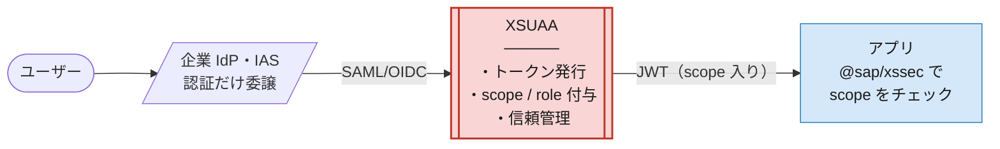
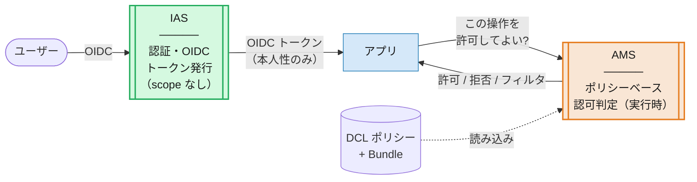
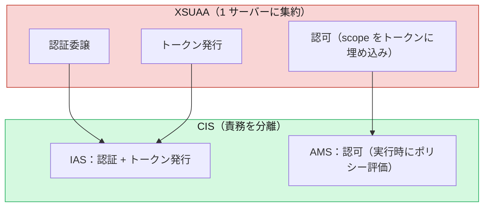

# 01. パラダイムシフト — 認証と認可の「分離」

> **この章の要点**
> XSUAA から CIS への最大の変化は、機能の置き換えではなく **「認証」と「認可」が別々のサービスに分離された** ことです。この 1 点を理解すると、以降のすべての違い（トークン構造・設定・ライブラリ）が自然に読めるようになります。

---

## 1. XSUAA の世界：中央に立つ 1 つのサーバー

XSUAA（SAP Authorization and Trust Management Service）は、BTP Cloud Foundry 上で **認証の入り口・トークン発行・認可情報の埋め込み** を **一手に引き受ける中央サーバー** でした。

ポイントは **発行される JWT の中に認可情報（scope / role）が詰め込まれている** ことです。アプリはトークンを検証し、その中の scope を見るだけで「この操作を許可してよいか」を判断できました。

- 認可の判断材料：**トークンの中**（`scope` クレーム）
- 認可のモデル：**静的な RBAC**（`xs-security.json` の scope / role-template を事前定義）
- 資格情報：主に **client secret**

---

## 2. CIS の世界：役割ごとにサービスが分かれる

CIS では、この「中央サーバー」の責務が **IAS（認証）** と **AMS（認可）** に分割されました。

決定的な違いは、**トークンには「誰であるか（本人性）」しか入らず、「何をしてよいか（認可）」は実行時に AMS が判定する** ことです。

- 認可の判断材料：**実行時に AMS が評価**（トークンの外）
- 認可のモデル：**ポリシーベース（DCL）** — 属性による動的判定も可能
- 資格情報：**X.509 証明書 / mTLS**（所有証明つき）

---

## 3. 並べて見る：何がどこへ移ったか

| 観点 | XSUAA | CIS（IAS + AMS） |
|---|---|---|
| 認証（本人確認） | IdP に委譲、XSUAA がトークン発行 | **IAS** が担当（OIDC 発行者） |
| 認可（権限判定） | XSUAA が scope をトークンに埋め込み | **AMS** が実行時に判定 |
| 認可情報の置き場所 | **トークンの中**（scope クレーム） | **トークンの外**（実行時評価） |
| 認可モデル | 静的 RBAC（scope / role） | ポリシーベース（DCL、属性対応） |
| 資格情報 | client secret 中心 | **X.509 証明書 / mTLS** |
| アプリのバインド先 | `xsuaa` サービス | `identity` サービス |

---

## 4. 「認可がトークンから外れた」ことの意味

これが CIS 最大の設計変更であり、実務への影響も大きいポイントです。

- ✅ **トークンが軽くなる** — 権限が増えても JWT が肥大化しない（scope が数百個…という問題が起きない）
- ✅ **権限変更が即時反映されやすい** — 認可はトークン再発行を待たず、実行時にポリシーで評価される
- ✅ **より細かい認可ができる** — 「Genre が Mystery 以外の本だけ読める」のような **属性・インスタンス単位（行レベル）** の制御が可能
- ⚠️ **アプリ側の前提が変わる** — 「トークンの scope を見れば分かる」コードは通用しない。認可判定は **AMS クライアントライブラリ経由** に置き換わる

> この「トークンの中の scope を見る」から「実行時に AMS へ問い合わせる」への転換が、既存 XSUAA アプリを移行するときに最も影響する箇所です。詳細は 03・06 で扱います。

---

## 次に読む

- **[02. 認証の違い](02-authentication.md)** — IAS が OIDC 発行者になること、証明書 / mTLS、トークン構造の実物
- **03. 認可の違い** — scope から DCL ポリシー・実行時 PDP・インスタンスベース認可へ

*(02 以降は順次作成します)*
