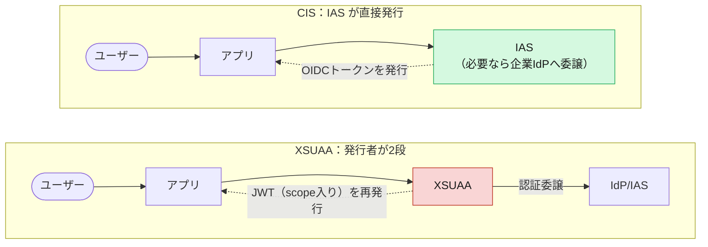
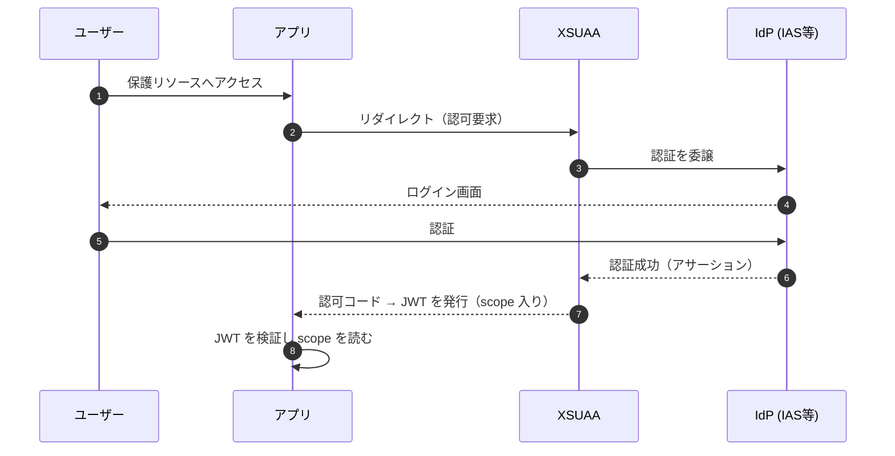
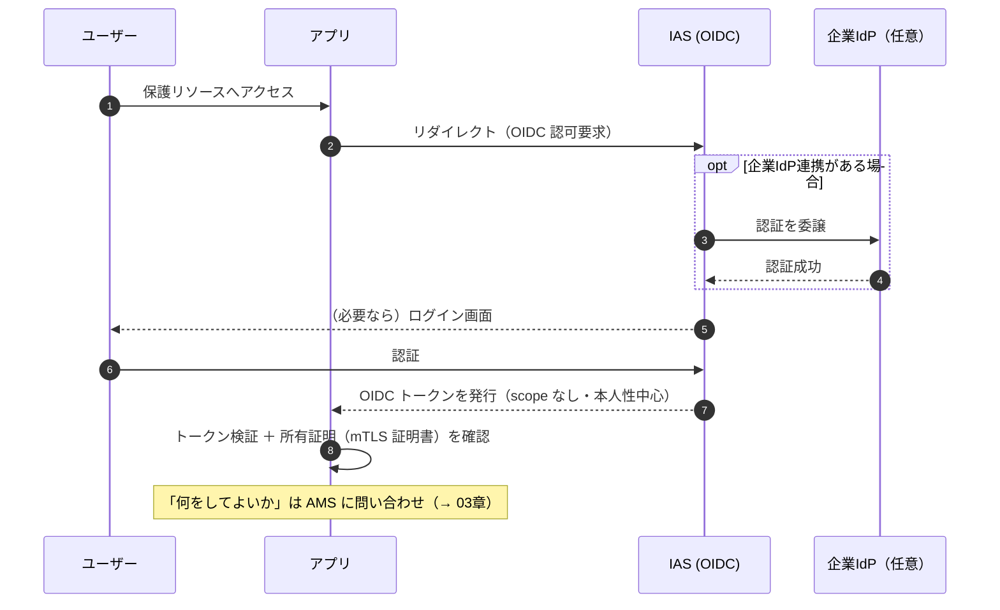
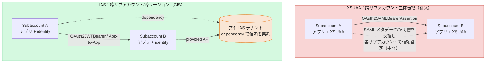

# 02. 認証の違い — IAS が「トークン発行者」になる

> **この章の要点**
> XSUAA が担っていた「トークン発行」の役割は、CIS では **IAS（Identity Authentication Service）** に移ります。アプリは XSUAA ではなく **IAS を直接信頼** し、IAS が発行する **OIDC トークン** を検証します。同時に、資格情報が **client secret から X.509 証明書（mTLS）** に変わります。
>
> 本章は **認証方式**（誰がトークンを発行し、どう認証し、何を提示するか）に絞ります。App-to-App の**設定手順（dependency 登録・Destination）や証明書更新の運用**は別ファイル [App-to-App 連携の設定と証明書運用](app2app-and-certificate-operations.md) にまとめています。

前章（[01](01-overview-paradigm-shift.md)）で「認証と認可が分離した」ことを見ました。本章はその **認証（＝誰であるか）側** にフォーカスします。

---

## 1. トークンを発行するのは誰か

| | XSUAA | CIS |
|---|---|---|
| トークン発行者 | **XSUAA**（BTP CF 上の OAuth2 認可サーバー） | **IAS**（OIDC プロバイダー） |
| 認証の実体 | IdP に委譲、XSUAA が最終的にトークンを発行 | IAS が認証（企業 IdP へさらに委譲も可）し、IAS がトークン発行 |
| アプリが信頼する相手 | XSUAA | **IAS** |
| トークンの種類 | XSUAA 独自の JWT（scope 入り） | 標準的な **OIDC トークン** |

ポイントは、**XSUAA という「中間のトークン発行者」がいなくなり、アプリが IAS を直接信頼する** ことです。XSUAA 時代も認証自体は IdP（多くは IAS）に委譲していましたが、トークンは必ず XSUAA が再発行していました。CIS では IAS が発行したトークンをそのままアプリが受け取ります。



---

## 2. 認証フローの対比

### XSUAA（OAuth2 認可コードフロー）



### CIS（IAS = OIDC プロバイダー）



XSUAA では最後に「scope を読む」で認可判断まで完結しましたが、CIS では **トークン検証は本人性の確認までで終わり、認可判断は別（AMS）** になります。

---

## 3. トークンの中身はどう変わるか

最も分かりやすい違いは、**CIS のトークンには `scope` クレームが無い** ことです。

**XSUAA トークン（イメージ）** — 認可情報が埋め込まれている

```json
{
  "scope": ["myapp!t123.Read", "myapp!t123.Write"],
  "xs.system.attributes": { "xs.rolecollections": ["BookAdmin"] },
  "client_id": "sb-myapp!t123",
  "cid": "sb-myapp!t123",
  "zid": "6898a89f-...",
  "grant_type": "authorization_code",
  "user_name": "john.doe@example.org",
  "email": "john.doe@example.org"
}
```

**CIS（IAS）トークン** — 本人性が中心、`scope` は無い

```json
{
  "sub": "eecd1df6-9ad9-4341-81e3-d123f392b79e",
  "iss": "https://customer.accounts.ondemand.com",
  "app_tid": "6898a89f-ad38-4a7f-9e7b-e89bd6bd7d40",
  "azp": "19e0fef0-9356-40e8-acb3-99346fc6abe4",
  "aud": "64926a29-3a02-47e4-af9d-08d41614c467",
  "ias_apis": ["amsValueHelp"],
  "cnf": { "x5t#S256": "UHBKahftM5a85fsxFJMkkOKBE5RpmVr0oP_NmsFyrms" },
  "user_uuid": "eecd1df6-9ad9-4341-81e3-d123f392b79e",
  "given_name": "John",
  "family_name": "Doe",
  "email": "john.doe@example.org"
}
```

> CIS トークンの実例は、このリポジトリの [Technical Communication](../docs/Authorization/TechnicalCommunication.md) に完全な形で掲載されています。

主なクレームの対応と役割:

| クレーム | 役割 | XSUAA との違い |
|---|---|---|
| `iss` | トークン発行者 = **IAS の URL** | XSUAA の URL ではなく IAS |
| `sub` / `user_uuid` / `scim_id` | ユーザーの一意識別子 | 概念は同じ |
| `app_tid` | アプリのテナント識別子 | XSUAA の `zid`（zone id）に相当 |
| `azp` / `aud` | 認可された当事者 / 受信者 | 概念は同じ |
| **`ias_apis`** | 消費が許可された API 権限グループ | **XSUAA には無い**（App-to-App 用、→ §5） |
| **`cnf.x5t#S256`** | 証明書の**所有証明**（proof-of-possession） | **XSUAA には無い**（mTLS 前提） |
| ~~`scope`~~ | — | **存在しない**（認可はトークン外で AMS が判定） |

---

## 4. 資格情報の変化：client secret → X.509 証明書（mTLS）

XSUAA では `clientid` + `clientsecret`（client secret）でトークンを取得するのが一般的でした。CIS では **X.509 証明書による mTLS（相互 TLS）** が基本になります。

- **mTLS**: クライアントとサーバーが互いに証明書で身元を証明し合う方式。
- **所有証明（proof-of-possession）**: トークンには証明書のフィンガープリント（`cnf.x5t#S256`）が埋め込まれ、「このトークンは、この証明書を持つ者だけが使える」ことを保証します。トークンだけ盗まれても、対応する秘密鍵（証明書）が無ければ使えません。

> プラットフォームの ingress が TLS を終端するため、呼び出し元の証明書はアプリに `x-forwarded-client-cert` ヘッダーで転送されます（Cloud Foundry は自動、Kyma では Istio/Envoy の設定が必要）。所有証明の検証は「x5t validation」「proof token validation」として BTP セキュリティライブラリが提供します（詳細は [ValueHelp](../docs/Authorization/ValueHelp.md) の Certificate Validation 節）。

> 証明書には有効期限があり、**更新（ローテーション）の運用**が必要になります。その仕組み・手順は [App-to-App 連携の設定と証明書運用](app2app-and-certificate-operations.md) にまとめています。

---

## 5. App-to-App の認証方式（技術通信 / 主体伝播）

システム間・アプリ間の通信でも、CIS では **IAS が発行するトークン**で認証します。Consumer（利用側）は、ユーザー文脈を伝播するかどうかで **3 つのフロー**を使い分けます。

| 用途 | フロー | ユーザー文脈 |
|---|---|---|
| 技術通信（技術ユーザー） | **client credentials flow** | なし（アプリ自身の身元） |
| 主体伝播（Consumer が既に JWT を持つ） | **JWT bearer flow** | ログインユーザーを維持 |
| 主体伝播（SAML2 等の別トークン） | **token exchange flow** | ログインユーザーを維持 |

いずれのフローでも、Consumer は **`resource` パラメータに、消費したい依存関係（dependency）を URN で指定**してトークンを取得します。

```
urn:sap:identity:application:provider:name:<dependency名>
（特殊ケースは …:provider:clientid:<Provider の client id>）
```

返るトークンの主なクレーム:

- `aud` = Provider（提供側）アプリ
- **`ias_apis`** = 許可された API 権限グループ名の配列（全 API 公開時は `principal-propagation`）

**どのアプリがどの API を消費してよいか**は、アプリではなく **テナント管理者が dependency の登録で決めます**。Provider 側が `ias_apis` を「実際にどんな権限に変換するか」は **AMS の内部ポリシー（`INTERNAL POLICY`）へのマッピング**で決まります（認可側の話。[Technical Communication](../docs/Authorization/TechnicalCommunication.md) と本ガイド 06 章）。

### サブアカウント／リージョンを跨ぐ主体伝播の変化 🔑

XSUAA から IAS への移行で、**跨サブアカウント（跨リージョン）の主体伝播**が大きく簡素化されます。

- **XSUAA（従来）**: サブアカウントを跨ぐ主体伝播には **`OAuth2SAMLBearerAssertion`** を使い、さらに **サブアカウント間で信頼を確立**する必要がありました。具体的には、一方のサブアカウントの **SAML メタデータ/署名証明書を取り出し、もう一方の XSUAA に「信頼する IdP」として設定**する——という **ペアごと・方向ごとの手作業**が発生します。
- **IAS（CIS）**: 同一の **IAS テナントが複数サブアカウント／リージョンで共有**されるため、信頼は **IAS テナント上の `dependency` 登録に集約**されます。結果、跨サブアカウント／跨リージョンでも **`OAuth2JWTBearer`（App-to-App）** が使え、**サブアカウント側の個別 SAML 信頼設定は不要**になります。前提は「両側に `identity` インスタンス＋ Consumer 側に dependency 登録」だけです。



> 実装上は、CAP などのランタイムが **token exchange**（Consumer のトークンを Provider 向けトークンへ交換）で App-to-App を実現します。IAS は **Consumer 側に有効な dependency がある場合にのみ** Provider 向けトークンを発行するため、これが「信頼の実体」になります。従来のように各サブアカウントで SAML 信頼を張り直す必要はありません。

> **設定・運用は別ファイル**: API 権限グループの公開手順、dependency の登録手順、Destination の設定、証明書のローテーション運用は [App-to-App 連携の設定と証明書運用](app2app-and-certificate-operations.md) を参照してください。

---

## 6. アプリの設定（バインディング）とライブラリ

| | XSUAA | CIS |
|---|---|---|
| バインドするサービス | `xsuaa` | **`identity`** |
| 認証ライブラリ（Node.js） | `@sap/xssec`（+ `passport`） | `@sap/xssec`（v4 で IAS トークン対応） |
| 認可ライブラリ | ライブラリ内で scope 判定 | **AMS クライアントライブラリ**（`@sap/ams` 等、→ 06章） |

`@sap/xssec` は XSUAA 時代から使われていますが、バージョン 4 以降で **IAS トークンの検証**（所有証明を含む）に対応しています。つまり「トークンを検証して本人性を確立する」役割は引き続き `@sap/xssec` が担い、「その人が何をしてよいか」を **AMS ライブラリ** が担う、という分業になります。

---

## この章のまとめ

- トークン発行者が **XSUAA → IAS** に変わり、アプリは **IAS を直接信頼** する。
- トークンは **OIDC 標準**で、**`scope` が無く**、本人性と `ias_apis`・所有証明（`cnf`）が中心。
- 資格情報が **client secret → X.509 証明書（mTLS）** に。所有証明でトークンの持ち主を縛る。
- バインド先が `xsuaa` → **`identity`**。認証は `@sap/xssec`（v4）、認可は AMS ライブラリへ分業。
- **App-to-App** は IAS トークンで認証し、フローは **技術通信＝client credentials／主体伝播＝JWT bearer・token exchange**。許可された API 権限グループは **`ias_apis`** に載る。設定手順・Destination・証明書運用は [別ファイル](app2app-and-certificate-operations.md)。
- **跨サブアカウント／跨リージョンの主体伝播**も、XSUAA の `OAuth2SAMLBearerAssertion` ＋ サブアカウント間 SAML 信頼設定から、IAS の **`OAuth2JWTBearer` ＋ dependency 集約**へ簡素化。

## 次に読む

- **[03. 認可の違い](03-authorization.md)** — `scope`/RBAC から **DCL ポリシー・実行時 PDP・インスタンスベース認可** へ（本ガイドの核）
