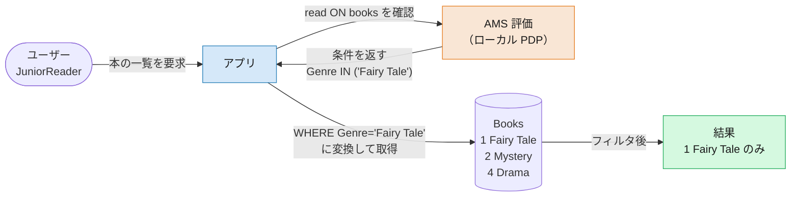
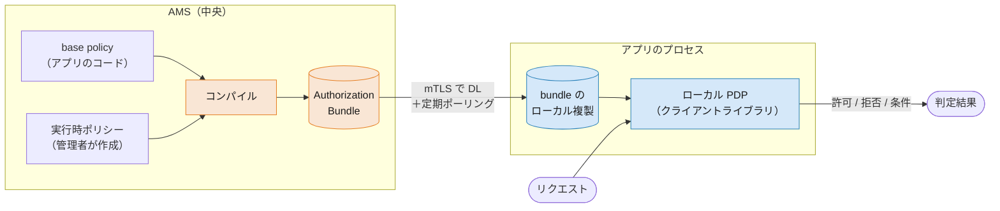
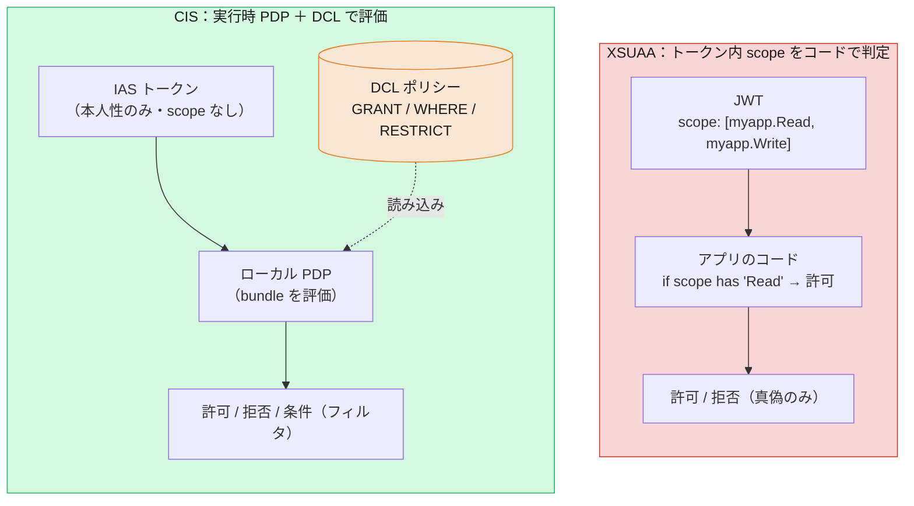

# 03. 認可の違い — scope 判定から DCL ポリシー・実行時評価へ

> **この章の要点**
> XSUAA では「認可＝トークンの `scope` を読んで真偽を判定する」ことでした。CIS では認可がトークンから外れ、**DCL（Data Control Language）で書いたポリシー** を **実行時に評価** します。これにより、真偽だけでなく **属性・行レベル（インスタンスベース）** の動的な認可が可能になります。評価は **アプリ内のローカル PDP** が、AMS から配布される **Authorization Bundle** を使って行います。
>
> 本章は本ガイドの **核** です。前章（[02](02-authentication.md)）で「トークンは本人性だけを運ぶ」ことを見ました。では「何をしてよいか」は誰が・どう決めるのか——それが本章のテーマです。

---

## 1. モデルの転換：静的 RBAC → ポリシーベース認可

XSUAA の認可は、`xs-security.json` に **scope と role-template を事前定義** し、それをトークンの `scope` クレームに埋め込む **静的な RBAC**（ロールベース）でした。アプリは「トークンに `Read` scope があるか？」を見るだけです。

CIS/AMS では、認可は **DCL で書いたポリシー** になり、**実行時に評価** されます。ポリシーは属性条件（`WHERE`）を持てるため、単なるロールの有無を超えた **ABAC（属性ベース）／行レベル** の判定ができます。

| 観点 | XSUAA | CIS（AMS） |
|---|---|---|
| 認可モデル | 静的 RBAC（scope / role） | **ポリシーベース**（DCL、ABAC 対応） |
| 定義の置き場所 | `xs-security.json`（scope / role-template） | **DCL ファイル**（`*.dcl`） |
| 認可情報の運び方 | **トークンの `scope`** に埋め込み | トークンには載せない（**実行時評価**） |
| 行レベルの絞り込み | 可能。ただし条件は**コードに固定**（変更＝再デプロイ） | 可能。**管理者が実行時に**調整（`USE ... RESTRICT`） |
| 変更の反映 | トークン再発行が必要 | **実行時に反映**（ポリシー更新が伝播） |
| アプリの判定方法 | `scope` を読む | **AMS へ問い合わせ**（ローカル PDP、→ §4） |

決定的な違いは、**「トークンの `scope` を見る」というコードが CIS には存在しない** ことです。認可判定は、次に見る DCL ポリシーの実行時評価に置き換わります。

---

## 2. DCL 入門 — 認可を「コード」で書く

DCL（Data Control Language）は、認可ポリシーを記述する専用言語です。基本は **「どの *アクション* を・どの *リソース* に対して許可するか」** を宣言します。

```dcl
POLICY ReadProducts {
    GRANT read ON products;
}
```

これは「`products` リソースに対する `read` アクションを許可する」という意味です。XSUAA の scope（`myapp.Read`）が「文字列 1 個の有無」だったのに対し、DCL は **アクション × リソース** の構造を持ちます。

### 属性条件とスキーマ

ポリシーには `WHERE` 条件を付けられます。条件で使う属性は、あらかじめ `schema.dcl` に宣言します。

```dcl
SCHEMA {
    category: String;
}

POLICY ReadEquipment {
    GRANT read ON products WHERE category = 'Equipment';
}
```

「`category` が `Equipment` の `products` だけ読める」——これが **属性ベース（ABAC）** の認可です。XSUAA の scope では表現できなかった粒度です。

### base policy と実行時ポリシー（開発者 vs 管理者）

DCL には **2 段階** の役割分担があります。

- **base policy**（開発者が定義）: アプリのソースコードに含める土台のポリシー。
- **admin / runtime policy**（管理者が実行時に派生）: base policy を `USE ... RESTRICT` で絞り込み、テナントごとの細かい認可を **実行時に** 作る。

```dcl
POLICY ReadProducts {
    GRANT read ON products WHERE category IS NOT RESTRICTED;
}

POLICY ReadOfficeSupplies {
    USE ReadProducts RESTRICT category = 'OfficeSupplies';
}
```

`IS NOT RESTRICTED` は「管理者がこの属性を絞り込んで **よい**（絞らなければ無制限）」、`IS RESTRICTED` は「管理者が絞り込ま **なければ** アクセスできない」という **ガードレール** を意味します。開発者が枠を決め、管理者がその中で運用ポリシーを組み立てる——という分業です。

> XSUAA では role-template に `attributes` を宣言し、ロールコレクションの割当時に値を入れる仕組みでしたが、DCL は **ポリシー言語そのもの** で条件を表現し、実行時に派生ポリシーを追加できます。

### CAP の場合は「ロールベース」

CAP アプリケーションでは、認可は引き続き **ロールベース** です。役割分担は次のとおりで、**cds アノテーションと DCL がセット** で機能します。

- **cds モデル側（`@requires` / `@restrict`）**: 「**どのロールが・どの操作をしてよいか**」を定義する。ここは XSUAA 時代と同じ書き方です。
- **DCL 側（`ASSIGN ROLE`）**: そのロールを「**どのユーザーに割り当てるか**」を定義する。

```cds
// cds モデル側：ロールが「何をしてよいか」を定義（XSUAA でも同じアノテーション）
service SalesService {
    @(requires: 'SalesManager')                          // サービス全体に必要なロール
    entity Products as projection on my.db.Products;

    @(restrict: [
        { grant: ['READ','WRITE'], to: 'SalesManager' },
        { grant: 'READ',           to: 'SalesRepresentative' }
    ])                                                    // 操作ごとに許可ロールを指定
    entity SalesOrders as projection on my.db.SalesOrders;
}
```

```dcl
// DCL 側：上のロールを「誰に割り当てるか」を定義
POLICY SalesRepresentative {
    ASSIGN ROLE SalesRepresentative;
}
```

つまり、XSUAA では「ロールコレクション ⇄ role-template（`xs-security.json`）」で担っていた **ロールの割当** が、CAP + AMS では **DCL の `ASSIGN ROLE` ポリシー** に置き換わります。cds の `@requires`/`@restrict` はそのまま流用できます。

`ASSIGN ROLE` は DCL の糖衣構文で、内部的には **`$SCOPES` という特別なリソース上のアクション** として表現されます（`GRANT SalesRepresentative ON $SCOPES;` と等価）。CAP プロジェクトでは、通常この `$SCOPES` が唯一の AMS リソースになります。

### XSUAA ↔ DCL 対応（概念）

| XSUAA | DCL（AMS） |
|---|---|
| scope（`myapp.Read`） | **アクション**（`GRANT read ON ...`） |
| role-template | **`POLICY`**（base policy） |
| role-template の `attributes` | **`WHERE` ＋ `RESTRICT`**（属性条件） |
| ロールコレクションでの属性値割当 | 管理者が派生する **実行時ポリシー**（`USE ... RESTRICT`） |
| （CAP）ロール | **`ASSIGN ROLE`**（＝ `$SCOPES` 上のアクション） |

---

## 3. インスタンスベース（行レベル）認可 🔑

**「この本は読めるが、あの本は読めない」** のような **行レベル（インスタンスベース）** の絞り込み自体は、XSUAA でも可能でした。CAP なら `@restrict` の `where` 条件でフィルタを書けます。

```cds
// XSUAA 時代：絞り込み条件はアプリのソースコードに書く
entity Books @(restrict: [
    { grant: 'READ', to: 'Reader', where: 'genre = $user.genre' }
]);
```

本当の違いは **「絞り込み条件を *どこで* 決めるか」** です。

- **XSUAA**: `where` 条件は **アプリのソースコードに固定** されます。「Mystery も読めるようにしたい」と要件が変われば、原則 **ソースを修正して再デプロイ** が必要でした。（role-template の attribute で *値* だけは実行時に差し替えられますが、条件の **構造** はコード側にあります。）
- **CIS/AMS**: 絞り込み条件は **DCL ポリシー** として表現され、テナント管理者が **SCI Admin Console（IAS 管理コンソール）で実行時に派生ポリシーを作成** できます。アプリを再デプロイせずに、テナントごと・ユーザーごとの絞り込みを調整できます。

例として、bookshop の「ジャンルで読める本を絞る」ポリシーを見ます。これは開発者の base policy `cap.Reader` から、**管理者が実行時に派生** させたポリシーです。

```dcl
// 管理者が Admin Console で作成する実行時ポリシー（base policy から派生）
POLICY JuniorReader {
    USE cap.Reader RESTRICT Genre IN ('Fairy Tale');
}
```

このポリシーを割り当てられたユーザーが本の一覧を取得すると、AMS は `Genre = 'Fairy Tale'` を **`where` 条件として注入** し、結果を行レベルで絞り込みます。CAP プロジェクトでは、この変換（認可条件 → CQL/CXN 式）は **自動** です（非 CAP でも SQL 抽出器などで同じことができます）。



ポイントは 2 つです。1 つは、認可判定の結果が **「はい／いいえ」だけでなく「条件（フィルタ）」** になりうること。もう 1 つは、その条件を **アプリのコードではなく実行時ポリシー（管理者）側に置ける** ことです。要件が変わるたびに `where` を書き換えて再デプロイする、という XSUAA 時代の負担がなくなります。

> `WHERE` 条件で使う属性（例では `Genre`）は `schema.dcl` に宣言し、CAP では `@ams.attributes` で cds モデルの要素（`genre` 等）へマッピングします。詳細は公開ドキュメントの [Instance-Based Authorization](../docs/CAP/InstanceBasedAuthorization.md) を参照してください。

---

## 4. 判定はどこで・いつ起きるか — 実行時 PDP と Authorization Bundle

「実行時に評価する」と聞くと、**リクエストごとに AMS へネットワーク問い合わせをする** ように思えるかもしれません。実際は違います。

- AMS は、アプリの base policy と管理者が作った実行時ポリシーを **中央でコンパイル** して **Authorization Bundle** にまとめます。
- 各アプリ（クライアントライブラリ）は、起動時に自分の AMS インスタンスから **証明書（mTLS）でこの bundle をダウンロード** します。
- その後も **定期的にポーリング** して、管理者による変更を取り込み、ローカルの複製を最新に保ちます。
- 認可判定そのものは、**アプリのプロセス内にある PDP（Policy Decision Point）** が、ダウンロード済み bundle を使って **ローカルで評価** します。



この設計には 2 つの意味があります。

- **速い・落ちにくい**: 判定はプロセス内で完結するため、リクエストごとの外部呼び出しがありません。
- **それでも動的**: 管理者がポリシーを変えても、クライアントが bundle をポーリングして取り込むため、**トークンを再発行せずに** 認可が更新されます。XSUAA の「scope はトークンに焼き込まれ、変更には再ログインが要る」とは対照的です。

> 01 章では「アプリが AMS に問い合わせる」と簡略化して描きましたが、正確には **PDP はアプリ内にあり、AMS からは bundle を受け取る** 関係です。だからこそ、アプリは起動時に「bundle が準備できたか」を確認してからトラフィックを受け付けます（readiness / startup check。→ 詳細は [Authorization Bundle](../docs/Authorization/AuthorizationBundle.md)）。

---

## 5. 図で見る：scope 判定 vs 実行時 PDP＋DCL

2 つのモデルを並べます。左（XSUAA）は「トークンの中を読む」、右（CIS）は「ポリシーをローカル PDP で評価する」です。



XSUAA では判定材料がトークンの中にあり、出力は真偽でした。CIS ではトークンは本人性だけを運び、判定は **ポリシー＋ローカル PDP** が行い、出力には **フィルタ条件** も含まれます。

---

## 6. 認可チェックの書き方（さわり）

実際の判定は、AMS クライアントライブラリで行います。最も基本的な形は「このアクションを、このリソースに対して許可してよいか」を問うものです。

```js
// Node.js（イメージ）
const decision = authorizations.checkPrivilege('read', 'products');
if (decision.isGranted()) {
    // read が許可されている
}
```

より実務的には、判定をコードに散らさず **宣言的** に書きます。CAP では標準の `@requires` / `@restrict` アノテーションがそのまま AMS の認可チェックとして働き、`RESTRICT` の属性条件は §3 のとおり自動でデータフィルタに反映されます。

```cds
service ProductService {
    @(restrict: [{ grant: 'READ', to: 'ReadProducts' }])
    entity Products as projection on my.db.Products;
}
```

> 言語・フレームワーク別の具体的な API（`checkPrivilege`、ルート／メソッドレベルのセキュリティ、CAP 連携、`ias_apis` からの cds ロール自動付与など）は **06 章** で扱います。本章は「認可がどういうモデルに変わったか」に集中します。

---

## この章のまとめ

- 認可モデルが **静的 RBAC（scope／role）→ ポリシーベース（DCL）** へ。トークンの `scope` を読むコードは無くなる。
- **DCL** は「アクション × リソース」を宣言し、`WHERE` で **属性条件（ABAC）** を表現できる。開発者の **base policy** と管理者の **実行時ポリシー（`USE ... RESTRICT`）** の分業。
- CAP では **ロールベース**のまま。`ASSIGN ROLE`（＝ `$SCOPES` 上のアクション）でロールを割り当てる。
- **インスタンスベース（行レベル）認可** 🔑 — 行レベルの絞り込みは XSUAA でも `@restrict ... where` で可能だったが、条件は **コードに固定** され変更に再デプロイが必要だった。AMS は条件を **DCL ポリシー** で表現し、**管理者が Admin Console で実行時に** 調整できる。`RESTRICT` の条件はフィルタとして返り、CAP では自動で `where`（CQL）へ変換される。
- 判定は **アプリ内のローカル PDP** が **Authorization Bundle**（AMS が中央コンパイル → mTLS で DL → 定期ポーリング）を評価して行う。外部呼び出しなしで速く、かつポリシー変更は再ログイン不要で反映される。

## 次に読む

- **04. 設定成果物の違い** — `xs-security.json`（scopes / role-templates）から **`identity` ＋ `authorization.enabled` ＋ DCL ファイル群** へ

*(04 以降は順次作成します)*
