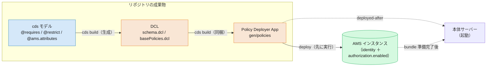
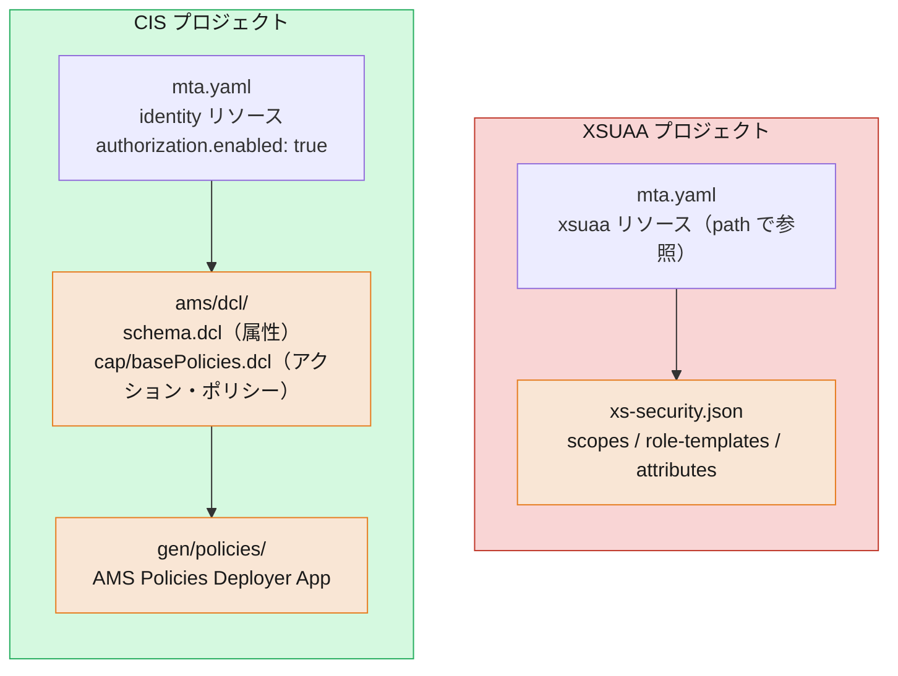

# 04. 設定成果物の違い — `xs-security.json` から `identity` ＋ DCL へ

> **この章の要点**
> XSUAA では、認可に関する設定を **`xs-security.json` という 1 枚のファイル** にほぼ集約していました（scope・role-template・attribute）。CIS では、この 1 枚が **2 種類の成果物** に分かれます——サービスを有効化する **サービス定義**（`identity` リソース ＋ `authorization.enabled: true`）と、認可そのものを書く **DCL ファイル群**（`schema.dcl` / base policy）です。さらに、DCL を AMS へ届けるための **Policy Deployer App** も成果物として加わります。
>
> 前章（[03](03-authorization.md)）では「認可モデルがどう変わったか」を見ました。本章は視点を変えて、**「その結果、リポジトリに置くファイル・BTP に定義するリソースがどう変わるか」** を、対比表とファイル構成図で押さえます。

---

## 1. 一枚で見る：設定成果物のマッピング

まず全体像です。XSUAA の `xs-security.json` が担っていた役割が、CIS では複数の成果物に分散します。

| XSUAA の成果物 | CIS の成果物 | 何を書くか |
|---|---|---|
| `mta.yaml` の **`xsuaa` リソース** | **`identity` リソース** ＋ `config.authorization.enabled: true` | サービスのプロビジョニング（AMS 有効化スイッチ） |
| `xs-security.json` の **`scopes`** | **DCL のアクション**（`schema.dcl` ＋ base policy `*.dcl`） | 何をしてよいか（アクション × リソース） |
| `xs-security.json` の **`role-templates`** | **DCL の `POLICY`**（base policy） | ロール／ポリシーの定義 |
| `xs-security.json` の **`attributes`** | **DCL の `SCHEMA` ＋ `WHERE`/`RESTRICT`** | 属性条件（ABAC） |
| （XSUAA では不要） | **AMS Policies Deployer App**（`gen/policies` 等） | DCL を AMS インスタンスへアップロードする成果物 |
| `mta.yaml` の app → `xsuaa` バインド | app → **`identity`** バインド | アプリと資格情報の結び付け |

ポイントは 2 つです。

1. **設定が「1 ファイル集約」から「役割ごとの複数成果物」へ分かれた**。サービスの有効化（`identity`）と、認可ロジック（DCL）と、その配布（deployer）が、それぞれ別の成果物になります。
2. **`xs-security.json` に相当する単一ファイルは存在しない**。認可は `xs-security.json` のような宣言 JSON ではなく、**DCL という専用言語のファイル群**（03 章参照）で表現します。

> DCL の**文法・意味**（`GRANT` / `WHERE` / `RESTRICT` / `ASSIGN ROLE` など）は [03 章](03-authorization.md#2-dcl-入門--認可をコードで書く)で扱いました。本章は「**どのファイルを・どこに置くか**」という成果物の観点に絞ります。

---

## 2. サービス定義の成果物 — `xsuaa` リソース → `identity` リソース

XSUAA では、`mta.yaml` に `xsuaa` サービスのリソースを宣言し、`path` で `xs-security.json` を指していました。

```yaml
# XSUAA：xsuaa リソース ＋ xs-security.json を参照
resources:
  - name: myapp-xsuaa
    type: org.cloudfoundry.managed-service
    parameters:
      service: xsuaa
      service-plan: application
      path: ./xs-security.json      # ← scope / role-template / attribute を書いた JSON
```

CIS では、バインドするサービスが **`identity`** に変わり、**`config.authorization.enabled: true`** が **AMS インスタンスを一緒にプロビジョニングするスイッチ** になります（[Getting Started](../docs/Authorization/GettingStarted.md) より）。

```yaml
# CIS：identity リソース。authorization.enabled が AMS 有効化スイッチ
resources:
  - name: myapp-identity
    type: org.cloudfoundry.managed-service
    parameters:
      service: identity
      service-plan: application
      config:
        authorization:
          enabled: true            # ← この 1 行で AMS インスタンスが付いてくる
```

| 観点 | XSUAA | CIS |
|---|---|---|
| `service` | `xsuaa` | **`identity`** |
| 認可定義の参照 | `path: ./xs-security.json` | **なし**（認可は DCL ファイル群で別管理） |
| 認可の有効化 | （xsuaa に内包） | **`config.authorization.enabled: true`** |
| 資格情報 | client secret（`service-key`） | **X.509 証明書（mTLS）**（[02 章](02-authentication.md#4-資格情報の変化client-secret--x509-証明書mtls)） |

つまり `identity` リソースの定義自体は「認可の中身」を持ちません。中身は次の DCL ファイル群が担い、`authorization.enabled` は「この `identity` インスタンスに AMS を付ける」宣言に過ぎません。

---

## 3. 認可定義の成果物 — `xs-security.json` の中身 → DCL ファイル群

XSUAA では、認可のすべてが `xs-security.json` の中にありました。

```json
{
  "xsappname": "myapp",
  "scopes": [
    { "name": "$XSAPPNAME.Read",  "description": "Read products" }
  ],
  "attributes": [
    { "name": "category", "valueType": "string" }
  ],
  "role-templates": [
    { "name": "Viewer", "scope-references": ["$XSAPPNAME.Read"],
      "attribute-references": ["category"] }
  ]
}
```

CIS では、この内容が **DCL のファイル群** に置き換わります。最小構成は次の 2 種類です。

| ファイル | 役割 | `xs-security.json` での対応箇所 |
|---|---|---|
| **`schema.dcl`** | 属性（AMS attribute）の宣言 | `attributes`（`valueType` 付き宣言） |
| **base policy（`*.dcl`）** | アクション／ポリシーの定義 | `scopes` ＋ `role-templates` |

これらは **`dclRoot`** と呼ばれるフォルダに置きます。既定値は Node.js が `ams/dcl`、Java が `srv/src/gen/ams` です（[cds Plugin](../docs/CAP/cds-Plugin.md#configuration) の `dclRoot`）。典型的な構成は次のとおりです。

```text
myapp/
├─ ams/
│  └─ dcl/                     ← dclRoot（Node.js 既定）
│     ├─ schema.dcl            ← 属性宣言（旧 attributes）
│     └─ cap/                  ← DCL パッケージ（既定名 "cap"）
│        └─ basePolicies.dcl   ← アクション・ポリシー（旧 scopes / role-templates）
└─ mta.yaml
```

- **`schema.dcl`**: 属性ベース／インスタンスベース認可で使う属性を宣言します。`xs-security.json` の `attributes` に相当しますが、型付きの `SCHEMA { ... }` ブロックで書きます（例は [03 §2](03-authorization.md#属性条件とスキーマ)）。
- **base policy（`basePolicies.dcl` など）**: `GRANT ... ON ...` や `POLICY { ... }`、CAP では `ASSIGN ROLE` を書きます。`xs-security.json` の `scopes` と `role-templates` を合わせた役割です。

> **CAP では手書きしなくてよい**: CAP プロジェクトでは、`schema.dcl` と `basePolicies.dcl` は cds モデル（`@requires` / `@restrict` / `@ams.attributes`）から **`cds build` 時に自動生成** されます（→ §4）。手で書くのは、生成物を超えるカスタムポリシーが必要なときだけです。非 CAP（Plain Java / Node.js / Go）では DCL を直接書きます。

---

## 4. ビルド／デプロイの成果物 — `cds add ams` が生成するもの

XSUAA では、`xs-security.json` を書けば、あとは `mta.yaml` の `xsuaa` リソースが読み込むだけで完結していました。CIS では「DCL を書く」だけでは足りず、**その DCL を AMS インスタンスへアップロードする成果物** が必要です。CAP ではこれを **`cds add ams`** がまとめて用意します。

`cds add ams`（＋ `cds build`）が生成・構成するもの:

| 生成物 | 場所（既定） | 役割 |
|---|---|---|
| `schema.dcl` / `basePolicies.dcl` | `dclRoot`（`ams/dcl`） | cds モデルから DCL を生成（§3） |
| **AMS Policies Deployer App** | Node.js `gen/policies` ／ Java `srv/src/gen/policies` | DCL を `identity` の資格情報で AMS へアップロードする最小の Node.js アプリ |
| `mta.yaml` の配線 | `mta.yaml` | deployer をデプロイし、本体サーバーを **その完了後に起動**（`deployed-after`）するよう構成 |

Deployer App は、アプリ本体とは別の **独立したデプロイ成果物** です。DB スキーマ migration を本体デプロイの前段で流すのと同じ考え方で、**認可の "スキーマ" である DCL を先にアップロード** してから本体を起動します（[Deploying DCL](../docs/Authorization/DeployDCL.md)）。



補足:

- **`xs-security.json` は書かなくなる**: CAP では認可の宣言元が cds モデルに一本化され、そこから DCL が生成されます。XSUAA 時代に手書きしていた `xs-security.json` に相当する認可 JSON はリポジトリから消えます。
- **DCL のローカルコンパイル（DCN）**: ローカルテスト用に、DCL は **DCN**（コンパイル済み中間形式）へ変換されます（既定 `gen/dcn`。[Testing](../docs/Authorization/Testing.md)）。これはビルドの中間成果物で、AMS へ上げるのは DCL そのものです。
- **`autoDeployDcl`**: Node.js ではハイブリッドテスト向けに、起動時へ DCL を自動アップロードするオプションもあります（既定は無効。[cds Plugin](../docs/CAP/cds-Plugin.md#node-js-specific-configuration)）。
- **複数マイクロサービスで `identity` を共有する場合**は、deployer の自動生成を **無効化** し、中央リポジトリから 1 本の deployer で流します（AMS は DCL のマージ非対応のため）。詳細は補足の [共有 IAS アプリと集中 DCL](shared-ias-app-central-dcl.md) を参照してください。

---

## 5. 図で見る：プロジェクト成果物の対比

同じ「1 つのアプリ ＋ 認可」を構成する成果物を、XSUAA と CIS で並べます。



XSUAA は「リソース定義 ＋ 認可 JSON 1 枚」でしたが、CIS は「リソース定義（`identity`）＋ DCL ファイル群 ＋ deployer」という **3 系統の成果物** になります。CAP を使うと、このうち DCL と deployer は自動生成されるため、開発者が意識して書くのは **cds モデル** と **`identity` リソース定義** に集約されます。

---

## この章のまとめ

- `xs-security.json` の 1 枚集約が、CIS では **サービス定義（`identity` ＋ `authorization.enabled`）** と **認可定義（DCL ファイル群）** と **配布（Policy Deployer App）** の 3 系統に分かれる。
- **サービス定義**: `mta.yaml` の `xsuaa` リソース → **`identity` リソース**。`config.authorization.enabled: true` が **AMS 有効化スイッチ**。認可の中身は持たない。
- **認可定義**: `xs-security.json` の `scopes`/`role-templates`/`attributes` → **`dclRoot`（既定 `ams/dcl`）配下の `schema.dcl` ＋ base policy（`*.dcl`）**。`xs-security.json` に相当する単一 JSON は存在しない。
- **配布**: DCL は **AMS Policies Deployer App**（`gen/policies` 等）で、DB migration のように **本体より先に** AMS へアップロードする。
- **CAP なら自動**: `cds add ams` ＋ `cds build` が DCL 生成・deployer 生成・`mta.yaml` 配線を行い、`xs-security.json` は書かなくなる。開発者が書くのは cds モデルと `identity` リソース定義。

## 次に読む

- **[05. ロール割当・管理の違い](05-role-assignment-admin.md)** *(作成予定)* — BTP コックピットのロールコレクションから、**IAS 管理コンソールでのポリシー／権限割当** へ
