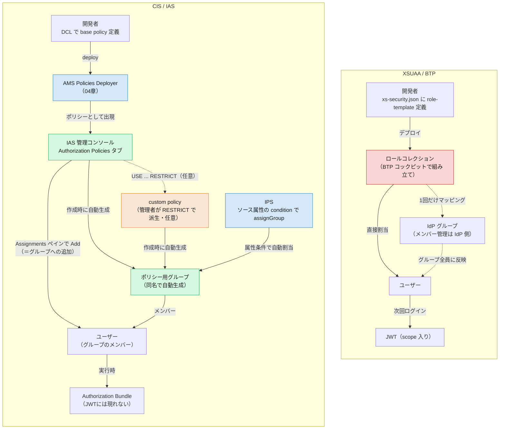

# 05. ロール割当・管理の違い — BTP コックピットから IAS 管理コンソールへ

> **この章の要点**
> XSUAA では、`xs-security.json` の role-template を土台に、管理者が **BTP コックピット** で「ロールコレクション」を組み立て、ユーザーまたは IdP グループに割り当てていました。CIS では、この「割当という行為」自体が **IAS 管理コンソール** に移り、割り当てる対象も「ロールコレクション」ではなく **認可ポリシー**（DCL の base policy／管理者が派生する custom policy、[03 章](03-authorization.md#base-policy-と実行時ポリシー開発者-vs-管理者)参照）そのものになります。**認可ポリシーを作成すると、同じ名前の「ユーザーグループ」が自動的に作られ**、そのグループにユーザーを追加することが割当そのものになります（§3）。手動での個別追加に加え、**IPS のプロビジョニング機能でソース属性を条件にこのグループへ自動割当**することもできます（§4）。
>
> **正直に言うと、これは AMS 側の制約でもあります。** ロールコレクションは複数アプリの role-template を横断して束ねられましたが、AMS の認可ポリシーは基本 **そのアプリ（`identity` インスタンス）に閉じ**、複数アプリのポリシーを一つの割当単位にまとめる標準機能はありません。同じ効果を得るには [共有 IAS アプリと集中 DCL](shared-ias-app-central-dcl.md) のように **アプリ構成そのものを変える**必要があり、これは AMS が標準で持つ機能というより **ロールコレクション相当のものを再現するための回避策**です。
>
> 前章（[04](04-configuration-artifacts.md)）で「認可の設定ファイルがどう変わったか」を見ました。本章は「その設定を、誰が・どこで・誰に割り当てるか」という **運用面**にフォーカスします。

---

## 1. 割当という行為の対比

| 観点 | XSUAA / BTP | CIS / IAS |
|---|---|---|
| 割当の器 | **ロールコレクション**（複数 role-template をまとめた入れ物） | **認可ポリシー**（base policy、または管理者が派生した custom policy）そのものを直接割当 |
| 割当場所 | BTP コックピット（サブアカウント → Security → Role Collections） | IAS 管理コンソール（Applications & Resources → Applications → 対象アプリ → **Authorization Policies** タブ） |
| 割当先の単位 | ユーザー **または** IdP グループへの一括マッピング（Map Role Collections to User Groups） | ユーザー、**または**（実体としては）**ポリシーと同名で自動生成されるグループ**への追加。IPS の属性条件付きプロビジョニングで一括・自動割当も可能（§3・§4） |
| 「器」を作るのは誰か | 開発者が `xs-security.json` で role-template を定義 → 管理者が BTP コックピットでロールコレクションに組み合わせる | 開発者が DCL で base policy を定義 → 管理者はそのまま割り当てるか、Admin Console で `USE ... RESTRICT` して custom policy を派生 |
| 反映されるタイミング | 次回ログイン時、新しい JWT（scope 入り）が発行される | 実行時、AMS が配布する **Authorization Bundle** に反映（[03 章](03-authorization.md#4-判定はどこでいつ起きるか--実行時-pdp-と-authorization-bundle)）。JWT には現れない |
| 複数アプリのポリシーを束ねる | ロールコレクションは **複数アプリの role-template を横断して束ねられる**（標準機能） | 認可ポリシーは基本 **1 つのアプリ（`identity` インスタンス）に閉じる**。束ねるには[共有 IAS アプリ＋集中 DCL](shared-ias-app-central-dcl.md)という **構成上の回避策**が必要（標準機能ではない） |

ポイントは、**「複数の権限をまとめる中間の器（ロールコレクション）を管理者が組み立てる」から「開発者が定義したポリシーを（必要なら絞り込んで）そのまま割り当てる」へ**、一段シンプルになったことです。ただし、これは単純な簡素化ではなく、一部は形を変えて残っています。「グループへ一括で割り当てる」という BTP の発想は、AMS では「**ポリシーごとに自動生成されるグループ**にユーザーを追加する」という形で実現されており（§3）、むしろ IPS と組み合わせると **属性条件による自動割当**まで可能です。一方、「複数アプリの権限を1つの器にまとめる」という BTP では標準機能だったことは、AMS では構成上の回避策（共有 IAS アプリ）に頼る必要があります——こちらは本当になくなった機能です。

---

## 2. 割当の手順（実際の画面遷移）

### XSUAA / BTP（おさらい）

1. 開発者が `xs-security.json` に role-template を定義。
2. 管理者が BTP コックピットの **Security → Role Collections** でロールコレクションを作成し、role-template を追加。
3. ロールコレクションを **ユーザーに直接割当**、または **IdP グループにマッピング**（[Map Role Collections to User Groups](https://help.sap.com/docs/BTP/65de2977205c403bbc107264b8eccf4b/51acfc82c0c54db59de0a528f343902c.html)）。後者を使うと、グループのメンバー管理は IdP 側に任せられ、BTP 側でのマッピング設定は最初の 1 回だけで済みます。

### CIS / IAS

1. 開発者が DCL で base policy を定義し、**AMS Policies Deployer App**（[04 章](04-configuration-artifacts.md#4-ビルドデプロイの成果物--cds-add-ams-が生成するもの)）で AMS へアップロード。
2. 管理者が **IAS 管理コンソール**にサインインし、**Applications & Resources → Applications** から対象アプリを選択。
3. アプリ詳細ページの **Authorization Policies** タブを開く。
4. 割り当てたいポリシーを選択すると **Assignments ペイン**が開く。
5. **Add** を選び、割り当てたい**ユーザーを選択**して Add。

（手順は [Assign Authorization Policies](https://help.sap.com/docs/IDENTITY_AUTHENTICATION/6d6d63354d1242d185ab4830fc04feb1/eac8e5e5db394e9ba409e68c66eedb77.html) より。CAP アプリでも同じ管理コンソールを使います — [CAP: Assign Policies in the Administrative Console](https://cap.cloud.sap/docs/node.js/authentication#assign-policies-in-the-administrative-console)）

> **裏側の実体はグループです**: ポリシーを作成すると、**そのポリシーと同じ名前のユーザーグループが自動生成**されます。上記の Assignments ペインでの Add はこのグループへの追加と同じ操作で、`Users & Authorizations → User Groups` からポリシー名のグループを探して直接ユーザーを追加することでも同じ結果になります（詳細は §3）。

base policy をそのまま割り当てることも、管理者が **Admin Console 上で `USE ... RESTRICT` して custom policy を作り**（[03 章](03-authorization.md#base-policy-と実行時ポリシー開発者-vs-管理者)）、それを割り当てることもできます。

> **ただし、これを無条件の「自由度」として評価するのは誤りです。** 本番の Admin Console でいきなりポリシーを手作りする運用は、変更管理・監査・DCL の後方互換性（[03 章](03-authorization.md#base-policy-と実行時ポリシー開発者-vs-管理者)の Forbidden Changes）の観点から通常は推奨されません。実運用の本流は、あくまで **開発環境で DCL をコードとして書き、deployer で移送する**（base policy として）ことです。Admin Console での custom policy 作成は、テナント固有の細かい調整や緊急対応のための**逃げ道**であって、「顧客管理者にポリシー作成を任せてよい」という設計思想ではありません。移送を前提にするなら、絞り込みの条件も **コードとして DCL に書き、deployer で流す**方を優先すべきです。

---

## 3. グループの役割の違い 🔑

BTP は「ロールコレクション ⇄ IdP グループ」のマッピングを一級市民の機能として持ち、グループ単位の一括割当が前提の設計です。IAS も、実は同じ発想を **別の実装**で持っています。

**認可ポリシーを作成すると、そのポリシーと同じ名前の「ユーザーグループ」が自動的に作成されます**（SAP Help: *"When you create a new authorization policy, a new user group is automatically created with the same name you specified for the authorization policy."*）。つまり——

- ポリシーへの割当は、実体としては **`Users & Authorizations → User Groups` にある、ポリシーと同名のグループへの追加**である。
- §2 の「Assignments ペインで Add」は、このグループを操作する専用 UI にすぎない。
- 管理者は **`Combine Authorization Policies`** で、同一アプリ内の複数ポリシーを1つの新しいポリシー（＝1つの新しいグループ）に合成することもできる（[Combine Authorization Policies](https://help.sap.com/docs/IDENTITY_AUTHENTICATION/6d6d63354d1242d185ab4830fc04feb1/1a69414b93ed44f8917fae5d6d6a430d.html)。ただし対象は同一アプリのポリシーに限られ、§1 で見た「アプリを跨いだ束ね」の代替にはならない）。

つまり **グループはむしろ AMS の割当の中核**であり、BTP のロールコレクション ⇄ グループマッピングに近い発想が、CIS では「ポリシー＝グループ」という形で実装されています。IAS 管理コンソールでの手動割当に加えて、**IPS のプロビジョニングでこのグループへ自動的にユーザーを追加する**こともできます（§4）——これは BTP の「IdP グループをロールコレクションにマッピングし、メンバー管理を IdP に任せる」やり方よりも、実は一歩進んだ仕組みです。属性条件（例: `department = 'Finance'`）で **動的に**振り分けられるためです。

> ⚠️ **05 章 初版からの訂正**: 初版では「IAS の割当はユーザー単位のみで、グループへの一括割当はできない」と書きましたが、これは誤りでした。上記の通り、ポリシー＝自動生成グループという実装により、グループベースの割当・自動化は可能です。この節と次節（§4 IPS）を訂正しています。

---

## 4. IPS（Identity Provisioning）の位置づけ — ポリシー割当も自動化できる

CIS を構成する 3 サービス（[README](README.md#cis-を構成する-3-つのサービス)）のうち、**IPS（Identity Provisioning）** は「誰が存在し、どのグループに属するか」を人事システムや他の IdP と同期する役割です。ユーザー・グループのデータそのものは **Identity Directory**（CIS の永続化レイヤー）に格納され、IPS はそこへの同期パイプラインを担います（SCIM ベース、フル/デルタ実行可能）。

§3 で見た通り、認可ポリシーの実体はグループです。したがって——

- **IPS が同期するもの**: ユーザーアカウント、**グループメンバーシップ**（＝ポリシー割当を含む）、属性値（`$user.department` など、[ユーザー属性による動的な認可](dynamic-authorization-user-attributes.md)の ABAC で使うもの）。
- **IPS はポリシー割当も自動化できる**: ターゲットシステムの transformation に **`assignGroup`**（または `unassignGroup`）という変数を使ったマッピングを追加するだけで、標準／リアルタイムプロビジョニングの一部としてグループ（＝ポリシー）割当が行われます（[Enabling Group Assignment](https://help.sap.com/docs/IDENTITY_AUTHENTICATION/6d6d63354d1242d185ab4830fc04feb1/0d80033336474468bb64ef8aeb7e3dd8.html)）。しかも、このマッピングは **`condition` にソース属性のフィルタ式**を指定できるため、**ソースシステムのユーザー属性に応じて割り当てるポリシーを自動で振り分けられます**:

  ```json
  {
    "condition": "($.department EQUALS 'Finance')",
    "constant": [{ "id": "<ポリシー用グループのID>" }],
    "targetVariable": "assignGroup"
  }
  ```

  SAP 自身がこれを *"Group Assignments Based on User Attributes"* として、条件付き認証などと並ぶ活用例で紹介しています。BTP の「IdP グループをロールコレクションにマッピングし、メンバー管理を IdP に任せる」方式と同じ**自動化のゴール**を、CIS では **IPS の属性条件マッピング**で（理論上はより柔軟な形で）達成できます。

> **ただし、これが現実的なのはポリシー数が少ないうちだけです。** `Enabling Group Assignment` の仕様上、**同じユーザーが複数の `condition` にマッチした場合、最後にマッチした条件だけが適用されます**（*"only the last matching condition is applied"*）。つまり、ポリシーごとに独立した条件を単純に並べても意図通りには動かず、**相互排他になるよう条件を注意深く整理・順序管理**する必要があります。ポリシーの数が増えるほど、この transformation 自体が複雑になり、組織変更（部署再編・新ポリシー追加）のたびに書き換えが必要になります——これは通常のアプリコードのようにテスト・レビュー・バージョン管理がしやすい場所ではありません。
>
> 現実的に機能するのは、**セントラル DCL 側で職位単位くらいの粗いポリシー**（例: Manager／Staff／Auditor）だけを用意し、少数の条件分岐に収まる場合です。ポリシーがそれより細かい（＝ [03 章](03-authorization.md#3-インスタンスベース行レベル認可-)で見た ABAC の理想形に近づく）場合は、IPS の transformation に業務ロジックを直接書き込むのではなく、**属性→ポリシーのマッピングテーブルを別途持ち、SCIM API（Identity Directory API）で割当を行う専用アプリケーション**を用意する方が現実的です。マッピングロジックを通常のコードとして書けば、テスト・レビュー・Git 履歴の対象にできます。IPS はあくまで「ユーザー・属性の同期基盤」に徹し、ポリシー割当の判断ロジックはそこから切り離す、という設計判断です。

> 「誰が存在するか」（Identity Directory）と「その人が何をしてよいか」（認可ポリシー＝グループ）は依然として別の概念ですが、**両者は同じグループという器で交差**しており、単純なケースでは IPS のプロビジョニング設定だけで両方を横断的に自動化できる、という点は XSUAA 時代にはなかった統合です（ただし上記の通り、規模が大きくなるとこの単純さは長続きしません）。

> XSUAA 時代、BTP はユーザーストア自体を持たず IdP に委譲していたのに対し、CIS では **Identity Directory が標準のユーザーストア**として組み込まれ、IPS がその同期経路になる——という位置づけの違いもあります（詳細は [What Are Cloud Identity Services?](https://help.sap.com/docs/IDENTITY_AUTHENTICATION/6d6d63354d1242d185ab4830fc04feb1/27882717f44b445fa287936c6f43dc1f.html)）。

---

## 5. App-to-App: どのアプリがどの API を消費してよいかも管理者が決める

ユーザーへの割当だけでなく、**アプリ間（App-to-App）の権限**も管理者マターです。「どのアプリがどの API 権限グループを消費できるか」は、アプリ自身ではなく **SCI テナントの管理者**が決めます（[Technical Communication](../docs/Authorization/TechnicalCommunication.md)）。

> The decision **which application** may consume which API permission group is made by the administrator of the SAP Cloud Identity Services tenant, not by the application itself.

この決定はトークンの **`ias_apis`** クレームに反映され（[02 章 §5](02-authentication.md#5-app-to-app-の認証方式技術通信--主体伝播)）、Provider アプリ側は「その API 権限グループにどんな DCL の `INTERNAL POLICY` を対応させるか」だけを決めます（06 章）。つまり——

- **「誰が何をしてよいか」の割当**（本章 §2）と
- **「どのアプリが何を消費してよいか」の割当**

の両方が、同じ **IAS 管理コンソール**（アプリの Trust/dependency 設定と Authorization Policies 設定）に集約されているのが CIS の特徴です。

> **ただし、これは純粋な追加コストでもあります。** XSUAA では技術通信・主体伝播の認可は基本 scope 判定の延長で済んでいましたが、CIS では App-to-App のたびに **dependency 登録・`INTERNAL POLICY` の用意・API 権限グループ→ポリシーのマッピング関数実装**という複数ステップが新たに必要になります。「アプリ間の権限がより明示的になった」という利点はある一方で、**開発・運用の手間が単純に増える**というトレードオフも正直に見ておくべきです。

App-to-App の dependency 登録・Destination 設定の具体手順は [App-to-App 連携の設定と証明書運用](app2app-and-certificate-operations.md) にまとめています。

---

## 6. 図で見る：管理・割当フローの対比



XSUAA 側は「ロールコレクションという器を作り、ユーザーかグループに割り当てる」2 段階です。CIS 側も、実体としては「ポリシー＝自動生成されるグループ」に対して、管理コンソールで個別に、または **IPS が属性条件で自動的に**、ユーザーを追加していく流れであり、見た目ほど単純な「個別割当のみ」ではありません。両者で異なるのは、**割当の結果が反映されるタイミング**です——XSUAA は次回ログインで新しい JWT に、CIS は実行時に配布される Authorization Bundle に反映されます。

---

## この章のまとめ

- 割当の器が **ロールコレクション → 認可ポリシー（base policy／custom policy）**に変わり、開発者の定義をそのまま、または管理者が絞り込んで割り当てる。
- 割当作業の場所が **BTP コックピット → IAS 管理コンソール**（Applications & Resources → Applications → 対象アプリ → Authorization Policies タブ → Assignments）に移る。
- **認可ポリシーの実体はグループ。** ポリシーを作成すると同名のユーザーグループが自動生成され、そのグループへの追加が割当そのものになる。管理コンソールの「Assignments ペインで Add」はこのグループを操作する専用 UI にすぎない。
- **グループへの一括割当・自動割当は可能だが、規模には限界がある。** IPS の `assignGroup` 変数 ＋ `condition` で属性ベースの自動割当ができるが、**同じユーザーが複数条件にマッチすると最後の条件だけが勝つ**仕様のため、ポリシーが増えると条件管理が複雑化する。現実的なのは職位単位程度の粗いポリシーまで。ポリシーが細かい場合は、マッピングテーブル＋SCIM APIで割り当てる専用アプリを作る方が保守しやすい。
- **複数アプリのポリシーを束ねる標準機能はない。** ロールコレクションは複数アプリの role-template を横断して束ねられたが、AMS の認可ポリシー（＝グループ）はアプリ（`identity` インスタンス）単位に閉じる。`Combine Authorization Policies` も同一アプリ内が対象。束ねたい場合は[共有 IAS アプリ＋集中 DCL](shared-ias-app-central-dcl.md)という構成上の回避策が必要——これが XSUAA → CIS で一番の運用上の課題になり得る。
- **Admin Console での custom policy 作成を無条件の利点と見ない。** 本流はあくまで開発環境で DCL をコードとして書き、deployer で移送すること。管理者による直接作成はテナント固有の調整・緊急対応の逃げ道であり、変更管理や DCL の後方互換性の観点から本番での多用は推奨されない。
- **IPS（Identity Provisioning）**は「誰が存在し、どのグループに属するか」を同期するレイヤーだが、グループ＝ポリシーである以上、**「何をしてよいか」の割当も実質的に担える**（上記）。
- **App-to-App** も同じ IAS 管理コンソールで管理され、「どのアプリがどの API 権限グループを消費できるか」は **SCI テナント管理者**が決める（`ias_apis`）。ただしこれは XSUAA になかった **追加の設定コスト**（dependency 登録・`INTERNAL POLICY`・マッピング関数実装）でもある。
- 反映タイミングも異なる：XSUAA は次回ログインで新しい JWT、CIS は実行時に配布される Authorization Bundle。

## 次に読む

- **[06. ライブラリ・実装の違い](06-libraries-implementation.md)** *(作成予定)* — `@sap/xssec` の scope 判定から、**AMS クライアントライブラリ・CAP 連携**へ
