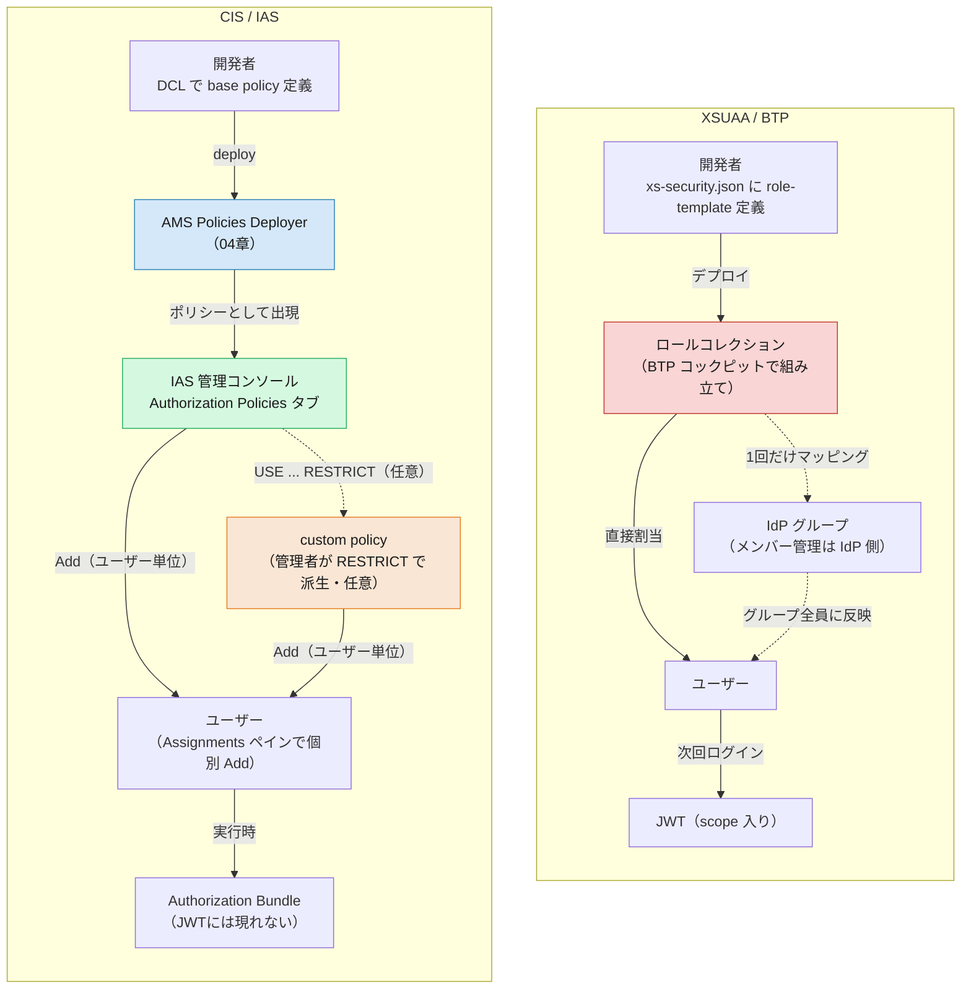

# 05. ロール割当・管理の違い — BTP コックピットから IAS 管理コンソールへ

> **この章の要点**
> XSUAA では、`xs-security.json` の role-template を土台に、管理者が **BTP コックピット** で「ロールコレクション」を組み立て、ユーザーまたは IdP グループに割り当てていました。CIS では、この「割当という行為」自体が **IAS 管理コンソール** に移り、割り当てる対象も「ロールコレクション」ではなく **認可ポリシー**（DCL の base policy／管理者が派生する custom policy、[03 章](03-authorization.md#base-policy-と実行時ポリシー開発者-vs-管理者)参照）そのものになります。割当の単位は基本 **ユーザー単位**で、BTP のような「グループへの一括マッピング」は現行の手順にはありません。
>
> **正直に言うと、これは AMS 側の制約でもあります。** ロールコレクションは複数アプリの role-template を横断して束ねられましたが、AMS の認可ポリシーは基本 **そのアプリ（`identity` インスタンス）に閉じ**、複数アプリのポリシーを一つの割当単位にまとめる標準機能はありません。同じ効果を得るには [共有 IAS アプリと集中 DCL](shared-ias-app-central-dcl.md) のように **アプリ構成そのものを変える**必要があり、これは AMS が標準で持つ機能というより **ロールコレクション相当のものを再現するための回避策**です。
>
> 前章（[04](04-configuration-artifacts.md)）で「認可の設定ファイルがどう変わったか」を見ました。本章は「その設定を、誰が・どこで・誰に割り当てるか」という **運用面**にフォーカスします。

---

## 1. 割当という行為の対比

| 観点 | XSUAA / BTP | CIS / IAS |
|---|---|---|
| 割当の器 | **ロールコレクション**（複数 role-template をまとめた入れ物） | **認可ポリシー**（base policy、または管理者が派生した custom policy）そのものを直接割当 |
| 割当場所 | BTP コックピット（サブアカウント → Security → Role Collections） | IAS 管理コンソール（Applications & Resources → Applications → 対象アプリ → **Authorization Policies** タブ） |
| 割当先の単位 | ユーザー **または** IdP グループへの一括マッピング（Map Role Collections to User Groups） | **ユーザー単位**（ポリシーの Assignments ペインで Add → ユーザーを選択）。グループへの直接割当は現行の手順にはない |
| 「器」を作るのは誰か | 開発者が `xs-security.json` で role-template を定義 → 管理者が BTP コックピットでロールコレクションに組み合わせる | 開発者が DCL で base policy を定義 → 管理者はそのまま割り当てるか、Admin Console で `USE ... RESTRICT` して custom policy を派生 |
| 反映されるタイミング | 次回ログイン時、新しい JWT（scope 入り）が発行される | 実行時、AMS が配布する **Authorization Bundle** に反映（[03 章](03-authorization.md#4-判定はどこでいつ起きるか--実行時-pdp-と-authorization-bundle)）。JWT には現れない |
| 複数アプリのポリシーを束ねる | ロールコレクションは **複数アプリの role-template を横断して束ねられる**（標準機能） | 認可ポリシーは基本 **1 つのアプリ（`identity` インスタンス）に閉じる**。束ねるには[共有 IAS アプリ＋集中 DCL](shared-ias-app-central-dcl.md)という **構成上の回避策**が必要（標準機能ではない） |

ポイントは、**「複数の権限をまとめる中間の器（ロールコレクション）を管理者が組み立てる」から「開発者が定義したポリシーを（必要なら絞り込んで）そのまま割り当てる」へ**、一段シンプルになったことです。ただし、これは単純な簡素化ではなく **できなくなったこともある** という点に注意が必要です。「グループへ一括で割り当てる」という BTP の便利機能は AMS のポリシー割当には（現行手順上は）なく、「複数アプリの権限を1つの器にまとめる」という BTP では標準機能だったことも、AMS では構成上の回避策（共有 IAS アプリ）に頼る必要があります。

---

## 2. 割当の手順（実際の画面遷移）

### XSUAA / BTP（おさらい）

1. 開発者が `xs-security.json` に role-template を定義。
2. 管理者が BTP コックピットの **Security → Role Collections** でロールコレクションを作成し、role-template を追加。
3. ロールコレクションを **ユーザーに直接割当**、または **IdP グループにマッピング**（[Map Role Collections to User Groups](https://help.sap.com/docs/BTP/65de2977205c403bbc107264b8eccf4b/51acfc82c0c54db59de0a528f343902c.html)）。後者を使うと、グループのメンバー管理は IdP 側に任せられ、BTP 側でのマッピング設定は最初の 1 回だけで済みます。

### CIS / IAS

1. 開発者が DCL で base policy を定義し、**AMS Policies Deployer App**（[04 章](04-configuration-artifacts.md#4-ビルドデプロイの成果物--cds-add-ams-が生成するもの)）で AMS へアップロード。
2. 管理者が **IAS 管理コンソール**にサインインし、**Applications & Resources → Applications** から対象アプリを選択。
3. アプリ詳細ページの **Authorization Policies** タブを開く。
4. 割り当てたいポリシーを選択すると **Assignments ペイン**が開く。
5. **Add** を選び、割り当てたい**ユーザーを選択**して Add。

（手順は [Assign Authorization Policies](https://help.sap.com/docs/IDENTITY_AUTHENTICATION/6d6d63354d1242d185ab4830fc04feb1/eac8e5e5db394e9ba409e68c66eedb77.html) より。CAP アプリでも同じ管理コンソールを使います — [CAP: Assign Policies in the Administrative Console](https://cap.cloud.sap/docs/node.js/authentication#assign-policies-in-the-administrative-console)）

base policy をそのまま割り当てることも、管理者が **Admin Console 上で `USE ... RESTRICT` して custom policy を作り**（[03 章](03-authorization.md#base-policy-と実行時ポリシー開発者-vs-管理者)）、それを割り当てることもできます。

> **ただし、これを無条件の「自由度」として評価するのは誤りです。** 本番の Admin Console でいきなりポリシーを手作りする運用は、変更管理・監査・DCL の後方互換性（[03 章](03-authorization.md#base-policy-と実行時ポリシー開発者-vs-管理者)の Forbidden Changes）の観点から通常は推奨されません。実運用の本流は、あくまで **開発環境で DCL をコードとして書き、deployer で移送する**（base policy として）ことです。Admin Console での custom policy 作成は、テナント固有の細かい調整や緊急対応のための**逃げ道**であって、「顧客管理者にポリシー作成を任せてよい」という設計思想ではありません。移送を前提にするなら、絞り込みの条件も **コードとして DCL に書き、deployer で流す**方を優先すべきです。

---

## 3. グループの役割の違い 🔑

BTP は「ロールコレクション ⇄ IdP グループ」のマッピングを **一級市民の機能**として持ち、グループ単位の一括割当が前提の設計です。一方、IAS の認可ポリシー割当手順（上記 §2）は **ユーザー単位**で、Assignments ペインにもグループを直接追加する操作は登場しません。

IAS にも **グループ**（Identity Directory 機能。管理者が作成し、ユーザーを追加/削除できる — [Managing Groups](https://help.sap.com/docs/IDENTITY_AUTHENTICATION/6d6d63354d1242d185ab4830fc04feb1/ddd067c899f94e2f9006cc4dd417be80.html)）はありますが、その主な用途は **条件付き認証・リスクベース認証**（特定グループにだけ 2FA を強制する、等）であり、BTP のロールコレクションのように「グループ＝認可ポリシーの一括割当単位」という位置づけではありません。

> 大人数への権限展開を自動化したい場合は、SCIM API 経由でユーザー管理・グループ管理を行う運用（後述の IPS）と組み合わせるか、ユーザー属性（`$user.department` 等）を条件にした **単一ポリシー**で表現する方が CIS らしいアプローチです（[ユーザー属性による動的な認可](dynamic-authorization-user-attributes.md)）。「大勢に同じロールを配る」から「属性で自動的に絞り込む」への発想転換は、[03 章](03-authorization.md#3-インスタンスベース行レベル認可-)で見たインスタンスベース認可と同じ思想です。

---

## 4. IPS（Identity Provisioning）の位置づけ

CIS を構成する 3 サービス（[README](README.md#cis-を構成する-3-つのサービス)）のうち、**IPS（Identity Provisioning）** は「誰が存在し、どのグループに属するか」を人事システムや他の IdP と同期する役割です。ユーザー・グループのデータそのものは **Identity Directory**（CIS の永続化レイヤー）に格納され、IPS はそこへの同期パイプラインを担います（SCIM ベース、フル/デルタ実行可能）。

- **IPS が同期するもの**: ユーザーアカウント、グループメンバーシップ、属性値（`$user.department` など、[04 章](dynamic-authorization-user-attributes.md)の ABAC で使うもの）。
- **IPS がしないこと**: 認可ポリシーの割当そのもの。「誰が存在するか」（IPS/Identity Directory）と「その人が何をしてよいか」（AMS の認可ポリシー割当、本章 §2）は、CIS でも明確に別レイヤーです。

> XSUAA 時代、BTP はユーザーストア自体を持たず IdP に委譲していたのに対し、CIS では **Identity Directory が標準のユーザーストア**として組み込まれ、IPS がその同期経路になる——という位置づけの違いもあります（詳細は [What Are Cloud Identity Services?](https://help.sap.com/docs/IDENTITY_AUTHENTICATION/6d6d63354d1242d185ab4830fc04feb1/27882717f44b445fa287936c6f43dc1f.html)）。

---

## 5. App-to-App: どのアプリがどの API を消費してよいかも管理者が決める

ユーザーへの割当だけでなく、**アプリ間（App-to-App）の権限**も管理者マターです。「どのアプリがどの API 権限グループを消費できるか」は、アプリ自身ではなく **SCI テナントの管理者**が決めます（[Technical Communication](../docs/Authorization/TechnicalCommunication.md)）。

> The decision **which application** may consume which API permission group is made by the administrator of the SAP Cloud Identity Services tenant, not by the application itself.

この決定はトークンの **`ias_apis`** クレームに反映され（[02 章 §5](02-authentication.md#5-app-to-app-の認証方式技術通信--主体伝播)）、Provider アプリ側は「その API 権限グループにどんな DCL の `INTERNAL POLICY` を対応させるか」だけを決めます（06 章）。つまり——

- **「誰が何をしてよいか」の割当**（本章 §2）と
- **「どのアプリが何を消費してよいか」の割当**

の両方が、同じ **IAS 管理コンソール**（アプリの Trust/dependency 設定と Authorization Policies 設定）に集約されているのが CIS の特徴です。

> **ただし、これは純粋な追加コストでもあります。** XSUAA では技術通信・主体伝播の認可は基本 scope 判定の延長で済んでいましたが、CIS では App-to-App のたびに **dependency 登録・`INTERNAL POLICY` の用意・API 権限グループ→ポリシーのマッピング関数実装**という複数ステップが新たに必要になります。「アプリ間の権限がより明示的になった」という利点はある一方で、**開発・運用の手間が単純に増える**というトレードオフも正直に見ておくべきです。

App-to-App の dependency 登録・Destination 設定の具体手順は [App-to-App 連携の設定と証明書運用](app2app-and-certificate-operations.md) にまとめています。

---

## 6. 図で見る：管理・割当フローの対比

XSUAA 側は「ロールコレクションという器を作り、ユーザーかグループに割り当てる」2 段階、CIS 側は「開発者のポリシーを、必要なら絞り込んで、ユーザーに直接割り当てる」流れです。どちらも最終的にユーザーへ辿り着きますが、CIS では **グループへの一括マッピングという近道が(現行手順上は)なく**、**割当の結果が JWT ではなく実行時の Authorization Bundle に反映される**点が異なります。

---

## この章のまとめ

- 割当の器が **ロールコレクション → 認可ポリシー（base policy／custom policy）**に変わり、開発者の定義をそのまま、または管理者が絞り込んで割り当てる。
- 割当作業の場所が **BTP コックピット → IAS 管理コンソール**（Applications & Resources → Applications → 対象アプリ → Authorization Policies タブ → Assignments）に移る。
- 割当の単位は基本 **ユーザー単位**。BTP の「ロールコレクション ⇄ IdP グループ」マッピングに相当する、グループへの一括割当は現行の手順にはない。
- **複数アプリのポリシーを束ねる標準機能もない。** ロールコレクションは複数アプリの role-template を横断して束ねられたが、AMS の認可ポリシーはアプリ（`identity` インスタンス）単位に閉じる。束ねたい場合は[共有 IAS アプリ＋集中 DCL](shared-ias-app-central-dcl.md)という構成上の回避策が必要——これが XSUAA → CIS で一番の運用上の課題になり得る。
- **Admin Console での custom policy 作成を無条件の利点と見ない。** 本流はあくまで開発環境で DCL をコードとして書き、deployer で移送すること。管理者による直接作成はテナント固有の調整・緊急対応の逃げ道であり、変更管理や DCL の後方互換性の観点から本番での多用は推奨されない。
- **IPS（Identity Provisioning）**は「誰が存在し、どのグループに属するか」を同期するレイヤーで、「何をしてよいか」を決める AMS の認可ポリシー割当とは明確に別。
- **App-to-App** も同じ IAS 管理コンソールで管理され、「どのアプリがどの API 権限グループを消費できるか」は **SCI テナント管理者**が決める（`ias_apis`）。ただしこれは XSUAA になかった **追加の設定コスト**（dependency 登録・`INTERNAL POLICY`・マッピング関数実装）でもある。
- 反映タイミングも異なる：XSUAA は次回ログインで新しい JWT、CIS は実行時に配布される Authorization Bundle。

## 次に読む

- **[06. ライブラリ・実装の違い](06-libraries-implementation.md)** *(作成予定)* — `@sap/xssec` の scope 判定から、**AMS クライアントライブラリ・CAP 連携**へ
