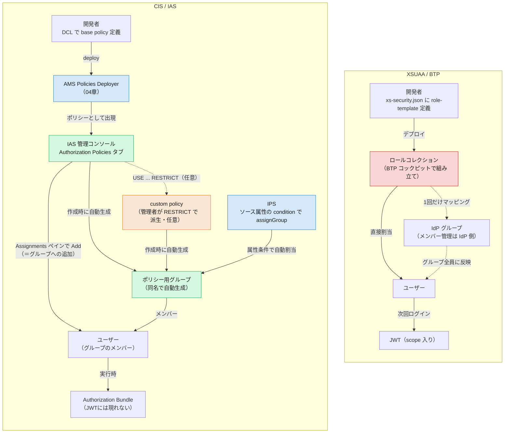

# 05. ロール割当・管理の違い — BTP コックピットから IAS 管理コンソールへ

> **この章の要点**
> XSUAA では、管理者が **BTP コックピット**で「ロールコレクション」（複数アプリの role-template をまとめた器）を組み立て、ユーザーや IdP グループに割り当てていました。CIS では、この割当が **IAS 管理コンソール**に移り、割り当てる対象も **認可ポリシー**（[03 章](03-authorization.md#base-policy-と実行時ポリシー開発者-vs-管理者)の base policy／custom policy）そのものになります。ポイントは、**認可ポリシーを作ると同名の「ユーザーグループ」が自動生成され、そのグループにユーザーを追加することが割当そのもの**になることです（§3）。手動追加のほか、**IPS のプロビジョニングで属性条件による自動割当**もできます（§4）。
>
> 一点、正直な制約があります。ロールコレクションは複数アプリの権限を「1つの名前」に束ねられましたが、**AMS にそれに相当する再利用可能な名前付きバンドルはありません**。ただし「横断的に扱う場所」自体が無いわけではなく、**Identity Directory が全アプリの割当を集約する中央ハブ**として機能します（§3 末尾）。
>
> 前章（[04](04-configuration-artifacts.md)）では「認可の設定ファイルがどう変わったか」を見ました。本章は「その設定を、誰が・どこで・誰に割り当てるか」という**運用面**にフォーカスします。

---

## 1. 割当という行為の対比

| 観点 | XSUAA / BTP | CIS / IAS |
|---|---|---|
| 割当の器 | **ロールコレクション**（複数 role-template をまとめた入れ物） | **認可ポリシー**（base policy／custom policy）を直接割当 |
| 割当場所 | BTP コックピット（サブアカウント → Security → Role Collections） | IAS 管理コンソール（Applications & Resources → Applications → 対象アプリ → **Authorization Policies** タブ） |
| 割当先の単位 | ユーザー、または IdP グループへの一括マッピング | ユーザー、または**ポリシーと同名で自動生成されるグループ**への追加。IPS で属性条件付きの自動割当も可能（§3・§4） |
| 「器」を作るのは誰か | 開発者が role-template を定義 → 管理者がロールコレクションに組み合わせる | 開発者が DCL で base policy を定義 → 管理者はそのまま割り当てるか、Admin Console で `USE ... RESTRICT` して custom policy を派生 |
| 反映タイミング | 次回ログイン時、新しい JWT（scope 入り）が発行される | 実行時、AMS が配布する **Authorization Bundle** に反映（[03 章](03-authorization.md#4-判定はどこでいつ起きるか--実行時-pdp-と-authorization-bundle)）。JWT には現れない |
| 複数アプリの権限を束ねる | ロールコレクションが複数アプリの権限を「1つの名前」に束ねる（再利用可能な名前付きバンドル） | **名前付きバンドルは無い**が、**Identity Directory が全アプリの割当を横断的に扱う中央ハブ**として機能する（§3）。集中 DCL は**カスタム CAP 側を少数の業務ロール型グループに整形**する手段で、割当自体は Identity Directory 層（[共有 IAS 構成](shared-ias-app-central-dcl.md)・§3） |

大きな流れは、**「管理者が中間の器を組み立てる」から「開発者が定義したポリシーを（必要なら絞り込んで）そのまま割り当てる」へ**一段シンプルになったことです。ただし「グループへ一括割当」「複数アプリを横断して扱う」という発想が消えたわけではありません。前者は「ポリシー＝自動生成グループにユーザーを追加する」形で（§3）、後者は「**Identity Directory という単一ハブに全アプリの割当が集約される**」形で（§3 末尾）残っています。本当に無くなったのは、**1つの名前を割り当てるだけで複数アプリ分が自動展開される再利用可能なバンドル・オブジェクト**だけです。

---

## 2. 割当の手順（実際の画面遷移）

### XSUAA / BTP（おさらい）

1. 開発者が `xs-security.json` に role-template を定義。
2. 管理者が BTP コックピットの **Security → Role Collections** でロールコレクションを作成し、role-template を追加。
3. ロールコレクションを**ユーザーに直接割当**、または **IdP グループにマッピング**（[Map Role Collections to User Groups](https://help.sap.com/docs/BTP/65de2977205c403bbc107264b8eccf4b/51acfc82c0c54db59de0a528f343902c.html)）。後者ならメンバー管理は IdP 側に任せられ、BTP 側の設定は最初の1回だけで済む。

### CIS / IAS

1. 開発者が DCL で base policy を定義し、**AMS Policies Deployer App**（[04 章](04-configuration-artifacts.md#4-ビルドデプロイの成果物--cds-add-ams-が生成するもの)）で AMS へアップロード。
2. 管理者が **IAS 管理コンソール**で **Applications & Resources → Applications** から対象アプリを選択。
3. **Authorization Policies** タブを開き、割り当てたいポリシーを選択すると **Assignments ペイン**が開く。
4. **Add** から割り当てたいユーザーを選んで追加。

この Assignments ペインでの Add は、実体としては**ポリシーと同名で自動生成されたグループへの追加**です（§3）。`Users & Authorizations → User Groups` からポリシー名のグループを直接開いても同じ結果になります。

base policy をそのまま割り当てるほか、管理者が **Admin Console 上で `USE ... RESTRICT` して custom policy を派生**（[03 章](03-authorization.md#base-policy-と実行時ポリシー開発者-vs-管理者)）させて割り当てることもできます。ただし本流はあくまで**開発環境で DCL をコードとして書き、deployer で移送する**ことです。本番の Admin Console で直接ポリシーを手作りするのは、変更管理・監査・DCL の後方互換性（[03 章](03-authorization.md#base-policy-と実行時ポリシー開発者-vs-管理者)の Forbidden Changes）の観点から、テナント固有の調整や緊急対応の**逃げ道**であって、常用する設計思想ではありません。

（手順は [Assign Authorization Policies](https://help.sap.com/docs/IDENTITY_AUTHENTICATION/6d6d63354d1242d185ab4830fc04feb1/eac8e5e5db394e9ba409e68c66eedb77.html)。CAP アプリでも同じ管理コンソールを使います — [CAP: Assign Policies in the Administrative Console](https://cap.cloud.sap/docs/node.js/authentication#assign-policies-in-the-administrative-console)）

---

## 3. グループの役割の違い 🔑

**認可ポリシーを作成すると、そのポリシーと同名の「ユーザーグループ」が自動的に作られます**（SAP Help: *"When you create a new authorization policy, a new user group is automatically created with the same name you specified for the authorization policy."*）。つまり——

- ポリシーへの割当は、実体としては **`Users & Authorizations → User Groups` にある同名グループへの追加**である。
- §2 の「Assignments ペインで Add」は、このグループを操作する専用 UI にすぎない。
- 管理者は **`Combine Authorization Policies`** で同一アプリ内の複数ポリシーを1つに合成できる（[Combine Authorization Policies](https://help.sap.com/docs/IDENTITY_AUTHENTICATION/6d6d63354d1242d185ab4830fc04feb1/1a69414b93ed44f8917fae5d6d6a430d.html)。ただし対象は同一アプリ内に限られ、アプリを跨いだ束ねの代替にはならない）。

グループはむしろ AMS の割当の**中核**であり、BTP の「ロールコレクション ⇄ IdP グループ」に近い発想が「ポリシー＝グループ」という形で実装されています。手動割当に加えて **IPS で属性条件による自動割当**（§4）もできる点は、BTP のグループマッピングより一歩進んだ仕組みです。

### 複数アプリを横断する割当先 — Identity Directory が中央ハブ

前述の通り**名前付きの再利用可能なバンドル**（ロールコレクション相当）はありませんが、**複数アプリの権限を横断して見て・割り当てる中央の場所**は標準で用意されています。SAP の公式リファレンスアーキテクチャ（[Authorization with SAP Cloud Identity Services](https://architecture.learning.sap.com/docs/ref-arch/20c6b29b1e/3)）は、**Identity Directory を認可割当の中央集約ポイント**と位置づけています（*"Identity Directory is the central point for the authorization assignments."*）。

- **AMS のポリシー**は自動でグループとして Identity Directory に公開される。
- **XSUAA のロールコレクション**も、IPS を設定すれば Identity Directory にグループとして複製できる。
- 他の SAP SaaS のロールも SCIM2 経由で同じ場所にグループとして並ぶ。
- UI には **user view**（1ユーザーに複数アプリのグループをまとめて割当）と **groups view** があり、標準 **SCIM2 API**（`/Groups`）でも同じ操作ができる。

つまり AMS・XSUAA（IPS 経由）・他 SAP SaaS の権限が、**すべて同じ Identity Directory の「グループ」として並び、1つのユーザーページから横断的に割り当てられます**——XSUAA 単体の BTP コックピットにはなかった統合です。ただし繰り返しになりますが、「Sales Manager」のような業務ロールを**1つの名前で表し、それを割り当てるだけで背後の複数グループが自動展開される**バンドル・オブジェクトは存在しません。「どのグループの組を割り当てるか」は、管理者または HR/IGA 側の命名規則・プロビジョニング設定として運用管理する必要があります。

この横断的な割当は **Identity Directory の標準 SCIM2 `/Groups` API** 経由でも行えます。これは業界標準プロトコルで、多くの HR/IGA（SAP Cloud Identity Access Governance、SailPoint、Saviynt 等）が標準で話せます。つまり「複数アプリの権限をまとめて割り当てたい」という要求は、**カスタムアプリを自作せず、既存の SCIM2 対応ツールの設定**で満たせる可能性が高い、ということです。

> **なぜ「一括割当」は中央 DCL では解けないのか — 標準 LoB ソリューションの存在** 🔑
> 複数アプリのポリシーを1箇所で束ねたくて [共有 IAS アプリ＋集中 DCL](shared-ias-app-central-dcl.md) を検討したくなりますが、それだけでは足りません。実務の業務ロール（例: Sales Manager）は、**カスタム CAP アプリの権限 ＋ 標準 SAP LoB ソリューション（S/4HANA Cloud・SuccessFactors 等）の権限**の両方にまたがります。標準アプリの権限は AMS ポリシーではないので中央 DCL には入らず、**それも Identity Directory のグループとして割り当てる**必要があります。
> つまり「1 ユーザーへの業務ロール一括割当」は、**原理的に Identity Directory / IGA（IAS の外側）でしか完結しません**。中央 DCL の役割は割当の代替ではなく、**カスタム CAP 側を少数の業務ロール型グループ（例: `salesManager`）に整形して、外側レイヤーの割当対象を減らす**ことです。両者は競合ではなく補完で、**「割当」という行為は常に Identity Directory 層に属します**。

---

## 4. IPS（Identity Provisioning）の位置づけ — ポリシー割当も自動化できる

CIS を構成する3サービス（[README](README.md#cis-を構成する-3-つのサービス)）のうち、**IPS** は「誰が存在し、どのグループに属するか」を人事システムや他の IdP と同期する役割です。ユーザー・グループのデータは **Identity Directory**（CIS の永続化レイヤー）に格納され、IPS がそこへの同期パイプライン（SCIM ベース、フル/デルタ実行可能）を担います。

§3 の通り認可ポリシーの実体はグループなので、**IPS はポリシー割当も自動化できます**。ターゲットシステムの transformation に **`assignGroup`**（または `unassignGroup`）変数のマッピングを追加し、`condition` にソース属性のフィルタ式を書けば、ユーザー属性に応じて割り当てるポリシーを自動で振り分けられます（[Enabling Group Assignment](https://help.sap.com/docs/IDENTITY_AUTHENTICATION/6d6d63354d1242d185ab4830fc04feb1/0d80033336474468bb64ef8aeb7e3dd8.html)）:

```json
{
  "condition": "($.department EQUALS 'Finance')",
  "constant": [{ "id": "<ポリシー用グループのID>" }],
  "targetVariable": "assignGroup"
}
```

BTP の「IdP グループをロールコレクションにマッピングし、メンバー管理を IdP に任せる」方式と同じ自動化のゴールを、CIS では IPS の属性条件マッピングで達成できます。

> **ただし、これが現実的なのはポリシー数が少ないうちだけです。** 仕様上、**同じユーザーが複数の `condition` にマッチした場合、最後にマッチした条件だけが適用されます**（*"only the last matching condition is applied"*）。条件を単純に並べても意図通りには動かず、相互排他になるよう順序を管理する必要があります。ポリシーが増えるほど transformation は複雑化し、組織変更のたびに書き換えが必要になります。現実的に機能するのは、**セントラル DCL 側で職位単位くらいの粗いポリシー**（例: Manager／Staff／Auditor）に留め、少数の条件分岐で収まる場合です。それより細かい場合は、IPS に業務ロジックを詰め込まず、§3 の **Identity Directory の SCIM2 API を話せる既存の HR/IGA ツール**にマッピング管理を任せる方が無難です。

---

## 5. App-to-App: どのアプリがどの API を消費してよいかも管理者が決める

ユーザーへの割当だけでなく、**アプリ間（App-to-App）の権限**も管理者マターです。「どのアプリがどの API 権限グループを消費できるか」は、アプリ自身ではなく **SCI テナントの管理者**が決めます（[Technical Communication](../docs/Authorization/TechnicalCommunication.md)）。

> The decision **which application** may consume which API permission group is made by the administrator of the SAP Cloud Identity Services tenant, not by the application itself.

この決定はトークンの **`ias_apis`** クレームに反映され（[02 章 §5](02-authentication.md#5-app-to-app-の認証方式技術通信--主体伝播)）、Provider 側は「その API 権限グループにどんな DCL の `INTERNAL POLICY` を対応させるか」を決めます（06 章）。**「誰が何をしてよいか」の割当**と**「どのアプリが何を消費してよいか」の割当**が、同じ **IAS 管理コンソール**に集約されているのが CIS の特徴です。

ただしこれは追加コストでもあります。XSUAA では技術通信の認可は scope 判定の延長で済んでいましたが、CIS では App-to-App のたびに **dependency 登録・`INTERNAL POLICY` の用意・API 権限グループ→ポリシーのマッピング関数実装**という複数ステップが新たに必要になります。具体手順は [App-to-App 連携の設定と証明書運用](app2app-and-certificate-operations.md) にまとめています。

---

## 6. 図で見る：管理・割当フローの対比



XSUAA は「器（ロールコレクション）を作り、ユーザーかグループに割り当てる」流れ。CIS は「ポリシー＝自動生成グループ」に対して、管理コンソールで個別に、または **IPS が属性条件で自動的に**ユーザーを追加していく流れです。決定的に違うのは**反映タイミング**——XSUAA は次回ログインの新 JWT、CIS は実行時の Authorization Bundle です。

---

## この章のまとめ

- 割当の器が **ロールコレクション → 認可ポリシー**に変わり、割当場所が **BTP コックピット → IAS 管理コンソール**（Authorization Policies タブ → Assignments）に移った。
- **認可ポリシーの実体はグループ。** ポリシーを作ると同名のユーザーグループが自動生成され、そのグループへの追加が割当そのもの。「Assignments ペインで Add」はこのグループを操作する UI にすぎない。
- **複数アプリを「1つの名前」で束ねる再利用可能なバンドルは無い**が、**Identity Directory が全アプリの割当を横断的に扱う中央ハブ**として機能する。AMS ポリシー・XSUAA ロールコレクション（IPS 複製）・他 SAP SaaS のロールが同じ「グループ」として並び、user view や標準 SCIM2 API で1ユーザーにまとめて割り当てられる。ポリシー自体を統合したい場合は[共有 IAS アプリ＋集中 DCL](shared-ias-app-central-dcl.md)。
- **自動割当は可能だが規模に限界がある。** IPS の `assignGroup` ＋ `condition` で属性ベースの自動割当ができるが、**複数条件にマッチすると最後の条件だけが勝つ**仕様のため、現実的なのは職位単位程度の粗いポリシーまで。それ以上は既存の HR/IGA ツール（SCIM2 対応）に任せる方が現実的。
- **Admin Console での custom policy 作成は無条件の利点ではない。** 本流は開発環境で DCL をコード化し deployer で移送すること。管理者の直接作成はテナント固有調整・緊急対応の逃げ道。
- **App-to-App** も同じ IAS 管理コンソールで管理され、消費可否は **SCI テナント管理者**が決める（`ias_apis`）。ただし dependency 登録・`INTERNAL POLICY`・マッピング関数実装という **XSUAA になかった追加コスト**を伴う。

## 次に読む

- **[06. ライブラリ・実装の違い](06-libraries-implementation.md)** *(作成予定)* — `@sap/xssec` の scope 判定から、**AMS クライアントライブラリ・CAP 連携**へ
