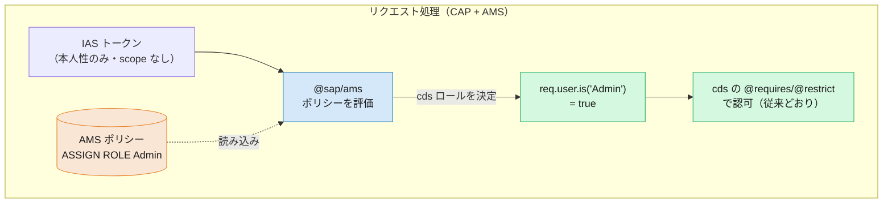

# 06. ライブラリ・実装の違い — `@sap/xssec` の scope 判定から AMS 連携へ

> **この章の要点**
> XSUAA では、認可判定を `@sap/xssec` の `checkScope()` や `req.user.is()` で行っていました。CIS/AMS でもライブラリは変わりますが、**CAP アプリケーションでは、認可チェックの書き方はほとんど変わりません**。`@requires` / `@restrict` / `req.user.is()` はそのまま使えます。理由は、AMS の CAP 連携プラグインが「ポリシー → cds ロール」の変換を裏側で行い、**フレームワークは従来どおりロールで認可する**からです（§3）。
> 開発者から見て実際に変わるのは、**判定コード本体ではなく「配管」**——認証 `kind` が `ias` になり、`cds add ams` がライブラリと DCL 生成・deployer を用意する、という部分です（多くは [04 章](04-configuration-artifacts.md) で見た内容）。
>
> 前章までで「認可モデル（03）」「設定成果物（04）」「割当・管理（05）」を見ました。本章はいよいよ **アプリのコードとライブラリ** の視点です。結論を先に言えば——**CAP を使う限り、ここが一番変化の小さい章**です。

---

## 1. 全体像 — どのライブラリが何に置き換わるか

XSUAA 時代、CAP アプリの認可は次の 3 点で成り立っていました。

- `xs-security.json` の scope / role（[04 章](04-configuration-artifacts.md)）
- 実行時に scope を検証する **`@sap/xssec`**
- cds の `@requires` / `@restrict`、必要なら `req.user.is()`

CIS ではこれが次のように変わります。

| 役割 | XSUAA（CAP） | CIS（CAP + AMS） |
|---|---|---|
| 認証ライブラリ | `@sap/xssec`（v3 系） | **`@sap/xssec`（v4 系）** ＋ IAS プラグイン |
| 認可ライブラリ | （xssec の scope 検証） | **`@sap/ams`**（Node）／`cap-ams-support`（Java） |
| 認証 `kind` | `xsuaa` | **`ias`** |
| 認可の宣言 | `@requires` / `@restrict` | **`@requires` / `@restrict`（変更なし）** |
| ロール判定 API | `req.user.is('role')` | **`req.user.is('role')`（変更なし）** |
| ロールの供給元 | JWT の scope | AMS ポリシー → cds ロールへ変換（§3） |

太字で「変更なし」と書いた行がポイントです。**cds モデルのアノテーションと、コード内のロール判定は、そのまま流用できます**。置き換わるのは、その下で動くライブラリと、ロールがどこから来るか（scope か、AMS ポリシーか）だけです。

> 非 CAP（Plain Node.js / Java / Go）では話が変わり、`checkScope()` を **`checkPrivilege()`** へ書き換える実装差が発生します。本ガイドのフォーカスは CAP なので、非 CAP は §7 に **参考** としてまとめます。

---

## 2. XSUAA 時代のおさらい

XSUAA + CAP では、認可は cds アノテーションで宣言し、必要に応じてハンドラ内で `req.user.is()` を使っていました。

```cds
// cds モデル：ロールが何をしてよいか（XSUAA 時代）
service AdminService @(requires: 'Admin') {
    entity Books as projection on my.Books;
}
```

```js
// ハンドラ内でのプログラム的判定（XSUAA 時代）
this.before('*', 'Books', req => {
    if (!req.user.is('Admin')) req.reject(403);
});
```

この `req.user.is('Admin')` は、**JWT の scope**（`myapp!t123.Admin` 等）を `@sap/xssec` が検証し、cds ロール `Admin` として見せていたものです。非 CAP なら `securityContext.checkScope('$XSAPPNAME.Admin')` に相当します。

**判定の材料はトークンの中にありました**——これが 03 章で見た「静的 RBAC」の実装面です。

---

## 3. CAP の場合：実はほとんど変わらない 🔑

CIS + AMS に移っても、**上のコードはそのまま動きます**。`@requires` も `@restrict` も `req.user.is('Admin')` も書き換え不要です。

変わるのは、その `Admin` というロールが **どこから来るか** です。

- **XSUAA**: JWT の scope から。
- **CIS/AMS**: ユーザーに割り当てられた **AMS ポリシー**（[05 章](05-role-assignment-admin.md)）から。`@sap/ams`（Java は `cap-ams-support`）が、割り当てられたポリシーを評価して **cds ロールを決定** し、`req.user.is()` が返す集合に反映します。

SAP のドキュメントはこれを **「AMS is transparent to CAP application code（AMS は CAP のアプリコードに対して透過的）」** と表現します。ライブラリはリクエストを横取りして「ポリシー → ロール」の変換を行い、その後は **フレームワークが従来どおりロールで認可** します。



XSUAA では「トークンの scope → `user.is()`」だった経路が、CIS では「**AMS ポリシー → `@sap/ams` → `user.is()`**」に差し替わっただけ、という図です。判定を書くアプリ側のコードは同じ位置・同じ API のままです。

### では、開発者は実際に何を変えるのか

コード（アノテーション・`user.is()`）ではなく、**プロジェクトの配管** です。多くは [04 章](04-configuration-artifacts.md) で見た成果物側の話です。

| 変えるもの | 内容 | 参照 |
|---|---|---|
| 認証 `kind` | `package.json` の `cds.requires.auth` を `xsuaa` → **`ias`** に | 下記 |
| ライブラリ | `@sap/xssec` を v4 へ、**`@sap/ams`** を追加（`cds add ams` が実施） | [04 §4](04-configuration-artifacts.md#4-ビルドデプロイの成果物--cds-add-ams-が生成するもの) |
| DCL 生成 | `@requires`/`@restrict` から **DCL を自動生成**（`cds build --for ams`） | [04 §3](04-configuration-artifacts.md#3-認可定義の成果物--xs-securityjson-の中身--dcl-ファイル群) |
| バインディング | `xsuaa` リソース → **`identity` リソース** | [04 §2](04-configuration-artifacts.md#2-サービス定義の成果物--xsuaa-リソース--identity-リソース) |

`kind` は `package.json` の 1 箇所です。

```json
// XSUAA
"cds": { "requires": { "auth": "xsuaa" } }
```

```json
// CIS/IAS
"cds": { "requires": { "auth": "ias" } }
```

そしてライブラリと DCL・deployer の追加は、手作業ではなく **`cds add ams` 一発** で用意されます（IAS 認証設定 `cds add ias` も必要に応じて自動実行されます）。

```sh
cds add ams        # @sap/ams + @sap/xssec 追加、mta.yaml 更新、ias 設定
npm install
cds build --for ams  # cds アノテーション → DCL を生成
```

> **まとめると**: CAP における「ライブラリ・実装の違い」は、**判定コードの違いではなく、依存ライブラリと認証 kind の違い**に集約されます。`checkScope` を `checkPrivilege` に書き直す、といった作業は CAP では発生しません。

---

## 4. インスタンスベース認可の実装 — CAP は自動変換

[03 §3](03-authorization.md#3-インスタンスベース行レベル認可-) で見た「行レベルの絞り込み」も、CAP では実装がほぼ透過的です。

AMS が返す認可条件（例: `Genre IN ('Fairy Tale')`）を **CQL / CXN 式へ変換してクエリに注入する処理を、CAP プラグインが標準で行います**。開発者が条件を自分で SQL に組み立てる必要はありません。

```cds
// これだけ。where 条件は AMS ポリシー側から実行時に注入される
service CatalogService {
    @(restrict: [{ grant: 'READ', to: 'Reader' }])
    entity Books as projection on my.Books;
}
```

- リソース属性（`Genre` 等）は `schema.dcl` に宣言し、cds モデルの要素へは **`@ams.attributes`** でマッピングします（[03 §3](03-authorization.md#3-インスタンスベース行レベル認可-)、[Instance-Based Authorization](../docs/CAP/InstanceBasedAuthorization.md)）。
- ユーザー属性（`$user.division` 等）を条件に使う ABAC パターンは、補足の [ユーザー属性による動的な認可](dynamic-authorization-user-attributes.md) を参照してください。

> この「条件木 → クエリ言語への変換」は、非 CAP では **自前で実装** が必要な、AMS で最も手のかかる部分です（§7 参考）。CAP プラグインを使う最大のうまみの 1 つがここです。

---

## 5. App-to-App（技術通信）の実装 — `ias_apis` からロール自動付与

[02 §5](02-authentication.md#5-app-to-app-の認証方式技術通信--主体伝播) / [05 §5](05-role-assignment-admin.md#5-app-to-app-どのアプリがどの-api-を消費してよいかも管理者が決める) で見たとおり、App-to-App では消費が許可された API 権限グループがトークンの **`ias_apis`** クレームに入ります。

CAP の場合、**技術ユーザー（technical user）トークン**については実装がほぼ不要です。

> CAP の認証ハンドラは `ias_apis` のリストを使い、**同名の cds ロールを自動的に付与** します（技術ユーザートークンの場合）。

つまり、Provider 側が API 権限グループ `ReadCatalog` を公開し、それを消費する技術ユーザートークンが来たら、CAP は `req.user.is('ReadCatalog')` を true にしてくれます。cds モデル側で `ReadCatalog` ロールに権限を紐付けておけば、それだけで通ります。

つまり、**同じ自社ランドスケープ内で CAP を組み合わせる限り、App-to-App の認可は `provided-apis` の公開と管理者の Dependency 承認だけで完結** し、追加のコードは要りません。

### `INTERNAL POLICY` とは — CAP では基本的に使わない

より細かい制御が必要な場合に登場するのが **`INTERNAL POLICY`** です。まず基本を押さえます。

- **何か**: 「この API 権限グループで呼ばれたら、何を許可するか」を定義する DCL ポリシー。
- **普通の `POLICY` との違い**: 管理者には**見えず**、ユーザーに**割り当てるものでもない**。その API 権限グループを消費できる**呼び出し元に一律で適用**される（呼び出し元が誰かは区別しない）。

```dcl
// 例：ExternalOrder という API 権限グループで呼ばれたら、注文額 100 未満で CreateOrders を許可
INTERNAL POLICY ExternalOrder {
    USE shopping.CreateOrders RESTRICT order.total < 100;
}
```

> **CAP の文脈では、`INTERNAL POLICY` を使う場面はほとんどありません。** 前述のとおり **技術ユーザー連携では不要**（`ias_apis` → 同名 cds ロールが自動）。`INTERNAL POLICY` が要るのは、実質 **主体伝播（principal propagation）で「アプリ A 経由だとユーザー本来の権限を一部に絞りたい」ケースだけ**です。しかもこれは、呼び出し元が **外部・第三者アプリ**のような「ユーザーの権限を丸ごと使わせたくない」相手のときに限られます。**自社内の CAP マイクロサービス同士の連携では、まず登場しません。**

その数少ないケースで実際に絞る場合は、[Technical Communication](../docs/Authorization/TechnicalCommunication.md) の仕組みを使います（XSUAA になかった **追加コスト**）。

- Provider 側 DCL に **`INTERNAL POLICY`** を定義（上記。API 権限グループごとの付与上限）。
- **API 権限グループ名 → ポリシー名** のマッピング関数を実装し、`IdentityServiceAuthProvider`（Node）／`SciAuthorizationsProvider`（Java）へ登録する。

```js
// Node.js（CAP）：マッピング関数を登録する例（srv/server.js）
const { amsCapPluginRuntime, TECHNICAL_USER_FLOW, PRINCIPAL_PROPAGATION_FLOW } = require('@sap/ams');
const { mapTechnicalUserApi, mapPrincipalPropagationApi } = require('./apis');

cds.on('bootstrap', () => {
    const authProvider = amsCapPluginRuntime.authProvider.xssecAuthProvider;
    authProvider.withApiMapper(mapTechnicalUserApi, TECHNICAL_USER_FLOW);
    authProvider.withApiMapper(mapPrincipalPropagationApi, PRINCIPAL_PROPAGATION_FLOW);
});
```

> 内部ポリシー名を API 権限グループ名と同じにしておくと、マッピング関数は「`internal.` を前置するだけ」の自明な実装になります（SAP 推奨）。フロー別（技術ユーザー／主体伝播）にマッパーを分けることで、どのグループをどちらのフローで消費させるかを制御できます。詳細と設定手順は [App-to-App 連携の設定と証明書運用](app2app-and-certificate-operations.md) にまとめています。

---

## 6. 移行を助ける仕組み — XSUAA と AMS の橋渡し

XSUAA から段階的に移行する場合、ライブラリ側に 2 つの受け皿があります。

**① `ias` 戦略の XSUAA フォールバック** — 認証 `kind` を `ias` にしても、`xsuaa` を併記しておけば XSUAA が発行したトークンも受け付けられます。移行期に両方のトークンが飛んでくる状況をしのげます。

```json
"cds": {
  "requires": {
    "auth": "ias",
    "xsuaa": true
  }
}
```

**② `HybridAuthProvider`（Node）／`HybridAuthorizationsProvider`（Java）** — XSUAA トークンの **scope を AMS ポリシーへマッピング** して評価するプロバイダです。XSUAA から AMS へ移行済みのアプリが、まだ XSUAA トークンを受ける必要がある場合に使います。

```js
// scope → AMS ポリシーのマッピングを渡す（イメージ）
const { HybridAuthProvider } = require('@sap/ams');
const scopeToPolicyMapper = (scope) => ({
    'na-foobar!t4711.ProductAdmin': ['shopping.ReadProducts', 'shopping.WriteProducts'],
}[scope] || []);
```

> どちらも「移行のための一時的な橋」です。恒久運用では IAS トークン ＋ AMS ポリシーに一本化する前提で、マッピング表を保守コストとして抱え込まないようにします。

---

## 7. 参考：非 CAP（Plain Node.js / Java / Go）の場合

フォーカスは CAP ですが、非 CAP との差を知っておくと「CAP がどれだけ隠蔽しているか」が分かります。**非 CAP では、`checkScope` を `checkPrivilege` に書き換える実装差が実際に発生** します。

| 観点 | XSUAA（非 CAP） | CIS/AMS（非 CAP） |
|---|---|---|
| 判定 API | `securityContext.checkScope('$XSAPPNAME.Read')` | **`authorizations.checkPrivilege('read', 'products')`** |
| 戻り値 | 真偽 | **`Decision`**（`isGranted()`／条件付き決定） |
| 認可の取得 | xssec の security context | **`AuthorizationsProvider`**（`SciAuthorizationsProvider` / Node `IdentityServiceAuthProvider`） |
| 行レベル絞り込み | 自前 `where` | **条件木を自前で走査**（Java `SqlExtractor` 等） |

```js
// 非 CAP（Node.js）：action × resource で判定
const decision = authorizations.checkPrivilege('read', 'products');
if (decision.isGranted()) { /* 許可 */ }
```

宣言的に書く手段もあります（Node.js express の `amsMw.checkPrivilege()`、Spring の `AmsRouteSecurity` / `@CheckPrivilege`）。ただし **インスタンスベースの絞り込み**（§4）は、非 CAP では AMS が返す条件木を **クエリ言語へ翻訳する処理を自分で書く** 必要があり（現状 Java に基本的な `SqlExtractor` がある程度）、ここが CAP との最大の実装差になります。

- 認可チェック全般: [Authorization Checks](../docs/Authorization/AuthorizationChecks.md)
- UI 事前チェック（メニュー/ボタンの出し分け）向けに、`getPotentialResources()` / `getPotentialActions()` / `getPotentialPrivileges()` で「付与されうる権限」を列挙する API もあります（条件は無視されるため、実行時は別途 `checkPrivilege` が必須）。

---

## ライブラリ早見表

| ランタイム | XSUAA | CIS/AMS |
|---|---|---|
| Node.js（CAP） | `@sap/xssec`（v3） | **`@sap/xssec`（v4）＋ `@sap/ams`（`^3`）**、ローカル用 `@sap/ams-dev` |
| Java（CAP） | `xsuaa` / `spring-xsuaa` | **`cap-ams-support` ＋ `jakarta-ams`**（`dcl-compiler-plugin` でビルド） |
| Java（非 CAP） | `java-security` / `spring-xsuaa` | **`ams-core` / `spring-boot-ams`** |
| Node.js（非 CAP） | `@sap/xssec` | **`@sap/ams`** |
| Go | （XSUAA 向けライブラリ） | **AMS Go クライアント** |

---

## この章のまとめ

- **CAP では実装はほぼ変わらない** 🔑 — `@requires` / `@restrict` / `req.user.is()` はそのまま。`@sap/ams`（Java: `cap-ams-support`）が **「AMS ポリシー → cds ロール」変換を透過的に** 行い、フレームワークは従来どおりロールで認可する。
- 開発者が実際に変えるのは **判定コードではなく配管** — 認証 `kind` を `xsuaa` → **`ias`**、ライブラリと DCL 生成・deployer は **`cds add ams`** が用意（多くは [04 章](04-configuration-artifacts.md)）。
- **インスタンスベース絞り込み** は CAP が **CQL/CXN へ自動変換**。開発者は `@restrict` と `@ams.attributes` を書くだけ。
- **App-to-App** は、技術ユーザーなら `ias_apis` から **cds ロールを自動付与**（実装ほぼ不要）。`INTERNAL POLICY` ＋ マッピング関数は、**主体伝播で外部アプリの権限を絞りたい**という限られたケース用で、**自社内 CAP 連携ではまず使わない**（[app2app doc](app2app-and-certificate-operations.md)）。
- 移行期は **`ias` の XSUAA フォールバック（`xsuaa: true`）** と **`HybridAuthProvider`（scope→policy）** が橋渡し。ただし恒久保守コストにしない。
- **非 CAP は参考**: `checkScope` → **`checkPrivilege`（`Decision`）** の実装差があり、行レベル絞り込みは条件木の自前翻訳が要る。CAP がこれらを隠蔽している。

## 次に読む

- **[07. まとめ・移行チートシート](07-summary-migration-cheatsheet.md)** *(作成予定)* — XSUAA と CIS の **メリット・デメリット・差分が一目でわかるシート**（各章のトレードオフを集約）
