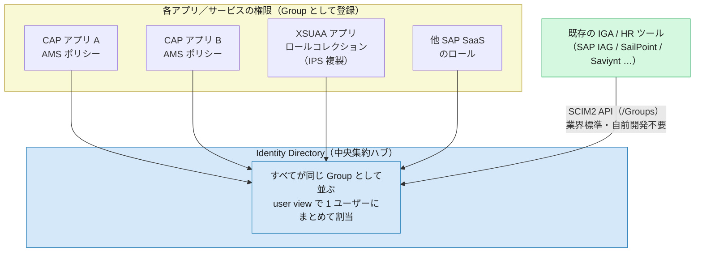

# 07. まとめ・移行チートシート — XSUAA と CIS の差分・メリット・デメリット

> **この章の要点**
> ここまでの 01〜06 で見てきた「何が・なぜ変わったか」を、**一目で見渡せる 1 枚のシート**に集約します。この章の狙いは、用語の 1:1 対応表（それは §2 に置きます）だけではありません。むしろ主役は §1 の **比較シート**——各章で明らかにした **正直なトレードオフ**（CIS のメリットと、その裏側の追加コスト・制約）を並べた表です。
> そして §3 で、このガイドを通じて最も議論になった論点——**「多くの CAP マイクロサービスを持つランドスケープで、そもそも CIS 方式に乗れるのか」**——に、調査で判明した答えを添えます。結論を先に言えば、**「複数アプリの権限を 1 つの名前に束ねる再利用可能なバンドル」は無い**が、**Identity Directory + SCIM2 という業界標準の統合ハブ**があるため、多くの企業では「乗れるかどうか」を左右するほどの障害にはなりません。
> そして最も率直な問い——**「そもそも手間の増える CIS を使うメリットはあるのか」**——にも正直に答えます（すぐ下の [なぜ CIS を選ぶのか](#なぜ-cis-を選ぶのか--正直な結論-)）。先取りすると、答えは「能力で XSUAA を上回るからではなく、SAP がそちらへ寄せているから」です。

---

## なぜ CIS を選ぶのか — 正直な結論 🔑

§1 の表を素直に読むと、当然の疑問が残ります——**アプリ単体で見れば CIS は XSUAA より手間が増えるのに、乗り換える技術的メリットはどこにあるのか。** このガイドの「一方的に美化しない」姿勢を最後まで貫くなら、答えははっきりしています。

**能力の比較では、CIS は XSUAA を上回りません。** §1 のメリット列は個別には成立しますが、「移行を正当化する純便益」として残るものはほとんどありません。理由を1つずつ潰すと:

- **認証統合はメリットにならない。** 標準的な BTP 構成では、XSUAA でも認証（ユーザーログイン・企業 IdP フェデレーション）は既に **IAS** が担っています。XSUAA は IAS を信頼して scope 入り JWT を発行しているだけ。「IAS を共通 ID 基盤にする」便益は XSUAA 時代に既に得ているもので、移行で新たに解放されるものではありません。
- **ランタイム移植性もメリットにならない。** `xsuaa` サービスは BTP Service Operator 経由で **Kyma からも消費でき**、Kyma 上の CAP で XSUAA 認可は動きます。「XSUAA は Cloud Foundry に縛られる」は不正確です。
- **認可の能力も上回らない。** 行レベル制御は XSUAA でも `@restrict ... where` で可能（[03 §3](03-authorization.md#3-インスタンスベース行レベル認可-)）。IAS ユーザー属性を条件に使う ABAC も、ロール爆発の回避も、role-template の attribute で XSUAA にできました。CIS 側の唯一の上積み「管理者が Admin Console で実行時に条件を派生」は、[05 章](05-role-assignment-admin.md)で本流でない**逃げ道**と位置づけた推奨しない経路です。
- **むしろ退化する軸がある。** 複数アプリのロールを1つに束ねるバンドリング（ロールコレクション）は、XSUAA にあって CIS が**失った**能力です（§3）。

能力で純粋に残る差は、認可を**トークン埋め込みでなく実行時に評価する**アーキテクチャ（権限変更が再ログイン不要・トークン非肥大）だけ。しかし大半の現場はそこで困っておらず、単独では移行理由になりません。

**では、なぜ新規開発では CIS を選ぶのか。理由は一つ、SAP の戦略的方向性に集約されます。**

SAP は CIS を go-forward の ID／認可基盤として位置づけ、XSUAA（＝Cloud Foundry 世代）から重心を移しつつあります。したがって判断は「CIS が XSUAA より優れているか」ではなく「**いつ・どの規模で寄せるか**」です。

**新規開発（greenfield）** は実質 **CIS 一択**です。ただしクリーンに始められるぶん傷は浅く、最初から pain point を避ける設計（[集中 DCL](shared-ias-app-central-dcl.md)、職位単位の粗いポリシー、Identity Directory＋SCIM2 で既存 IGA に寄せる）を入れておけば済みます。

**既存企業（brownfield）** のほうが桁違いに難しい。動いているロールコレクション体系の作り替え、長期化する移行ブリッジ（[06 §6](06-libraries-implementation.md#6-移行を助ける仕組み--xsuaa-と-ams-の橋渡し)）、認可ガバナンスの担い手交代（管理者のクリック運用→開発者の DCL コード）が重くのしかかります。ただし救いもあり、**認証は既に IAS なので、移行対象は「認可（scope→DCL）」と「資格情報（secret→証明書）」に絞られます**。全面移行ではなく認可レイヤの差し替えと捉え、傷を広げず（新規アプリに XSUAA を足さない・scope 直読みコードを `req.user.is()` に隔離）、pain point の改善を待って本体を動かすのが現実解です。

> **一行でまとめると**: CIS は認証・認可の能力で XSUAA を上回るから選ぶのではない。**SAP がそちらへ寄せているから、新規は選ばざるを得ない**。既存は非推奨の日に備え、傷を広げずに時期を計る——これがこのガイドの身も蓋もない結論です。
>
> 注: 「XSUAA が非推奨になる」という確定情報はありません。方向性として運用の前提に置くのは合理的、という程度に受け取ってください。

---

## 1. 一目でわかる比較シート 🔑

**観点ごとに、XSUAA / CIS の実態と、CIS 側のメリット・デメリットを並べた表**です。メリットの列だけを見ないでください。CIS は多くの点で洗練されていますが、**すべての行に「ただし」がある**——これがこのガイドの一貫した姿勢です。

| 観点 | XSUAA | CIS | CIS のメリット | CIS のデメリット・追加コスト |
|---|---|---|---|---|
| **役割分担** | 認証・トークン発行・認可（scope）を **1 サービスが一手に**担う中央 AS | **IAS（認証）/ AMS（認可）/ IPS（プロビジョニング）に分離**（[01](01-overview-paradigm-shift.md)） | 関心が分離され、各レイヤを独立に進化・スケールできる | 構成要素が増え、全体像の理解と設定箇所の把握コストが上がる |
| **認証トークン発行者** | XSUAA（CF 上の OAuth2 AS） | **IAS（OIDC Provider）** をアプリが直接信頼（[02](02-authentication.md)） | 標準 OIDC。App-to-App の信頼集約が容易。ただし**ユーザー認証は XSUAA 時代も既に IAS**のため、認証統合自体は移行の新たな便益ではない（[なぜ CIS を選ぶのか](#なぜ-cis-を選ぶのか--正直な結論-)） | アプリの信頼先・検証設定を IAS 前提に見直す必要 |
| **資格情報** | client secret（共有シークレット） | **X.509 証明書 / mTLS**、所有証明 `cnf.x5t#S256`（[02](02-authentication.md)） | 共有シークレット漏洩リスクの低減、より強い本人性 | 証明書はライフサイクルあり。ローテーション運用の設計が要る（[app2app 運用](app2app-and-certificate-operations.md)） |
| **トークンと認可** | **scope 入り JWT**（認可がトークンに埋め込み） | トークンは**本人性のみ**、scope なし。認可は**実行時に評価**（[01](01-overview-paradigm-shift.md)・[03](03-authorization.md)） | トークン肥大の解消、権限変更が**再ログイン不要で即時反映** | 「トークンを見れば権限が分かる」前提のコード・デバッグ手法が使えない |
| **認可モデル** | scope / role-template による**静的 RBAC**（ただし属性・行レベル条件も表現できた） | **DCL ポリシー**によるポリシーベース（ABAC 可）・**実行時 PDP 評価**（[03](03-authorization.md)） | **純便益は限定的**。実行時 PDP 評価で権限変更が再ログイン不要・トークン非肥大。一方 ABAC・属性ベース条件は **XSUAA でも可能**で差別化ではなく、「管理者が実行時に条件派生」は本流でない逃げ道（[なぜ CIS を選ぶのか](#なぜ-cis-を選ぶのか--正直な結論-)） | DCL という新しい記述言語と PDP/bundle の実行モデルを学ぶ必要 |
| **行レベル（インスタンスベース）認可** | `@restrict ... where` で可能だが**条件はソースに固定**（変更＝再デプロイ） | **DCL の `RESTRICT`** で表現、管理者が Admin Console で**実行時に条件を派生**（[03 §3](03-authorization.md#3-インスタンスベース行レベル認可-)） | 条件をコードから切り離せる。ただし XSUAA も `where` で行レベルは可能で、実行時の条件派生は Admin Console 依存＝本流でない | 条件の所在が「コード＋ポリシー」に分かれ、追跡が一段複雑に |
| **ロール割当** | BTP コックピットで**ロールコレクション**を組み立てて割当 | **IAS 管理コンソール**でポリシー（＝自動生成グループ）に割当。**IPS で属性条件の自動割当**も可（[05](05-role-assignment-admin.md)） | 中間の器を組む手間が減り、開発者定義のポリシーをそのまま割当 | IPS 属性割当は「**最後にマッチした条件だけが適用**」される仕様。ポリシーが細かいと破綻しやすい（§4） |
| **複数アプリの権限を束ねる** | ロールコレクションが**複数アプリの権限を「1 つの名前」に**束ねられた | **名前付きの再利用可能バンドルは無い**。ただし **Identity Directory が全アプリ割当の中央ハブ**（[05 §3](05-role-assignment-admin.md#3-グループの役割の違い-)・§3） | Identity Directory + **SCIM2** で既存 IGA/HR ツールがそのまま統合ハブに使える | 「1 割当で複数アプリ分が自動展開される」オブジェクトは無い。束ねたければ[集中 DCL](shared-ias-app-central-dcl.md) など構成変更が要る（**§3 の中心論点**） |
| **App-to-App（技術通信）** | **Destination を mta.yaml に宣言的に定義**すれば完結（技術通信＝SAML Bearer / client credentials ＋ scope） | **dependency 登録 + `ias_apis` クレーム**（[02 §5](02-authentication.md#5-app-to-app-の認証方式技術通信--主体伝播)・[05 §5](05-role-assignment-admin.md#5-app-to-app-どのアプリがどの-api-を消費してよいかも管理者が決める)） | 共有 IAS への信頼集約で跨サブアカウント・跨リージョンが簡素化 | **dependency 登録は管理コンソールの手動ステップで mta.yaml では完結しない**（Destination を宣言すれば済んだ XSUAA と違い、デプロイ記述子の外に承認作業が残る＝再現デプロイ性の低下）。加えて `INTERNAL POLICY`・マッピング関数も追加ステップ（[06 §5](06-libraries-implementation.md#5-app-to-app技術通信-の実装--ias_apis-からロール自動付与)） |
| **実装（CAP）** | `@requires` / `@restrict` / `req.user.is()`、`@sap/xssec` | **書き方はほぼ変わらない**。`@sap/ams` が「ポリシー→ロール」を透過変換（[06](06-libraries-implementation.md)） | CAP なら判定コードの書き換えは**ほぼ不要**（`checkScope`→`checkPrivilege` は非 CAP のみ） | 認証 `kind`・依存ライブラリ・DCL 生成という「配管」の切替は必要（`cds add ams`） |
| **移送・変更管理** | ロールコレクションは管理者がコックピットで運用 | 本流は **DCL をコード化 → deployer で移送**（[03](03-authorization.md#base-policy-と実行時ポリシー開発者-vs-管理者)・[04 §4](04-configuration-artifacts.md#4-ビルドデプロイの成果物--cds-add-ams-が生成するもの)） | ポリシーが Git 管理・レビュー・CI 対象になり、監査証跡が残る | base policy 更新は**後方互換**（Forbidden Changes）に注意。Admin Console 手作りは本流でない（§4） |

> **表の読み方**: 「メリット」列だけを根拠に移行判断をしないでください。CIS は設計として一貫していますが、**XSUAA が暗黙に肩代わりしていた運用（ロールコレクションによる束ね、トークンを見れば分かる権限）を、CIS では別の場所で明示的に設計し直す**必要があります。その「別の場所」がどこかを示すのが、この表の右 2 列です。

---

## 2. 概念対応表（XSUAA → CIS）

用語の 1:1 マッピングです。「XSUAA でのアレは CIS でいうと何か」を引くための逆引き表として使ってください（各用語の詳細は [用語集](glossary.md) と該当章へ）。

| XSUAA の概念 | CIS の概念 | 参照 |
|---|---|---|
| `xsuaa` サービスインスタンス | **`identity` サービスインスタンス**（`authorization.enabled: true` で AMS 有効化） | [04 §2](04-configuration-artifacts.md#2-サービス定義の成果物--xsuaa-リソース--identity-リソース) |
| `xs-security.json` | **DCL ファイル群** ＋ `authorization.enabled` | [04 §3](04-configuration-artifacts.md#3-認可定義の成果物--xs-securityjson-の中身--dcl-ファイル群) |
| scope | **DCL のアクション**（`USE <action>`） | [03 §2](03-authorization.md) |
| role-template | **`POLICY`**（DCL ポリシー） | [03 §2](03-authorization.md) |
| role collection | **ポリシー割当**（IAS 管理コンソール／同名の自動生成グループ） | [05](05-role-assignment-admin.md) |
| `xs-security.json` の attribute | **DCL の `RESTRICT`**（ABAC 条件） | [03 §3](03-authorization.md#3-インスタンスベース行レベル認可-) |
| client secret | **X.509 証明書（mTLS）** | [02](02-authentication.md) |
| JWT 内の scope（トークン埋め込み判定） | **実行時 PDP 評価**（Authorization Bundle） | [03 §4](03-authorization.md#4-判定はどこでいつ起きるか--実行時-pdp-と-authorization-bundle) |
| `@sap/xssec` の scope 判定（`checkScope`） | **AMS クライアントライブラリ**（CAP は透過／非 CAP は `checkPrivilege`） | [06](06-libraries-implementation.md) |
| BTP コックピットでの割当 | **IAS 管理コンソール**での割当 | [05](05-role-assignment-admin.md) |
| XSUAA の主体伝播（principal propagation） | **App-to-App ＋ `ias_apis`** | [02 §5](02-authentication.md#5-app-to-app-の認証方式技術通信--主体伝播) |

---

## 3. 中心論点：多数のマイクロサービスで「CIS 方式に乗れるのか」 🔑

このガイドで最も掘り下げた論点です。多くの CAP マイクロサービスを持つランドスケープでは、**1 つの業務ロール（例: Sales Manager）が複数アプリの認可にまたがる**のが普通です。XSUAA のロールコレクションは、これを「1 つの名前」に束ねて 1 回の割当で表現できました。CIS でこれができるのか——が問いです。

### 論点の整理（このガイドで辿った経緯）

1. **当初の懸念**: 「複数アプリ由来のポリシーを 1 つのグループにまとめられないなら、業務ロールを 1 回の割当で表現できず、監査・JML（Joiner/Mover/Leaver）運用で効いてくる」。これは正当な指摘でした。
2. **「自前の割当アプリを作る」案は却下**: マッピングテーブル＋SCIM API の専用アプリを作る案は、「**どの企業もやりたがらない。なぜ XSUAA でできたことをカスタムアプリで実装しなければならないのか**、となる」と正しく退けられました。ビルド・保守コストと、監査証跡が自前ツールに散逸する点が問題です。
3. **調査で判明した、より正確な答え**（SAP Architecture Center RA0019「Authorization with SAP Cloud Identity Services」）:
   - 「1 つの名前で複数アプリ分を自動展開する再利用可能なバンドル・オブジェクト」（ロールコレクション相当）は**確かに無い**。
   - しかし **Identity Directory が公式に「認可割当の中央集約ポイント」**と位置づけられています。AMS ポリシー（グループ化）・XSUAA ロールコレクション（IPS 複製でグループ化）・他 SAP SaaS のロールが、**すべて同じ Identity Directory の Group** として並びます。
   - UI の **"user view"** で 1 ユーザーに複数グループ（＝複数アプリの権限）をまとめて割り当てられ、標準 **SCIM2 API**（`/Groups`）でも同じことができます。これは自前開発ではなく、**既存の HR/IGA（SAP IAG、SailPoint、Saviynt 等）や SCIM2 対応プロビジョニングツールがそのまま使える**業界標準プロトコルです。

### 結論（誇張なき併記）

- **「名前付きバンドルが無い」ことは事実**です。ロールコレクションのように「1 割当で複数アプリ分が自動展開される再利用可能オブジェクト」は AMS にありません。
- **しかしそれは「乗れるかどうか」を左右するほどの障害ではない可能性が高い**です。**Identity Directory + SCIM2 という標準の統合ポイントが既にあり**、多くの企業は既存の IGA/HR ツールでこれをカバーできます。
- **真に検討が必要になるのは**、SCIM2 を話せる IGA ツールを持たない・導入しない**中〜小規模組織**で、**かつポリシー数が多い**場合です。この場合の現実解は、[共有 IAS アプリ＋集中 DCL](shared-ias-app-central-dcl.md) のような集約設計か、**職位単位の粗いポリシー設計**（IPS の属性条件割当で足りる粒度に留める）です。
- **この結論は「標準 SAP LoB ソリューション」の存在でさらに強まります。** 業務ロールはカスタム CAP と標準アプリ（S/4HANA Cloud・SuccessFactors 等）の権限にまたがり、**標準側も Identity Directory のグループとして割り当てます**。中央 DCL はカスタムの断片しか束ねられないため、**一括割当は原理的に Identity Directory / IGA（IAS の外側）の仕事**。中央 DCL は割当の代替ではなく、カスタム側を少数の業務ロール型グループに整形してその割当を楽にする**補完手段**です（[05 §3](05-role-assignment-admin.md#3-グループの役割の違い-)）。

---

## 4. デメリット・追加コストの正直な棚卸し

§1 の表に散らばっている「デメリット」列を、明示的にまとめておきます。移行判断で見落とさないためのチェックリストです。

1. **複数アプリのポリシーを束ねる標準機能がない**（§3）
   個別 CAP が個別の `identity` インスタンス（＝AMS アプリ）を作ると、ポリシーもそのアプリに閉じます。束ねたければ[共有 IAS アプリ＋集中 DCL](shared-ias-app-central-dcl.md) という **構成変更を伴う回避策**が要りますが、これは**カスタム CAP 側の「整形」にすぎません**。標準 SAP LoB ソリューションの権限は AMS ポリシーではないため中央 DCL に入らず、**業務ロールの一括割当は原理的に Identity Directory / IGA（IAS の外側）でしか完結しません**（[05 §3](05-role-assignment-admin.md#3-グループの役割の違い-)）。ロールコレクションの単純な代替にはなりません。

2. **IPS の属性条件割当には運用限界がある**
   ポリシー＝自動生成グループなので、IPS の `assignGroup`/`condition` で属性ベースの一括割当は可能です。ただし仕様上、**同じユーザーが複数の条件にマッチすると「最後にマッチした条件だけ」が適用**されます。ポリシーが細かい（ABAC 寄り）と運用が破綻しやすく、**職位単位くらいの粗いポリシー**に留めるのが現実的です（[05 §4](05-role-assignment-admin.md)）。

3. **Admin Console での custom policy 作成は「本流の運用」ではない**
   本番でいきなり管理者がポリシーを手作りする運用は通常しません。本流は**開発環境で DCL をコード化し deployer で移送**することで、変更管理・監査・**後方互換**（[03 の Forbidden Changes](03-authorization.md#base-policy-と実行時ポリシー開発者-vs-管理者)）の制約が伴います。Admin Console 作成はテナント固有調整・緊急対応の**逃げ道**であって設計思想ではありません。

4. **App-to-App の認可設定は純粋な追加ステップ — しかも一部は宣言的に書けない**
   dependency 登録・`INTERNAL POLICY`・`ias_apis` マッピング関数の実装は、XSUAA の技術通信より**手間が増える**部分です（[06 §5](06-libraries-implementation.md#5-app-to-app技術通信-の実装--ias_apis-からロール自動付与)）。ただし自社内 CAP 連携で技術ユーザーを使う限り、`ias_apis` → 同名 cds ロール自動付与でほぼ済み、`INTERNAL POLICY` はまず登場しません。

   より見落としやすい影響が **宣言的完結性の喪失**です。XSUAA では **Destination を mta.yaml に宣言的に定義**すれば App-to-App の配線がデプロイ記述子だけで完結し、環境の再作成もそのまま再現できました。CIS では、Provider 側の API 公開（`provided-apis`）は `identity` パラメータで宣言的に書けるものの、**Consumer 側の dependency 登録（＝管理者の承認）は IAS 管理コンソールの手動操作**で、**mta.yaml には書けません**（[app2app doc §2](app2app-and-certificate-operations.md#2-設定手順api-公開と-dependency-登録)）。結果として、デプロイ記述子の外に**手動ステップ（＝承認作業）が残り**、IaC / CI-CD による完全な再現デプロイが一段難しくなります。

---

## 5. 移行時の注意

XSUAA から CIS へ移行する際に、コード・運用の両面で見直しが要る点です。

- **トークン前提コードの見直し**: 「JWT の scope を直接読む」「トークンを見れば権限が分かる」前提のコードは動きません。認可判定は `req.user.is()`（CAP）や `checkPrivilege()`（非 CAP）に寄せ、**scope クレームへの直接依存を除去**します（[06](06-libraries-implementation.md)）。
- **テスト**: 認可がトークン埋め込みから実行時 PDP 評価に変わるため、**ポリシー評価を含むテスト**（付与されたロール／行レベル絞り込み）を用意します。プロトコルレベル（HTTP/OData）で「あるユーザーで期待どおり絞り込まれるか」を検証するのが確実です。
- **証明書運用**: client secret から X.509/mTLS に変わるため、**証明書ローテーション**の運用設計が必要です（CF は再デプロイ/リバインド、Kyma は `credentialsRotationPolicy`。Destination に独自証明書を手動アップロードした場合のみ手動更新）。詳細は [App-to-App 連携の設定と証明書運用](app2app-and-certificate-operations.md)。
- **移行期の橋**: 一度に切り替えられない場合、①認証 `kind` を `ias` にしつつ `xsuaa: true` を併記して**両方のトークンを受ける**、②`HybridAuthProvider`（Node）／`HybridAuthorizationsProvider`（Java）で **XSUAA の scope を AMS ポリシーへマッピング**——の 2 つの受け皿があります（[06 §6](06-libraries-implementation.md#6-移行を助ける仕組み--xsuaa-と-ams-の橋渡し)）。ただし**恒久的な保守コストにしない**——最終的に IAS トークン＋AMS ポリシーへ一本化します。

---

## 6. 参照リンク集

### 本ガイドの各章

| # | ページ | テーマ |
|---|---|---|
| 01 | [パラダイムシフト](01-overview-paradigm-shift.md) | 認証と認可の「分離」 |
| 02 | [認証の違い](02-authentication.md) | IAS・mTLS・トークン構造・App-to-App の認証方式 |
| 03 | [認可の違い](03-authorization.md) | DCL・実行時 PDP・インスタンスベース認可 |
| 04 | [設定成果物の違い](04-configuration-artifacts.md) | `identity` + `authorization.enabled` + DCL |
| 05 | [ロール割当・管理の違い](05-role-assignment-admin.md) | IAS 管理コンソール・IPS・Identity Directory |
| 06 | [ライブラリ・実装の違い](06-libraries-implementation.md) | CAP は透過的・`cds add ams`・非 CAP の `checkPrivilege` |

### 補足トピック

- [App-to-App 連携の設定と証明書運用](app2app-and-certificate-operations.md)
- [共有 IAS アプリと集中 DCL（複数 CAP 構成）](shared-ias-app-central-dcl.md)
- [ユーザー属性による動的な認可（CAP ＋ AMS）](dynamic-authorization-user-attributes.md)
- [IAS / AMS 用語集](glossary.md)

### 公開ドキュメント（`docs/`）

- [Getting Started（AMS の導入）](../docs/Authorization/GettingStarted.md)
- [Technical Communication（技術通信・主体伝播）](../docs/Authorization/TechnicalCommunication.md)
- [Deploy DCL（移送）](../docs/Authorization/DeployDCL.md)
- [Changing DCL（後方互換・Forbidden Changes）](../docs/Authorization/ChangingDCL.md)
- サンプル: [docs/Samples](../docs/Samples/)

---

## このガイドのまとめ

XSUAA 経験者として、CIS を次の 4 つで説明できれば、このガイドの狙いは達成です。

1. **認証と認可の「分離」** — XSUAA が一手に担っていた役割が、IAS（認証）/ AMS（認可）/ IPS（プロビジョニング）に分かれた（[01](01-overview-paradigm-shift.md)）。
2. **認可がトークンから外れた** — scope 入り JWT がなくなり、認可は実行時 PDP で評価される。権限変更は再ログイン不要で即時反映される代わりに、「トークンを見れば権限が分かる」前提は捨てる（[03](03-authorization.md)）。
3. **静的 RBAC → ポリシーベース認可** — `xs-security.json` の scope から DCL ポリシー・実行時評価へ。ABAC・行レベル絞り込みが柔軟になる代わりに、新しい記述言語と実行モデルを学ぶ（[03](03-authorization.md)・[04](04-configuration-artifacts.md)）。
4. **client secret → 証明書（mTLS）** — 資格情報が強くなる代わりに、証明書ライフサイクルの運用が要る（[02](02-authentication.md)）。

そして、このガイドが一貫して強調してきたのは——**CIS の利点は、必ずその裏側の運用実態・追加コストとセットで理解する**ことです。特に「複数アプリの権限を束ねる」観点では、**名前付きバンドルは無いが Identity Directory + SCIM2 という統合ハブがある**という、誇張も過小評価もしない現実的な見立てを持ってください（§3）。

最後に、最も率直な問い「なぜ手間の増える CIS を使うのか」への正直な答えは——**能力で XSUAA を上回るからではなく、SAP がそちらへ寄せているから**です（[なぜ CIS を選ぶのか](#なぜ-cis-を選ぶのか--正直な結論-)）。認証は XSUAA 時代も既に IAS、Kyma でも XSUAA は動き、行レベル・属性認可も XSUAA で可能だった——CIS が能力で勝る場面は限られ、束ねの軸ではむしろ退化する。それでも新規は選ばざるを得ず、既存は非推奨の日に備えて傷を広げずに時期を計る。これがこのガイドの結論です。

## 次に読む

- **[README（ガイドの入口へ戻る）](README.md)** — 全体像・読む順の再確認
- 実装に踏み込むなら、公開ガイドの [Getting Started](../docs/Authorization/GettingStarted.md) から
