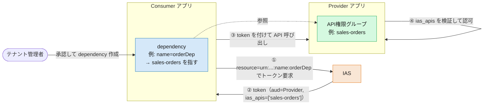
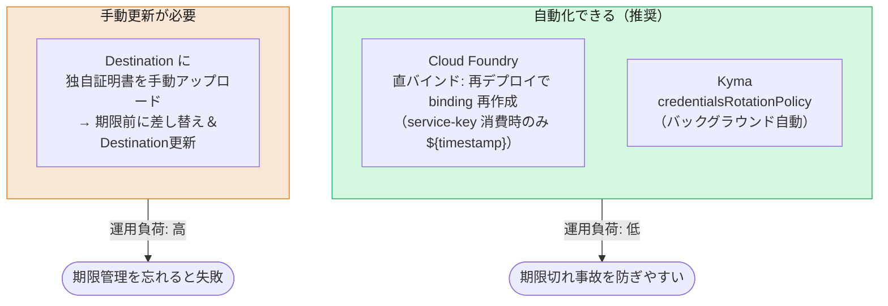

# App-to-App 連携の設定と証明書運用

> このファイルは **App-to-App 連携の設定・運用面**を扱います。
> — dependency（依存関係）の登録、Destination の設定、**証明書のライフサイクル／ローテーション運用**。
>
> 認証方式そのもの（トークン取得フローや `ias_apis` クレームの意味）は [02. 認証の違い](02-authentication.md) を参照してください。
>
> **`questions.md` の質問への回答:**
> - App-to-App の dependency の考え方（Provider が API を公開 → Consumer が dependency を登録 → `ias_apis` に載る）
> - Destination／アプリ側の具体設定と、証明書更新の運用（自動化できるか、Cloud Foundry での操作）

---

## 1. 登場人物と関係

XSUAA では、アプリ間連携は主に「Destination ＋ OAuth2（SAML Bearer / client credentials）＋ XSUAA の scope」で表現していました。CIS ではこれが **IAS の「API 権限グループ（API permission group）」と「dependency（依存関係）」** に置き換わります。

- **Provider（提供側）アプリ**: 自分の API を **API 権限グループ**として公開する。
- **Consumer（利用側）アプリ**: Provider の API 権限グループに対する **dependency** を登録する。
- **テナント管理者**: 「どの Consumer が、どの Provider の、どの API 権限グループを消費してよいか」を承認する（＝ dependency の作成）。**許可を出すのはアプリではなく管理者**。
- 実行時、Consumer が取得する **IAS トークンの `ias_apis` クレーム**に、許可された API 権限グループ名が入る。



> トークン取得のフロー（技術通信＝client credentials／主体伝播＝JWT bearer・token exchange）と `ias_apis` の詳細は [02 §5](02-authentication.md) を参照。

---

## 2. 設定手順：API 公開と dependency 登録

**Provider 側：API を公開する**
- 管理コンソール: `Applications and Resources > Applications > [Provider] > Trust タブ > Application APIs > Provided APIs` に API 権限グループ名を追加（URN 準拠・最大50文字・最大50個）。「Allow all APIs for principal propagation」を選ぶと `ias_apis` に `principal-propagation` が入る。
- または `identity` サービスのパラメータで宣言的に定義:

```json
{ "provided-apis": [ { "name": "sales-orders", "description": "Access sales orders" } ] }
```

**Consumer 側：dependency を登録する**
- 管理コンソール: `Applications and Resources > Applications > [Consumer] > Trust タブ > Application APIs > Dependencies` で、一意の dependency 名を付け、Provider アプリと API を選択（最大400個）。

> SAP も「Destination を作る感覚に近い」と案内しています。dependency 名はシナリオガイド等で管理者に伝えるのが定石です。

> **⚠️ ただし：Consumer 側の dependency は宣言的（mta.yaml）に書けない**
> Provider 側の API 公開は上記のとおり `identity` サービスの `provided-apis` パラメータで**宣言的に定義できます**（mta.yaml に載る）。しかし **Consumer 側の dependency 登録（＝管理者による承認）は、この管理コンソール操作でしか行えず、mta.yaml では表現できません**。
> これは XSUAA からの見落としやすい影響です。XSUAA では **Destination を mta.yaml に宣言的に定義**すれば App-to-App の配線がデプロイ記述子だけで完結し、環境を作り直してもそのまま再現できました。CIS では Destination（§3）を宣言できても、**dependency という手動の承認ステップがデプロイ記述子の外に残る**ため、IaC / CI-CD による完全な再現デプロイが一段難しくなります（この追加コストは [07 §4](07-summary-migration-cheatsheet.md#4-デメリット追加コストの正直な棚卸し) にも記載）。

---

## 3. Destination の設定

Destination の組み方には **2 通り**あります。**誰の資格情報でトークンを取るか**が本質的な分岐点です。CAP で IAS 保護アプリを呼ぶなら §3.1（資格情報を Destination に持たせない）が推奨、汎用・非 CAP や従来型は §3.2 です。

### 3.1 推奨（CAP）: 資格情報を持たない Destination 🔑

CAP（Java／Cloud SDK）で別の IAS アプリを呼ぶ場合、Destination には **client id も secret も証明書も書きません**。認証タイプを `NoAuthentication` にし、`cloudsdk.ias-dependency-name` で IAS の dependency を指すだけです。

```
# BTP Destination（プロパティ表記）
Name=app2app
Type=HTTP
URL=https://<Provider アプリ URL>
ProxyType=Internet
Authentication=NoAuthentication
cloudsdk.ias-dependency-name=<dependency 名>
```

実行時、Cloud SDK は **Consumer アプリにバインドされた自分の `identity` インスタンスの資格情報**を使ってトークンを取得します。つまり——**本人性は「自分のバインディング」**、**呼ぶ相手の指定は「dependency」**、という二段構えです（[02 §5](02-authentication.md)）。

- 前提: 両アプリが同じ IAS テナントを信頼し、IAS 側で dependency が登録済み（§2）。
- **ユーザー文脈の伝播（named user＝ログインユーザ / technical user）は Destination の認証タイプでは決まりません**。`NoAuthentication` は「Destination に資格情報を持たせない」ことを指定するだけで、テクニカルユーザ／ログインユーザのどちらで呼ぶかは**別途 CAP 側で指定**します。
  - **CAP Java**: remote service の `onBehalfOf` で宣言的に指定。`currentUser`（既定＝ログインユーザがいれば伝播、なければテクニカルユーザにフォールバック）／`systemUser`（テナント別テクニカルユーザ）／`systemUserProvider`（プロバイダテナントのテクニカルユーザ）。`onBehalfOf` は **`cloudsdk.ias-dependency-name` を持つ IAS app-2-app Destination（＝この §3.1 の構成）にのみ効く**点に注意（他の Destination タイプでは無視される）。
  - **CAP Node.js**: `onBehalfOf` 相当の宣言的キーは無く（SAP ドキュメントにも未整備の TODO が残る）、リモートサービス呼び出し時に現在の `req` を引き継ぐ（`srv.tx(req)` → ログインユーザ伝播）か、引き継がない（→ テクニカルユーザ）かで実行時に制御します。

**CAP Java での `onBehalfOf` 指定箇所** — `srv/src/main/resources/application.yaml` の `cds.remote.services.<サービス名>.destination` 配下に書きます（この §3.1 の Destination 名を `destination.name` に指定）:

```yaml
# srv/src/main/resources/application.yaml
cds:
  remote.services:
    RemoteIasService:
      destination:
        name: app2app        # ↑の NoAuthentication + cloudsdk.ias-dependency-name な Destination
        onBehalfOf: systemUser   # 省略時は currentUser（ログインユーザ伝播＋テクニカルへフォールバック）
```

> **共有 identity バインディング（§3.1 脚注の Destination レス構成）の場合**は `destination` ではなく `binding` 配下に同じキーで書きます:
>
> ```yaml
> cds:
>   remote.services:
>     OtherCapService:
>       binding:
>         name: shared-identity
>         onBehalfOf: systemUser
> ```

- **この方式の最大の利点**: 資格情報が Destination に一切載らないため、**証明書 / secret のローテーション時に Destination を触る必要がありません**（§4.4）。

> さらに、Consumer と Provider が **同じ `identity` インスタンスを共有**する構成なら、**Destination すら不要**です。CAP の remote service に `binding: name: <shared-identity>` を直接指定できます（CAP Java: "Binding to a Service with Shared Identity"、[共有 IAS 構成](shared-ias-app-central-dcl.md)）。

### 3.2 従来型: 資格情報を Destination に持たせる（汎用 / 非 CAP）

CAP プラグインを使わない場合や、汎用の Destination サービス経由で組む場合は、認証タイプに応じて **資格情報を Destination に設定**します。

- **`OAuth2ClientCredentials`** — 技術通信（技術ユーザー）。ログインユーザーの文脈を**伝播しない**システム間連携。
- **`OAuth2JWTBearer`** — 主体伝播。ログインユーザーの文脈を**維持**（別トークン種別からは token exchange 系）。

> `OAuth2JWTBearer`（IAS）は **跨サブアカウント／跨リージョン**でもそのまま使えます。信頼は IAS テナントの dependency に集約されるため、XSUAA の `OAuth2SAMLBearerAssertion` で必要だった **サブアカウント間の SAML 信頼設定は不要**です（変化点の詳細は [02 §5](02-authentication.md)）。

以下は主体伝播（`OAuth2JWTBearer`）の例です。技術通信なら `Authentication` を `OAuth2ClientCredentials` に変えます（`tokenService.body.resource` の dependency 指定は同じ）。

```json
{
  "Name": "app2app",
  "Type": "HTTP",
  "URL": "https://<Provider アプリ URL>",
  "ProxyType": "Internet",
  "Authentication": "OAuth2JWTBearer",
  "clientId": "<Consumer の client id>",
  "clientSecret": "<Consumer の client secret>",
  "tokenServiceURL": "https://<CIS テナント URL>/oauth2/token",
  "tokenServiceURLType": "Dedicated",
  "tokenService.body.resource": "urn:sap:identity:application:provider:name:<dependency名>"
}
```

ここで **トークン取得の認証（`clientSecret`）を mTLS（証明書）に置き換えられます**。ただしこの方式は **資格情報のコピーを Destination が抱える**ため、ローテーション時に **Destination 側の更新が必要**になります（§4.4）。この「トークン取得に使う証明書 / secret」の出所とローテーションが、次章の主題です。

### 3.3 起点が approuter（UI5 / Build Work Zone）のとき 🔑

§3.1 の `NoAuthentication` + `cloudsdk.ias-dependency-name` は **CAP／Cloud SDK ランタイム専用**です（プロパティ名の `cloudsdk.` が示すとおり）。UI5 を **Build Work Zone / approuter** から動かす構成では、Destination を解決・呼び出すのは **approuter** であり、CAP アプリではありません。approuter はこのプロパティを解釈せず、読むべき「自前 `identity` バインディング」も持たないため、**§3.1 は成立しません**。呼ぶ相手で 2 つに分かれます:

| ケース | 実体 | Destination |
|---|---|---|
| **A. UI5 → 同じ IAS/XSUAA で守られた自前バックエンド** | approuter が**ログインユーザ自身のトークンをそのまま転送**（`forwardAuthToken` 等） | 資格情報なしで動くが、これは §3.1 の Cloud SDK 機構ではなく**単なるトークン転送**（同一 issuer を信頼する相手に自分のトークンを渡すだけ） |
| **B. UI5 → 別の IAS アプリ（真の app2app）** | approuter に**トークン交換**をさせる | **§3.2**。`OAuth2JWTBearer` + `clientId`/`clientSecret`（＝冒頭ブログと同型） |

> **⚠️ 混同注意**: A の「Destination に資格情報を載せない」姿は §3.1 と似て見えますが、中身は別物です。**§3.1（`NoAuthentication` + dependency）は「CAP バックエンド同士」専用**で、**approuter 起点の app2app は §3.2** になります。「approuter でも `cloudsdk.ias-dependency-name` が効く」と誤解しないこと。

> **証明書は要る?**: **B でも証明書のアップロードは不要**です。ブログと同じく `clientId` + `clientSecret` だけで動きます。証明書が絡むのは、トークン取得の認証を **あえて secret から mTLS に強化**する場合だけ（§4.4 表③のオプション）で、必須ではありません。

### 3.4 §3.2 / §3.3-B で Destination に載せる資格情報の出所 🔑

Destination に資格情報のコピーを持たせる構成（§3.2、および §3.3-B の approuter 起点 app2app）では、**そのコピー元をどこにするか**が運用の安定性を左右します。**アプリバインディングの資格情報を直に貼るのは避ける**——再バインド／再デプロイで作り直され、固定値の静的 Destination が**回すたびに壊れる**からです（[§4.4 表②の⚠️](#44-destination-側のローテーション操作-)）。デプロイ周期から切り離した安定した資格情報を使います。

| 出所 | デプロイ耐性 | いつ使う |
|---|---|---|
| **① サービスキー**（`cf create-service-key <identity-instance> <key>`） | ○ アプリ再デプロイで再生成されない | アプリが `identity` インスタンスに**バインド済み**のとき。同じインスタンスから安定資格情報を切り出せる。`-c '{"credential-type":"binding-secret"}'`（または `X509_GENERATED`）で種別も選べる |
| **② IAS 管理コンソールの手動シークレット**（Client Authentication タブ） | ○ デプロイと無関係 | 背後に BTP インスタンスが無い**スタンドアロン IAS アプリ**（例: ブログの proxy app＝交換の中継専用）。サービスキーという取り口が無いのでこれ一択 |
| ③ アプリバインディングの資格情報 | ✗ 再バインドで変わり得る | Destination への固定コピー用途には**不向き** |

> **補足**: `identity` は特別ではなく、**普通の BTP サービスと同じくサービスキーを作れます**。`identity` インスタンスを作ると IAS テナントに対応する IAS アプリが自動生成され、サービスキーの資格情報＝その IAS アプリの資格情報になります。**手動シークレット作成が必須なのは②（スタンドアロン IAS アプリ）だけ**で、①経由のアプリなら管理コンソールに入らずサービスキーで取れます。

> **ただし「安定＝コストゼロ」ではない**: ①②いずれも **Destination に資格情報のコピーを持たせる構図は変わりません**。それ自身の有効期限があり、更新時は結局 [§4.4 表②](#44-destination-側のローテーション操作-) のとおり Destination の貼り替えが要ります。デプロイ周期から切り離せるだけで、**二重管理そのものは消えません**。これを根本から消せるのが、資格情報を Destination に載せない **§3.1（CAP バックエンド同士）** です。

---

## 4. 証明書のライフサイクルと運用 🔑

> **`questions.md` の質問への回答:**
> 「Destination 経由で App-to-App 連携している場合、証明書の更新が定期的に必要になるのか？」

**結論: X.509 証明書には有効期限が必ずあるため「更新（ローテーション）」自体は避けられません。ただし "手動で定期更新が必要か" は、証明書の出所（プロビジョニング方式）によって変わります。**

XSUAA の client secret は「一度発行したら（明示的にローテーションしない限り）長く使える」運用が可能でした。CIS の証明書ベースでは **有効期限が本質的に存在** するのが最大の意識の変化です。

### 4.1 証明書の出所と更新方式（credential-type）

`identity` サービスのバインディングは、`credential-type` によって証明書の扱いが変わります。

| credential-type | 証明書の在り処 | 更新（ローテーション） | 手動作業 |
|---|---|---|---|
| `SECRET` | （証明書ではなく client secret） | secret のローテーション | — |
| **`X509_GENERATED`** | **バインディングに含まれる**（SAP が生成） | `validity`（日数）で期限指定。**デフォルト 30 日・最長 30 日**（`validity-type` は `DAYS` のみ、範囲 1–30）。**サービスキー/バインディングのローテーション**で更新（CF は再デプロイ/リバインド、Kyma は自動。→ 4.2） | ランタイム依存（日々の手作業は不要にできる） |
| `X509_PROVIDED` | バインディングに**含まれない**（アプリが提供） | 自前の証明書管理に依存 | 自前で更新が必要 |

> **アプリ側はランタイムの証明書差し替えに対応済み**
> `X509_PROVIDED` や、ローテーションで `X509_GENERATED` の証明書が切り替わる場合、証明書は実行中に変わります。AMS クライアントライブラリはこれを想定しており、Node.js は `identityService.setCertificateAndKey(cert, key)`、CAP プラグインは `amsCapPluginRuntime.credentials.certificate/key` の更新で、**実行中に新しい証明書へ差し替え**できます（[AuthorizationBundle](../docs/Authorization/AuthorizationBundle.md) の Certificate Configuration 節）。

**推奨パターン（手動更新ほぼ不要）**: アプリを `identity` に **`credential-type: X509_GENERATED` でバインド**し、セキュリティライブラリ（`@sap/xssec` / SAP Cloud SDK / AMS）が **そのバインディング証明書で直接トークンフローを実行**します（Destination に証明書を手で載せない）。バインディングパラメータは、このリポジトリの [DeployDCL](../docs/Authorization/DeployDCL.md) と同じ書き方です:

```yaml [mta.yaml（バインディング側）]
modules:
  - name: my-consumer-srv
    requires:
      - name: my-consumer-identity   # identity サービスインスタンス
        parameters:
          config:
            credential-type: X509_GENERATED
            validity: 30          # 証明書の有効日数（範囲 1–30、既定 30）
            validity-type: DAYS   # DAYS のみ対応
```

> **出典（`validity` の値）**: SAP 公式 [Reference Information for the Identity Service of SAP BTP](https://help.sap.com/docs/identity-authentication/identity-authentication/reference-information-for-identity-service-of-sap-btp)（[GitHub ソース](https://github.com/SAP-docs/btp-cloud-identity-services/blob/main/docs/Integrating-the-Service/reference-information-for-the-identity-service-of-sap-btp-9379444.md)）。`identity` サービスの `X509_GENERATED` は **`validity` 既定 30・範囲 1–30 DAYS**、`validity-type` は `DAYS` のみ、`key-length` は 2048（既定）/4096。**「7日」「最長1年」は誤り**——7日は別サービス（XSUAA）のデフォルト、1年は identity・XSUAA いずれの公式リファレンスにも無い。

### 4.1.1 binding と service-key ではローテーションのされ方が違う（重要）

有効期限は**バインディング単位でもサービスキー単位でもなく「生成される証明書（クレデンシャル）単位」**です。binding と service-key は**それぞれ独立した証明書＝独立した有効期限**を持ち、`credential-type` / `validity` は **config を書いた場所のクレデンシャル**に効きます。**CAP のデフォルトは `credential-type` を binding 側**（`modules[].requires[].parameters.config`）に置くので、効くのは **その binding の証明書**です（capire もこの書き方）。

ローテーションの起こり方が両者で決定的に違います:

| | **binding**（CAP デフォルト） | **service-key**（`resources[].service-keys`） |
|---|---|---|
| 更新のトリガ | **アプリの再デプロイ時に CF が binding を再作成 → IAS が新証明書を発行**（設定が未変更でも） | deploy では自動再作成されない。**名前で永続**するので回すには工夫が要る |
| CF での回し方 | **再デプロイ（＝移送）するだけ**。`service-keys` も `${timestamp}` も不要 | サービスキー名に **`${timestamp}`** を使い、再デプロイ毎に新キー＝新証明書（旧キー自動削除） |
| いつ使う | 直バインドの CAP アプリ | 外部 Consumer・サブアカウント跨ぎなど、**バインドできない相手に資格情報を渡す**場合 |

> **要点（＝「デフォルト構成から変えたくない」への回答）**: **CAP デフォルトの binding のままでよい**。証明書は**アプリを再デプロイ（cTMS 移送）するたびに自動で更新**されます。`${timestamp}` サービスキーへ作り替える必要はありません（あれは service-key を消費する構成向け）。

> ⚠️ **gotcha（IAS の User Management / SCIM API を使う場合のみ）**: binding 再作成で証明書がローテートされると、IAS が「**API Access for application users**」を自動的に無効化し、手動で再有効化するまで User Management REST API が止まる、という報告があります（[SAP Community](https://community.sap.com/t5/human-capital-management-q-a/ias-service-binding-auto-rotates-x-509/qaq-p/14268538)）。**通常のトークン認証／AMS だけなら無関係**です。

> ⚠️ **要環境確認**: 「**未変更の再デプロイでも binding が再作成され新証明書が出る**」は SAP Community の報告ベースで、一次リファレンスの明文ではありません。本番前に自環境で **再デプロイ前後の証明書（serial / notBefore）が変わること**を一度確認してください。`app-identifier` を付けると**ローテーション後も subject（DN）が安定**し、信頼設定が壊れません（capire も「rotation に必要」と明記）。

### 4.2 ランタイム別のローテーション方法

証明書の**ローテーション方法はランタイムで異なります**（質問への直接回答）。

- **Cloud Foundry（classic）**: **完全無停止の自動更新はありません。再デプロイ or リバインドが必要**です。**直バインドの CAP アプリなら、再デプロイ（＝移送）するだけで binding が再作成され新証明書に更新**されます（4.1.1）。**最長 30 日**なので長い期限で頻度を下げる余地は小さく、**月次以内のローテーションが前提**——通常リリース／定期移送に吸収させます（4.2.2）。`${timestamp}` サービスキー方式（下記）は、**binding ではなく service-key を消費する構成**（外部 Consumer 等）向けの選択肢です。手動更新（再デプロイ / unbind→rebind）の使い分けは 4.2.1 を参照。
- **Kyma**: SAP BTP サービスオペレーターの **`credentialsRotationPolicy`** により、**バックグラウンドで自動ローテーション**（再デプロイ不要）。
- **ランタイム差し替え（4.1）が効く範囲に注意**: ライブラリの実行時差し替えは「**新しい証明書がプロセスに“届く”経路がある**」ことが前提です。**Kyma はマウントされた Secret が自動更新**されるので再起動なしで追従できます。一方 **CF の binding 証明書は `VCAP_SERVICES` に注入され、プロセス起動時に固定**される（[Cloud Foundry Docs: application binding](https://docs.cloudfoundry.org/devguide/services/application-binding.html)）ため、binding を作り直しても **アプリを restart/restage しないと新証明書は読み込まれません**。CF で無停止差し替えができるのは、`X509_PROVIDED` でアプリが独自にファイル/Secret を読み直す構成に限られます。**したがって「再デプロイなら無停止」は誤り**——ダウンタイムの整理は 4.2.3 を参照。

CF のサービスキー自動更新（`${timestamp}`）の記述例 — **これは binding ではなく service-key を消費する構成向け**（外部 Consumer・跨ぎ等）。直バインドの CAP なら不要で、再デプロイだけで回ります（4.1.1）:

```yaml [mta.yaml（CF: サービスキー自動更新／service-key 消費時）]
resources:
  - name: my-consumer-identity
    type: org.cloudfoundry.managed-service
    parameters:
      service: identity
      service-plan: application
      service-keys:
        - name: consumer-key-${timestamp}   # 再デプロイ毎に新キー=新証明書、旧キーは自動削除
          config:
            credential-type: X509_GENERATED
            validity: 30          # 範囲 1–30（既定 30）。1年などは不可
            validity-type: DAYS
  # アプリ側は env-var-name で固定エイリアス参照にする（キー名が毎回変わるため）
```



### 4.2.1 再デプロイ（MTA）と unbind→rebind、どちらで更新するか

証明書を切り替える（＝新しいバインディング証明書に更新する）手段は主に 2 つあります。**どちらが良いかは「デプロイ成果物とパイプラインを持っているか」で変わります**——一方的に再デプロイが上ではありません。

> なお **unbind→rebind→restage は SAP 公式が IAS バインディングのローテーション標準手順として明記**しています（[Job Scheduling Service – Credential Rotation](https://help.sap.com/docs/JOB_SCHEDULER/07b57c2f4b944bcd8470d024723a1631/ed3bf285065e4d42b95926589c36d39a.html)：unbind → rebind で新資格情報が自動生成 → restage）。その場しのぎではなく**正規の選択肢**であり、しかもこの手順は **SAP Automation Pilot の提供カタログだけで自動化できます**（→ 4.2.3）。

| | MTA 再デプロイ（binding 再作成） | 手動 unbind → rebind |
|---|---|---|
| **前提（必要なもの）** | **デプロイ可能な成果物（`mta.yaml`/`mtar`）＋デプロイ権限** | **`cf` CLI アクセスのみ（ソース・パイプライン不要）** |
| 方式 | 宣言的（`mta.yaml` に記述） | 命令的（`cf` CLI の手作業） |
| 自動化 | CI/CD で定期実行できる | 都度手動・忘れやすい |
| 証明書の切替 | 再デプロイで **binding 再作成 → 新証明書**（旧は置き換え。service-key 消費時は `${timestamp}` で旧キー自動削除） | unbind を先にすると**資格情報が一時的に消える（ギャップ）** |
| 再現性 / 監査 | ソース管理・パイプラインに残る | 記録が残りにくい |
| 向く場面 | **CI/CD 管理下の定常ローテーション** | **ソースを持たない運用者**の対応、**緊急**（鍵漏洩の疑い）、MTA 管理外の単発 |

- **ソース／パイプラインを持つチーム**なら、定常ローテーションは **MTA 再デプロイが既定**。宣言的で、直バインドなら再デプロイだけで binding が再作成され新証明書に更新、CI/CD に載せられ監査も効く。
- **ソースや mtar を持たない運用者**（本番を `cf` で見るだけの立場、緊急対応など）にとっては、**unbind→rebind の方が現実的**。再デプロイは成果物とデプロイ権限がないと実行できないが、unbind→rebind は `cf` アクセスだけで完結する——ここが再デプロイにない強み。
- unbind→rebind を使うときは「**新しいバインドを先に作ってから古いバインドを外す**」順にしてギャップ（認証断）を避ける。unbind を先にすると、その間アプリは有効な資格情報を持たない。
- ⚠️ **MTA 管理下のリソースを手で unbind/rebind すると、次の `cf deploy` がデスクリプタ定義に合わせて元に戻す（ドリフト）**ことがある。MTA で管理しているなら手動更新はその場しのぎと割り切り、恒久策は通常の再デプロイ（＝移送）に寄せるのが安全。
- どちらでも、CF では新しい資格情報を読ませるためにアプリの **restage / 再起動**が要る（ライブラリの実行時差し替え（4.1）を使わない限り）。

### 4.2.2 定期ローテーションを cTMS 移送と衝突させずに回す

**採用方針**: CF では **再デプロイ方式**を基本にする（**CAP デフォルトの直バインドのまま、構成変更なし**）。UPS 経由で資格情報を配布し定期更新する案も検討したが、①UPS は配布層であって証明書の発生源にならず結局ローテーション・ジョブの自作が要る、②秘密鍵のコピーが増える、③自動検出されず資格情報ロケーションの手当てが要る、④restage 前提、と割に合わないため見送り。ZTIS（`X509_ATTESTED`、自動ローテーション）は最も楽だが、**環境での利用可否が要確認**（公開ドキュメント・Kyma モジュールは存在するが CF/顧客利用の可否は landscape 依存）なので、確実な既定路線は再デプロイ方式とする。

**衝突回避の原則**: 本番へのデプロイ権限を **cTMS 一本に保つ**。ローテーションもその同じ管を通し、GitHub Actions 等から**直接 `cf deploy` する第2経路を作らない**。

前提となる事実 — **直バインドは再デプロイのたびに CF が binding を再作成し、IAS が（設定未変更でも）新証明書を発行**する（[SAP Community](https://community.sap.com/t5/human-capital-management-q-a/ias-service-binding-auto-rotates-x-509/qaq-p/14268538) 報告、4.1.1）。ゆえに「変更が無くても再移送すればローテーションになる」。（service-key 消費構成の場合は、`${timestamp}` が **mtar に焼き込まれずデプロイ時に解決**される性質で同じ効果を得る＝[service-keys 公式](https://github.com/SAP-docs/btp-cloud-platform/blob/main/docs/30-development/service-keys-32297f1.md)。）

推奨パターン:

1. **トリガは cTMS 移送に向ける**（直 `cf deploy` にしない）。スケジューラがやるのは cTMS 移送のキックで、出口は常に cTMS ＝書き手は1つ。
2. **無操作フォールバックにする**: 一律に定期移送するのではなく「**本番に直近 ~25 日 移送が無ければ、現行の本番承認版を再移送する**」ゲート付きにする。通常リリースが月内にあればフォールバックは発火せず、**通常移送と重ならない**。cTMS はノード単位で移送をシリアライズするため、仮に重なってもクロバーせずキューされる。
3. **再移送するのは現行の本番承認版**（main の先端や任意スナップショットではない）。コード変更を持ち込まない。
4. **安全網**: `validity: 30`（最大）で窓を最大化／発火は ~20〜25 日の余裕を持たせる（移送1回のスリップ＝失効＝障害）／**証明書・バインディングの経過日数を監視しアラート**（失効忘れが証明書運用最大の事故）。

| | 内容 |
|---|---|
| 既定方針 | 再デプロイ方式を cTMS 経由で（CAP デフォルトの直バインドのまま、構成変更なし） |
| 発火条件 | 直近 ~25 日 本番移送が無い時だけ（無操作フォールバック） |
| 移送対象 | 現行の本番承認版（変更を持ち込まない） |
| 窓 / 余裕 | `validity: 30`、発火は 20〜25 日目安 |
| 監視 | 証明書/バインディング経過日数のアラート必須 |

> **上級策（任意）**: 回転する identity 資格情報リソースだけを**別 MTA / 別移送ノード**に切り出すと、ローテーション移送がアプリのコードに触れず blast radius を最小化できる。構成は一段複雑になるので、まずは上記 1–4 で足りることが多い。

> ⚠️ **要環境確認**: cTMS で「**同一バージョンの再移送**」を再実行できるか（インポートキューの再処理・API 駆動での再トリガ可否）は、パイプライン / cTMS 設定に依存する。定期ローテーションを組む前に自環境で一度確認すること。

### 4.2.3 ダウンタイムの正直な整理と Automation Pilot での自動化 🔑

**「再デプロイなら無停止」は誤り**——ここは正直に。証明書を切り替えるには、どの方式でも**新しい資格情報をアプリプロセスに読み込ませる**必要があり、CF では binding 証明書が `VCAP_SERVICES` に注入されてプロセス起動時に固定されるため、**binding を作り直したら restart/restage が要る**（4.2）。

| 方式 | アプリ停止 | 資格情報ギャップ | 無停止にできるか |
|---|---|---|---|
| **MTA 通常再デプロイ**（デフォルト strategy） | あり（stop→start） | 再起動窓に内包 | ❌ 単一インスタンスは瞬断あり |
| **MTA Blue-Green**（[`bg-deploy` / Blue-Green Deployment Strategy](https://help.sap.com/docs/BTP/65de2977205c403bbc107264b8eccf4b/772ab72204f04946b79ce2d962e64970.html)） | **なし** | **なし**（green が新 binding で起動 → ルート切替 → blue 破棄） | ✅ **唯一の真の無停止経路** |
| **unbind→rebind→restage**（SAP 公式の IAS ローテ手順） | あり（restage） | unbind〜restage 完了まで（発行済みトークンは ~1h 有効なので実害は限定的） | ❌（unbind 先行のギャップは原理的に消せない） |

> **要点**: 単一インスタンスの Consumer アプリなら、通常再デプロイも rebind も**同程度の瞬断**がある。**真の無停止が要るなら Blue-Green（`bg-deploy`）**——これは再デプロイ方式だけが持つ経路で、rebind では原理的に到達できない。逆に**「軽く・コードに触れず・cTMS 再移送可否に依存せず」回したいなら rebind 方式**が向く。トレードオフであって一方的な優劣ではない。

**Automation Pilot で rebind 方式を自動化する** — `cf` アクセス（技術ユーザー）さえ自動化に渡せば、unbind→rebind→restage を**提供カタログのコマンドだけ**で組めます:

| ステップ | コマンド | カタログ |
|---|---|---|
| ① 旧 binding 削除 | [UnbindCfServiceInstance](https://help.sap.com/docs/automation-pilot/automation-pilot/unbindcfserviceinstance-command) | `cf-sapcp`（提供済み） |
| ② 再バインド | [BindCfServiceInstance](https://help.sap.com/docs/AUTOMATION_PILOT/de3900c419f5492a8802274c17e07049/9d05845ff219428c85a3e475e33deacd.html) | `cf-sapcp` |
| ③ restage（またはローリング再起動） | RestageCloudAlmCfApp / RestartCloudAlmCfApp | `calmhm-sapcp` |

- **BindCfServiceInstance には任意 JSON の `parameters` 入力があり**、mta.yaml と同じ `{"credential-type":"X509_GENERATED","validity":30,"app-identifier":"<name>"}` をそのまま渡せる＝**デプロイ記述子と同一構成の binding を再作成**できる。
- スケジュール実行は Automation Pilot 標準機能、失敗は Alert Notification 連携。期限監視は公式サンプル [Check CF Certificate Expiration](https://github.com/SAP-samples/automation-pilot-examples/blob/main/check-cf-certificate-expiration)（CF binding 内の証明書期限を監視）がそのまま使える。
- **利点**: cTMS の「同一バージョン再移送が可能か」という未確認の前提（4.2.2 の⚠️）に依存しない。デプロイ成果物・パイプライン不要で、**コードに一切触れない**（blast radius は無変更再移送より小さい）。
- **注意**: ①「本番への書き手は cTMS 一本」という統制原則（4.2.2）とは形式上ずれる → 「デプロイは cTMS／資格情報ローテは Automation Pilot の承認済み SOP」と役割分担を明文化する。②CF は同一アプリに二重 binding を持てないため **unbind が先**になり、restage 完了までの数十秒〜数分、**新規トークン取得だけが失敗し得る**（取得済みトークンは有効）——低トラフィック帯に。③自動化自身が **CF 技術ユーザー（SpaceDeveloper 権限＋user/password か refreshToken）を要する**＝管理する資格情報が1つ増える。
- `app-identifier` を付けて subject（DN）を安定させるのは、この方式でも必須（4.1.1）。

> **既定方針への位置づけ**: 4.2.2 の無操作フォールバック（「~25 日 移送が無ければ現行版を再移送」）を、**cTMS 再移送の代わりに Automation Pilot の unbind→rebind→restage シナリオ**で実現してもよい。cTMS 再移送可否の検証が不要になり、仕組みが一段軽くなる。無停止が必須の系だけは Blue-Green（`bg-deploy`）を選ぶ。

> **出典**: [Job Scheduling Service – Credential Rotation](https://help.sap.com/docs/JOB_SCHEDULER/07b57c2f4b944bcd8470d024723a1631/ed3bf285065e4d42b95926589c36d39a.html)（IAS binding のローテは unbind→rebind→restage）、[Automation Pilot – Cloud Foundry (cf-sapcp) Catalog](https://help.sap.com/docs/AUTOMATION_PILOT/de3900c419f5492a8802274c17e07049/5146cd69fd7f4fc899ceadc39ba2f3b0.html)、[BindCfServiceInstance Command](https://help.sap.com/docs/AUTOMATION_PILOT/de3900c419f5492a8802274c17e07049/9d05845ff219428c85a3e475e33deacd.html)、[Blue-Green Deployment of MTAs](https://help.sap.com/docs/BTP/65de2977205c403bbc107264b8eccf4b/772ab72204f04946b79ce2d962e64970.html)、[CF application binding](https://docs.cloudfoundry.org/devguide/services/application-binding.html)。

### 4.3 手動更新が残るケース

- **Destination に独自の証明書（キーストア）を自分でアップロード**してトークン取得の mTLS に使う場合。→ 有効期限前に、更新した証明書をアップロードして Destination を手動更新する必要があります。SAP 公式も「有効期限前に、更新した証明書をアップロードして Destination を手動更新する（Rotate certificates before expiry by uploading the updated destination certificate）」と明記しています。
- なお BTP Destination サービスには「デフォルトクライアント証明書」を自動生成・自動更新する仕組みもあり、これを使えば手動更新を避けられます。

> **要点**: 「証明書だから毎回手動で入れ替えが必要」ではありません。**アプリを `identity` に `X509_GENERATED` でバインドし、CF は再デプロイ（直バインドは binding 再作成で自動更新／service-key 消費時は `${timestamp}`）、Kyma は `credentialsRotationPolicy`** に任せれば、日々の手作業は不要にできます。手動運用が残るのは「Destination に独自証明書を手で載せた」ケースです。

### 4.4 Destination 側のローテーション操作 🔑

§4.1〜4.3 は **Consumer アプリが IAS からトークンを取るための資格情報（＝バインディング側）**の更新でした。では、コックピットの **Destination 側**には何が必要か——これは **資格情報を Destination に複製しているか**で決まります。§3 の 2 方式がそのまま効いてきます。

`OAuth2ClientCredentials` / `OAuth2JWTBearer` は、トークン取得のために **client id ＋ secret（または証明書）を Destination 設定内にコピーとして保持**します。このコピーは**バインディングのローテーションに自動追従しません**。ここが分岐点です。

| Destination の持ち方 | ローテーション時の Destination 操作 |
|---|---|
| **① 資格情報を持たない**（§3.1：`NoAuthentication` ＋ `cloudsdk.ias-dependency-name`、または共有 identity バインディング） | **不要**。ライブラリが実行時に新しいバインディング資格情報を読む。Destination には資格情報が無いので触らなくてよい |
| **② client secret をインライン**（§3.2 の `clientSecret`） | **必要**。コックピット **Connectivity → Destinations → Edit** で `Client Secret`（変わっていれば `Client ID` も）を新しい値に貼り替え → **Save**。自動化するなら **Destination service REST API** / **MTA の destination-content（`init_data`）** / **Terraform** |
| **③ 証明書キーストアをアップロード**（§3.2 で clientSecret を mTLS 化） | **必要**。Edit で更新キーストアを **再アップロード → Save**（§4.3）。または Destination service の **デフォルトクライアント証明書**（自動更新）を使う |

> **⚠️ 証明書/secret のローテーション（§4.2）と ② の相性に注意**: 再デプロイのたびにバインディングが作り直されて証明書/secret が変わる運用にすると、**それを固定値で持つ静的 Destination は回すたびに壊れます**。両立させたいなら Destination 更新を同じ CI/CD パイプラインで自動化するか、そもそも **① を選んで二重管理を消す**のが定石です。

**結論**: 「Destination に資格情報のコピーを持たせた瞬間、回すものが 2 つ（バインディング＋Destination）になり、両者は同期しない」。これを避けられるのが §3.1 の推奨構成であり、**①なら §4.2 のバインディング更新だけで、Destination は無操作**で済みます。

---

## 関連

- [02. 認証の違い](02-authentication.md) — 認証方式（トークン発行者・フロー・`ias_apis`・mTLS）
- [Technical Communication](../docs/Authorization/TechnicalCommunication.md) — `ias_apis` を AMS 内部ポリシーに変換する認可側の詳細
