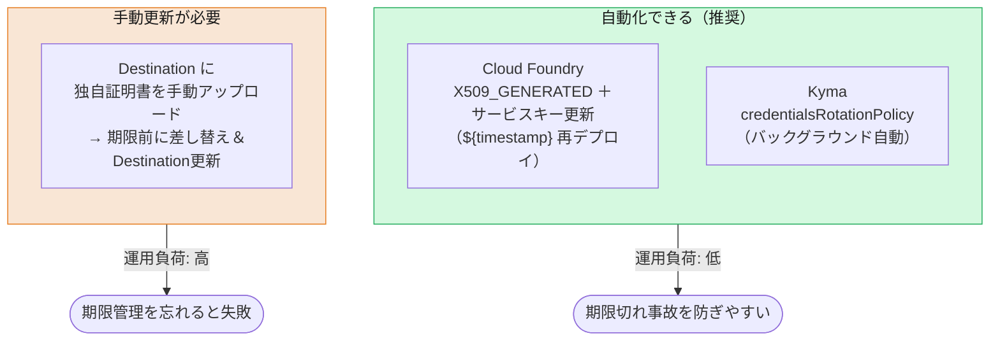

# App-to-App 連携の設定と証明書運用

> このファイルは **App-to-App 連携の設定・運用面**を扱います。
> — dependency（依存関係）の登録、Destination の設定、**証明書のライフサイクル／ローテーション運用**。
>
> 認証方式そのもの（トークン取得フローや `ias_apis` クレームの意味）は [02. 認証の違い](02-authentication.md) を参照してください。
>
> **`questions.md` の質問への回答:**
> - App-to-App の dependency の考え方（Provider が API を公開 → Consumer が dependency を登録 → `ias_apis` に載る）
> - Destination／アプリ側の具体設定と、証明書更新の運用（自動化できるか、Cloud Foundry での操作）

---

## 1. 登場人物と関係

XSUAA では、アプリ間連携は主に「Destination ＋ OAuth2（SAML Bearer / client credentials）＋ XSUAA の scope」で表現していました。CIS ではこれが **IAS の「API 権限グループ（API permission group）」と「dependency（依存関係）」** に置き換わります。

- **Provider（提供側）アプリ**: 自分の API を **API 権限グループ**として公開する。
- **Consumer（利用側）アプリ**: Provider の API 権限グループに対する **dependency** を登録する。
- **テナント管理者**: 「どの Consumer が、どの Provider の、どの API 権限グループを消費してよいか」を承認する（＝ dependency の作成）。**許可を出すのはアプリではなく管理者**。
- 実行時、Consumer が取得する **IAS トークンの `ias_apis` クレーム**に、許可された API 権限グループ名が入る。


> トークン取得のフロー（技術通信＝client credentials／主体伝播＝JWT bearer・token exchange）と `ias_apis` の詳細は [02 §5](02-authentication.md) を参照。

---

## 2. 設定手順：API 公開と dependency 登録

**Provider 側：API を公開する**
- 管理コンソール: `Applications and Resources > Applications > [Provider] > Trust タブ > Application APIs > Provided APIs` に API 権限グループ名を追加（URN 準拠・最大50文字・最大50個）。「Allow all APIs for principal propagation」を選ぶと `ias_apis` に `principal-propagation` が入る。
- または `identity` サービスのパラメータで宣言的に定義:

```json
{ "provided-apis": [ { "name": "sales-orders", "description": "Access sales orders" } ] }
```

**Consumer 側：dependency を登録する**
- 管理コンソール: `Applications and Resources > Applications > [Consumer] > Trust タブ > Application APIs > Dependencies` で、一意の dependency 名を付け、Provider アプリと API を選択（最大400個）。

> SAP も「Destination を作る感覚に近い」と案内しています。dependency 名はシナリオガイド等で管理者に伝えるのが定石です。

> **⚠️ ただし：Consumer 側の dependency は宣言的（mta.yaml）に書けない**
> Provider 側の API 公開は上記のとおり `identity` サービスの `provided-apis` パラメータで**宣言的に定義できます**（mta.yaml に載る）。しかし **Consumer 側の dependency 登録（＝管理者による承認）は、この管理コンソール操作でしか行えず、mta.yaml では表現できません**。
> これは XSUAA からの見落としやすい影響です。XSUAA では **Destination を mta.yaml に宣言的に定義**すれば App-to-App の配線がデプロイ記述子だけで完結し、環境を作り直してもそのまま再現できました。CIS では Destination（§3）を宣言できても、**dependency という手動の承認ステップがデプロイ記述子の外に残る**ため、IaC / CI-CD による完全な再現デプロイが一段難しくなります（この追加コストは [07 §4](07-summary-migration-cheatsheet.md#4-デメリット追加コストの正直な棚卸し) にも記載）。

---

## 3. Destination の設定

Destination の組み方には **2 通り**あります。**誰の資格情報でトークンを取るか**が本質的な分岐点です。CAP で IAS 保護アプリを呼ぶなら §3.1（資格情報を Destination に持たせない）が推奨、汎用・非 CAP や従来型は §3.2 です。

### 3.1 推奨（CAP）: 資格情報を持たない Destination 🔑

CAP（Java／Cloud SDK）で別の IAS アプリを呼ぶ場合、Destination には **client id も secret も証明書も書きません**。認証タイプを `NoAuthentication` にし、`cloudsdk.ias-dependency-name` で IAS の dependency を指すだけです。

```
# BTP Destination（プロパティ表記）
Name=app2app
Type=HTTP
URL=https://<Provider アプリ URL>
ProxyType=Internet
Authentication=NoAuthentication
cloudsdk.ias-dependency-name=<dependency 名>
```

実行時、Cloud SDK は **Consumer アプリにバインドされた自分の `identity` インスタンスの資格情報**を使ってトークンを取得します。つまり——**本人性は「自分のバインディング」**、**呼ぶ相手の指定は「dependency」**、という二段構えです（[02 §5](02-authentication.md)）。

- 前提: 両アプリが同じ IAS テナントを信頼し、IAS 側で dependency が登録済み（§2）。
- ユーザー文脈の伝播（named user / technical user）は、CAP の remote service 側 `onBehalfOf`（`currentUser` / `systemUser` / `systemUserProvider`）で制御します。
- **この方式の最大の利点**: 資格情報が Destination に一切載らないため、**証明書 / secret のローテーション時に Destination を触る必要がありません**（§4.4）。

> さらに、Consumer と Provider が **同じ `identity` インスタンスを共有**する構成なら、**Destination すら不要**です。CAP の remote service に `binding: name: <shared-identity>` を直接指定できます（CAP Java: "Binding to a Service with Shared Identity"、[共有 IAS 構成](shared-ias-app-central-dcl.md)）。

### 3.2 従来型: 資格情報を Destination に持たせる（汎用 / 非 CAP）

CAP プラグインを使わない場合や、汎用の Destination サービス経由で組む場合は、認証タイプに応じて **資格情報を Destination に設定**します。

- **`OAuth2ClientCredentials`** — 技術通信（技術ユーザー）。ログインユーザーの文脈を**伝播しない**システム間連携。
- **`OAuth2JWTBearer`** — 主体伝播。ログインユーザーの文脈を**維持**（別トークン種別からは token exchange 系）。

> `OAuth2JWTBearer`（IAS）は **跨サブアカウント／跨リージョン**でもそのまま使えます。信頼は IAS テナントの dependency に集約されるため、XSUAA の `OAuth2SAMLBearerAssertion` で必要だった **サブアカウント間の SAML 信頼設定は不要**です（変化点の詳細は [02 §5](02-authentication.md)）。

以下は主体伝播（`OAuth2JWTBearer`）の例です。技術通信なら `Authentication` を `OAuth2ClientCredentials` に変えます（`tokenService.body.resource` の dependency 指定は同じ）。

```json
{
  "Name": "app2app",
  "Type": "HTTP",
  "URL": "https://<Provider アプリ URL>",
  "ProxyType": "Internet",
  "Authentication": "OAuth2JWTBearer",
  "clientId": "<Consumer の client id>",
  "clientSecret": "<Consumer の client secret>",
  "tokenServiceURL": "https://<CIS テナント URL>/oauth2/token",
  "tokenServiceURLType": "Dedicated",
  "tokenService.body.resource": "urn:sap:identity:application:provider:name:<dependency名>"
}
```

ここで **トークン取得の認証（`clientSecret`）を mTLS（証明書）に置き換えられます**。ただしこの方式は **資格情報のコピーを Destination が抱える**ため、ローテーション時に **Destination 側の更新が必要**になります（§4.4）。この「トークン取得に使う証明書 / secret」の出所とローテーションが、次章の主題です。

---

## 4. 証明書のライフサイクルと運用 🔑

> **`questions.md` の質問への回答:**
> 「Destination 経由で App-to-App 連携している場合、証明書の更新が定期的に必要になるのか？」

**結論: X.509 証明書には有効期限が必ずあるため「更新（ローテーション）」自体は避けられません。ただし "手動で定期更新が必要か" は、証明書の出所（プロビジョニング方式）によって変わります。**

XSUAA の client secret は「一度発行したら（明示的にローテーションしない限り）長く使える」運用が可能でした。CIS の証明書ベースでは **有効期限が本質的に存在** するのが最大の意識の変化です。

### 4.1 証明書の出所と更新方式（credential-type）

`identity` サービスのバインディングは、`credential-type` によって証明書の扱いが変わります。

| credential-type | 証明書の在り処 | 更新（ローテーション） | 手動作業 |
|---|---|---|---|
| `SECRET` | （証明書ではなく client secret） | secret のローテーション | — |
| **`X509_GENERATED`** | **バインディングに含まれる**（SAP が生成） | `validity` で期限指定（SAP 管理証明書は短期。例: XSUAA 管理のデフォルト **7日**、最長 **1年**）。**サービスキー/バインディングのローテーション**で更新（CF は再デプロイ/リバインド、Kyma は自動。→ 4.2） | ランタイム依存（日々の手作業は不要にできる） |
| `X509_PROVIDED` | バインディングに**含まれない**（アプリが提供） | 自前の証明書管理に依存 | 自前で更新が必要 |

> **アプリ側はランタイムの証明書差し替えに対応済み**
> `X509_PROVIDED` や、ローテーションで `X509_GENERATED` の証明書が切り替わる場合、証明書は実行中に変わります。AMS クライアントライブラリはこれを想定しており、Node.js は `identityService.setCertificateAndKey(cert, key)`、CAP プラグインは `amsCapPluginRuntime.credentials.certificate/key` の更新で、**実行中に新しい証明書へ差し替え**できます（[AuthorizationBundle](../docs/Authorization/AuthorizationBundle.md) の Certificate Configuration 節）。

**推奨パターン（手動更新ほぼ不要）**: アプリを `identity` に **`credential-type: X509_GENERATED` でバインド**し、セキュリティライブラリ（`@sap/xssec` / SAP Cloud SDK / AMS）が **そのバインディング証明書で直接トークンフローを実行**します（Destination に証明書を手で載せない）。バインディングパラメータは、このリポジトリの [DeployDCL](../docs/Authorization/DeployDCL.md) と同じ書き方です:

```yaml [mta.yaml（バインディング側）]
modules:
  - name: my-consumer-srv
    requires:
      - name: my-consumer-identity   # identity サービスインスタンス
        parameters:
          config:
            credential-type: X509_GENERATED
            validity: 90          # 証明書の有効日数（例）
            validity-type: DAYS
```

### 4.2 ランタイム別のローテーション方法

証明書の**ローテーション方法はランタイムで異なります**（質問への直接回答）。

- **Cloud Foundry（classic）**: **完全無停止の自動更新はありません。再デプロイ or リバインドの操作が必要**です。推奨は MTA の *Automatic Service Key Renewal* — サービスキー名に `${timestamp}` を使うと、再デプロイのたびに新しいキー（＝新しい証明書）が作られ、**古いキーは自動削除**されます。アプリは `env-var-name` で固定エイリアス参照にします。手動なら「サービスキー再作成（または unbind → rebind）＋ restage」でも同じ結果。`validity` を長め（最長1年）にして再デプロイ頻度を下げ、CI/CD で自動実行するのが定石です。
- **Kyma**: SAP BTP サービスオペレーターの **`credentialsRotationPolicy`** により、**バックグラウンドで自動ローテーション**（再デプロイ不要）。
- いずれの場合も、ライブラリは実行時の証明書差し替えに対応（4.1）なので、新しい証明書がバインディングに届けば**再起動なしで追従**します。

CF のサービスキー自動更新（`${timestamp}`）の記述例:

```yaml [mta.yaml（CF: サービスキー自動更新）]
resources:
  - name: my-consumer-identity
    type: org.cloudfoundry.managed-service
    parameters:
      service: identity
      service-plan: application
      service-keys:
        - name: consumer-key-${timestamp}   # 再デプロイ毎に新キー=新証明書、旧キーは自動削除
          config:
            credential-type: X509_GENERATED
            validity: 365
            validity-type: DAYS
  # アプリ側は env-var-name で固定エイリアス参照にする（キー名が毎回変わるため）
```



### 4.3 手動更新が残るケース

- **Destination に独自の証明書（キーストア）を自分でアップロード**してトークン取得の mTLS に使う場合。→ 有効期限前に、更新した証明書をアップロードして Destination を手動更新する必要があります。SAP 公式も「有効期限前に、更新した証明書をアップロードして Destination を手動更新する（Rotate certificates before expiry by uploading the updated destination certificate）」と明記しています。
- なお BTP Destination サービスには「デフォルトクライアント証明書」を自動生成・自動更新する仕組みもあり、これを使えば手動更新を避けられます。

> **要点**: 「証明書だから毎回手動で入れ替えが必要」ではありません。**アプリを `identity` に `X509_GENERATED` でバインドし、CF は `${timestamp}` 再デプロイ、Kyma は `credentialsRotationPolicy`** に任せれば、日々の手作業は不要にできます。手動運用が残るのは「Destination に独自証明書を手で載せた」ケースです。

### 4.4 Destination 側のローテーション操作 🔑

§4.1〜4.3 は **Consumer アプリが IAS からトークンを取るための資格情報（＝バインディング側）**の更新でした。では、コックピットの **Destination 側**には何が必要か——これは **資格情報を Destination に複製しているか**で決まります。§3 の 2 方式がそのまま効いてきます。

`OAuth2ClientCredentials` / `OAuth2JWTBearer` は、トークン取得のために **client id ＋ secret（または証明書）を Destination 設定内にコピーとして保持**します。このコピーは**バインディングのローテーションに自動追従しません**。ここが分岐点です。

| Destination の持ち方 | ローテーション時の Destination 操作 |
|---|---|
| **① 資格情報を持たない**（§3.1：`NoAuthentication` ＋ `cloudsdk.ias-dependency-name`、または共有 identity バインディング） | **不要**。ライブラリが実行時に新しいバインディング資格情報を読む。Destination には資格情報が無いので触らなくてよい |
| **② client secret をインライン**（§3.2 の `clientSecret`） | **必要**。コックピット **Connectivity → Destinations → Edit** で `Client Secret`（変わっていれば `Client ID` も）を新しい値に貼り替え → **Save**。自動化するなら **Destination service REST API** / **MTA の destination-content（`init_data`）** / **Terraform** |
| **③ 証明書キーストアをアップロード**（§3.2 で clientSecret を mTLS 化） | **必要**。Edit で更新キーストアを **再アップロード → Save**（§4.3）。または Destination service の **デフォルトクライアント証明書**（自動更新）を使う |

> **⚠️ `${timestamp}` 自動キー更新（§4.2）と ② の相性に注意**: バインディングを毎回作り直して secret が変わる運用にすると、**secret を固定値で持つ静的 Destination は回すたびに壊れます**。両立させたいなら Destination 更新を同じ CI/CD パイプラインで自動化するか、そもそも **① を選んで二重管理を消す**のが定石です。

**結論**: 「Destination に資格情報のコピーを持たせた瞬間、回すものが 2 つ（バインディング＋Destination）になり、両者は同期しない」。これを避けられるのが §3.1 の推奨構成であり、**①なら §4.2 のバインディング更新だけで、Destination は無操作**で済みます。

---

## 関連

- [02. 認証の違い](02-authentication.md) — 認証方式（トークン発行者・フロー・`ias_apis`・mTLS）
- [Technical Communication](../docs/Authorization/TechnicalCommunication.md) — `ias_apis` を AMS 内部ポリシーに変換する認可側の詳細
