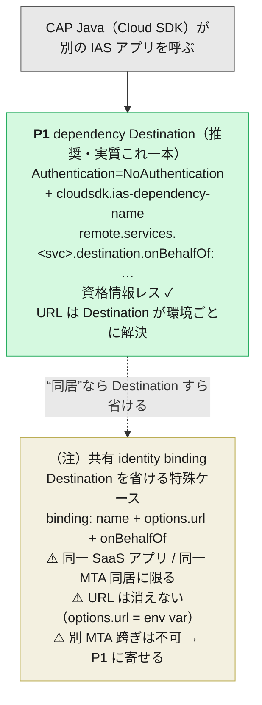
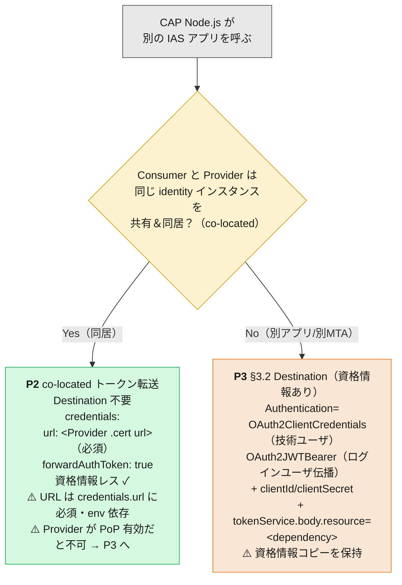
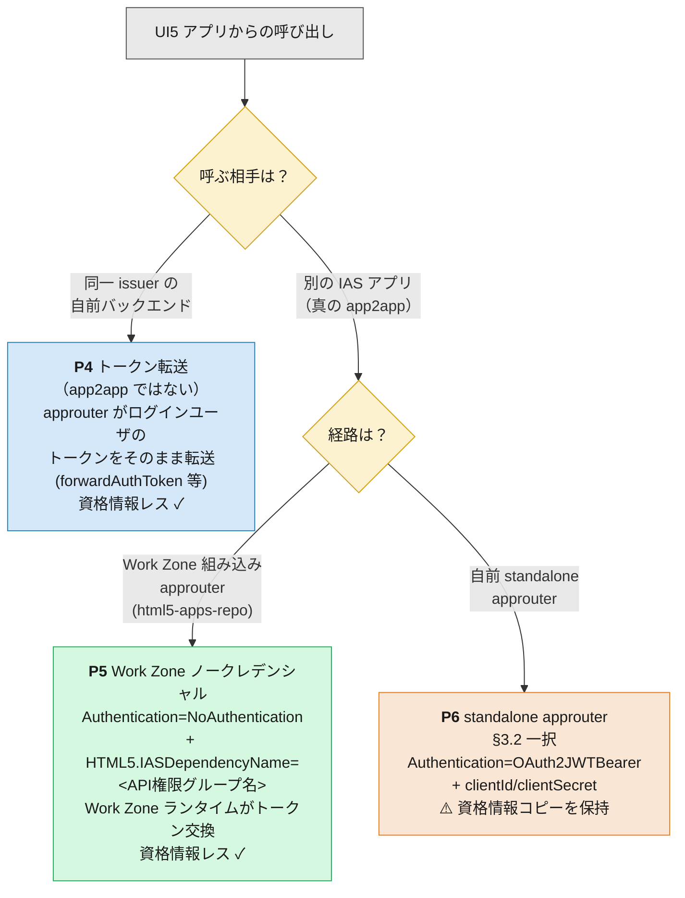

# App-to-App パターン早見（別紙）

> **この 1 枚の目的**: 「自分のケースはどのパターンか」を起点から素早く特定するための早見表です。
> 各パターンの**設定の詳細・出典・落とし穴**は、本文 [App-to-App 連携の設定と証明書運用](app2app-and-certificate-operations.md) の該当 § を参照してください。この別紙は本文の**再構成**が主で、URL 解決に関する補足（capire 一次情報）だけ追記しています。

**分岐の本質は 3 つだけ**です:

1. **起点（誰が呼ぶか）** — CAP Java バックエンド / CAP Node.js バックエンド / UI5 フロントエンド。
2. **資格情報を Destination に持たせるか** — 持たせない構成（`NoAuthentication` 系）はローテーション時に **Destination 無操作**、持たせる構成（`OAuth2*` 系）は **Destination の貼り替えが必要**（本文 §4.4）。
3. **プロバイダの URL をどう解決するか** — これは「資格情報を持つか」とは**別軸**です。URL は必ず環境ごとに変わり、**Destination なら platform が環境／サブアカウント単位で解決**しますが、Destination を省いて service binding だけで組むと **URL を自分（アプリの環境変数）で持つ**ことになります（後述の ⚠️）。

> **総括フレーム｜「同一 IAS アプリか別か」は、接続設定としては “dependency を挟むか否か” にほぼ圧縮される**
> 同一/別は結局 **トークンの audience が最初から合っているか**の問題です。**同一 IAS アプリ＝audience 一致＝dependency 不要・交換不要・トークンをそのまま転送**、**別 IAS アプリ＝audience を合わせに行く＝dependency 必須・トークン交換**（`cloudsdk.ias-dependency-name` / `tokenService.body.resource` / `HTML5.IASDependencyName`）。**URL 解決も証明書/PoP も、この軸とは直交**です。
> ただし **2 つの留保**——**① PoP を有効にすると「同一アプリ＝ただ転送」の旨みは消える**（転送トークンは cnf 不一致で弾かれ、結局 cert-bound トークンの取り直し＝交換に戻る。§6）。**② 接続設定の外では同一アプリは今も重い**——同一 IAS アプリ＝同一 AMS＝**同一 Authorization Bundle** なので中央 DCL＋deployer 1 本への集約が要る（[shared-ias-app-central-dcl.md](shared-ias-app-central-dcl.md)）し、dependency の「別アプリ」側には Provider の API 公開＋管理者承認という IAS プロビジョニング（本文 §2）も伴う。

以下、起点ごとに 3 枚のフローに分けます。パターン ID（P1〜P6）は末尾のカタログ表に対応します。

---

## 1. 起点が CAP Java バックエンド



- **CAP Java の別 IAS アプリ呼び出しは、実務上ほぼ P1 一本**です。Destination に client id/secret/証明書を書かず（資格情報レス＝緑）、本人性は「自分のバインディング」、相手は `cloudsdk.ias-dependency-name` で指す。**URL は Destination が持ち、platform が環境／サブアカウント単位で解決**するので、跨ぎ・環境差はここで吸収されます。→ **ローテーション時に Destination を触らない**（本文 §3.1・§4.4）。
- **ユーザー伝播は `destination.onBehalfOf` で宣言的に決める**（`currentUser` 既定 ／ `systemUser` ／ `systemUserProvider`）。
- **（注）の共有 identity binding（`binding: name`）は「Destination すら要らない」構成として紹介されがちですが、適用範囲は狭い**です。capire 一次情報が理由を明言しています:

  > **The plain service binding of XSUAA or IAS does not contain the URL of the remote API.** Therefore, it needs to be explicitly configured in the `options` section. Since the **URL is typically not known during development, you can define it as an environment variable**（`CDS_REMOTE_SERVICES_..._BINDING_OPTIONS_URL`）。
  > — capire [Binding to a Service with Shared Identity](https://cap.cloud.sap/docs/java/cqn-services/remote-services#binding-to-a-service-with-shared-identity)（前提は *"available within the **same SaaS application**"*）

  ```yaml
  cds:
    remote.services:
      OtherCapService:
        binding:
          name: shared-identity      # ← 消えるのは「資格情報」だけ
          options:
            url: https://<Provider>  # ← URL は依然必須（開発時不明なら env var）
          onBehalfOf: systemUser
  ```

  つまり **binding が消すのは資格情報だけで、URL 問題は消えません**。URL は `options.url` に必須で、環境ごとに変わる値を**アプリの環境変数として自分で管理**することになります。しかも **MTA の `~{module/url}` 参照は同一 `mta.yaml` 内でしか解決しない**ため、**プロバイダが別 MTA なら URL 変数参照は不可**（ハードコード／env var 注入に落ちる）。この構成が現実的なのは capire の言うとおり **「同一 SaaS アプリ / 同一 MTA に同居している」場合**に限られ、**独立ライフサイクルの別 MTA 同士では素直に P1（Destination）に寄せる**のが定石です。

---

## 2. 起点が CAP Node.js バックエンド



- **Node.js に Java の `cloudsdk.ias-dependency-name`（P1）は存在しません**。別アプリ／別 MTA を呼ぶ外部 app2app は**常に P3**（資格情報を持つ Destination）になります（オレンジ ＝ ローテーション時に **Destination 更新が必要**）。**URL は Destination が環境ごとに解決**します。
- **P2（co-located）は資格情報レス**ですが、**Java の共有 binding と同じ URL 制約を負います**——`credentials.url` にプロバイダ URL が**必須**で、環境差は自分で持つ（同一 SaaS アプリ／同居前提）。受信したログインユーザの JWT を `forwardAuthToken: true` で**そのまま転送**するだけ（トークン交換不要・`onBehalfOf` 相当のキー不要）。**別 MTA 跨ぎには不向き**な点も Java の（注）と同じで、その場合は P3 に寄せます。
- **P3 のユーザー伝播は Destination の `Authentication` タイプ自体で決まる**（`OAuth2ClientCredentials`=技術ユーザ ／ `OAuth2JWTBearer`=ログインユーザ伝播）。Node.js に `onBehalfOf` に当たる追加キーはありません（本文 §3.2）。
- **⚠️ P2 は Provider が Proof-of-Possession（PoP）を強制すると通りません**。転送トークンの `cnf.x5t#S256` は「元の発行先の証明書」に紐づき、転送アプリ自身の mTLS 証明書と指紋が食い違うためです（詳細は §6）。回避は 2 択——**(a) Provider 側で PoP を無効化**（Node.js Provider は `requires.auth.config.validation.{x5t,proofToken}.enabled: false`。ただしトークン窃取耐性が下がる同居構成の割り切り）、または **(b) P3 の証明書版に替える**（Destination が証明書を持ち、cert-bound トークンを取り直して `.cert` に mTLS＝PoP を保ったまま通す本筋。§6）。

---

## 3. 起点が UI5 フロントエンド



- **P4 は厳密には app2app ではありません**（青）。同一 issuer を信頼する自前バックエンドに、ログインユーザ自身のトークンを渡すだけのトークン転送。トークン交換は起きません。URL は Destination（`~{srv-api/srv-url}` 等）で解決。
- **P5（緑）と P6（オレンジ）はどちらも「別の IAS アプリを呼ぶ真の app2app」**ですが、**経路で分かれる**のが最大のポイント:
  - **Work Zone の組み込み approuter（html5-apps-repo ランタイム）経由なら P5**。`HTML5.IASDependencyName` に Provider が公開した **API 権限グループ名**を書くだけで、Work Zone ランタイムがトークン交換を行う（資格情報レス）。IAS 側の dependency は **Work Zone の IAS アプリ**に登録する点に注意。
  - **自前で書いた standalone approuter 経由なら P6**。`HTML5.IASDependencyName` が同様に効く保証は公式に確認できないため、**§3.2（`OAuth2JWTBearer` + `clientId`/`clientSecret`）が確実な選択肢**（本文 §3.3 の A/B/C とその ⚠️）。
- **プロパティ名の取り違え注意**: Java 系の `cloudsdk.ias-dependency-name`（P1）と Work Zone の `HTML5.IASDependencyName`（P5）は**別物**。「approuter なら常にノークレデンシャルにできる」わけではなく、**Work Zone の組み込みランタイムを使う場合に限って** P5 が成立します。
- **証明書は P5・P6 とも不要**。P6 で secret を mTLS に強化する場合だけ証明書が絡む（本文 §3.3 末尾）。

---

## 4. パターン・カタログ表

| ID | 起点 | Destination | 資格情報の在り処 | URL の解決 | ユーザー伝播の決まり方 | ローテーション時の Destination 操作 | 本文 § |
|---|---|---|---|---|---|---|---|
| **P1** | CAP Java | `NoAuthentication` + `cloudsdk.ias-dependency-name` | 資格情報レス（自分の binding） | **Destination**（環境/サブアカウント単位で platform 解決） | `destination.onBehalfOf` | **無操作** | [§3.1](app2app-and-certificate-operations.md) |
| **P2** | CAP Node.js（co-located） | **不要** | 資格情報レス（トークン転送） | ⚠️ `credentials.url` 必須（env 依存・同居前提） | 受信ログインユーザ JWT をそのまま転送 | **無操作** | [§3.1 脚注](app2app-and-certificate-operations.md) |
| **P3** | CAP Node.js（別app/別MTA） | `OAuth2ClientCredentials` / `OAuth2JWTBearer` + creds | ⚠️ Destination にコピー | Destination | Destination の `Authentication` タイプ | **更新必要**（secret/証明書の貼り替え） | [§3.2](app2app-and-certificate-operations.md) |
| **P4** | UI5（同一 issuer BE） | 資格情報なし（トークン転送のみ） | 資格情報レス | Destination | ログインユーザのトークンを転送 | **無操作** | [§3.3-A](app2app-and-certificate-operations.md) |
| **P5** | UI5（Work Zone 組込 approuter） | `NoAuthentication` + `HTML5.IASDependencyName` | 資格情報レス（WZ ランタイムが交換） | Destination | ログインユーザ → トークン交換 | **無操作** | [§3.3-B](app2app-and-certificate-operations.md) |
| **P6** | UI5（standalone approuter） | `OAuth2JWTBearer` + `clientId`/`clientSecret` | ⚠️ Destination にコピー | Destination | `OAuth2JWTBearer`（ログインユーザ伝播） | **更新必要**（secret/証明書の貼り替え） | [§3.3-C](app2app-and-certificate-operations.md) |
| （注） | CAP Java（共有 binding） | **不要**（binding のみ） | 資格情報レス（自分の binding） | ⚠️ `options.url` 必須（env 依存・**同一 SaaS/同一 MTA 同居に限る**・別 MTA 跨ぎ不可） | `binding.onBehalfOf` | **無操作** | [§3.1 脚注](app2app-and-certificate-operations.md) |

> **P1 と（注）の違い＝「URL を誰が持つか」**: どちらも資格情報レスですが、**P1 は URL を Destination（platform 管理）に置く**のに対し、**（注）は URL をアプリの環境変数に置く**。別 MTA・跨ぎ・環境差が絡むほど Destination（P1）が有利で、（注）は同居構成の軽量ショートカットと割り切るのが安全です。

---

## 5. 「資格情報レスかどうか」で見る早見（ローテーション運用の分かれ目）

本文 §4.4 の要点を 1 枚に。**回すもの（ローテーション対象）が 1 つで済むか 2 つに増えるか**の分岐です。**これは URL 解決の軸とは独立**——資格情報レスでも URL は別途要ります（P2 と（注））。

| | 資格情報レス（回すのは binding だけ） | 資格情報コピーあり（binding ＋ Destination の二重管理） |
|---|---|---|
| **該当パターン** | **P1・P2・P4・P5**（＋ Java 共有 binding の（注）） | **P3・P6** |
| Destination | 不要、または `NoAuthentication`（値を持たない） | `OAuth2*` で `clientSecret` / 証明書をインライン保持 |
| ローテーション時 | **Destination 無操作**。§4.2 の binding 更新だけ | Destination の貼り替えが**追加で必要**。binding 更新と同期しない |
| 二重管理 | 無し | **有り**（回すたびに静的 Destination が壊れ得る） |

> **原則**: 「Destination に資格情報のコピーを持たせた瞬間、回すものが 2 つになり、両者は同期しない」（本文 §4.4）。証明書ローテーションを楽にしたいなら資格情報レス（P1/P2/P4/P5）を選ぶ。ただし **P1 が資格情報レスと URL 解決（Destination）の両取り**なのに対し、P2 と（注）は URL をアプリ側に抱える点が残るコストです。

---

## 6. Proof-of-Possession（PoP）を保つ場合の呼び方

**PoP は「Provider が呼び出し先として要求するか」の軸**で、言語ランタイム（Java/Node.js）とは独立です。しかも**現代のデフォルトは両ランタイムとも `.cert` ルートで有効**（CAP Java＝SAP BTP Spring Security Client 3.5.1+ で既定強制、Node.js＝`@sap/xssec` が `.cert` ルートで既定有効）。よって実務では **「Provider は証明書提示を要求する」と想定するのが安全**です。

PoP 有効時の原則は 1 つ——**「受け取ったトークンを転送する」のをやめ、「自分の証明書に紐づくトークンを取り直して `.cert` ルートに mTLS で出す」**。この「取り直し＋mTLS」を自動でやるのが Destination／binding 経由のパターンです。

| 起点 | PoP を保つ正しい呼び方 | 資格情報レスと両立？ | ユーザー文脈 |
|---|---|---|---|
| **CAP Java** | **P1**（Destination NoAuth + `cloudsdk.ias-dependency-name` ／ 共有 binding）。Remote Services が**バインディングの X.509 でトークン交換＋mTLS を自動実行**（capire 明記） | ✅ **両立する** | `onBehalfOf: currentUser` で伝播 |
| **CAP Node.js** | **P3 の証明書版**（§3.2 Destination・`OAuth2JWTBearer` ＋ **証明書ベース**）。cert-bound トークンを取得し `.cert` に mTLS | ❌ 不可（**Destination が証明書を持つ**） | `OAuth2JWTBearer` で伝播 |
| ~~P2 co-located forwardAuthToken~~ | **PoP 有効では使えない**（転送＝再発行しないため cnf 不一致） | — | — |

> **⚠️ 重要｜PoP 版 P3 の Destination は「secret」ではなく「証明書」を持つ**: 素の §3.2（`clientId`/`clientSecret`）は **PoP を強制しない Provider にしか通りません**。PoP 有効の Provider には、`.cert` ルートへの mTLS と cnf 一致のため **Destination がクライアント証明書を持つ必要**があります——subaccount の **Destination Certificates で Generate / Upload** した keystore を `KeyStoreLocation` / `tokenService.KeyStoreLocation` で参照します。**⚠️ CF の Destination サービスに「自動更新される default cert」は無い**（年2回自動ローテの "Client Default" は ABAP 環境専用。§4.3 訂正）ため、**この keystore はローテーションが手動**（§4.4 ③）＝ REST API/Terraform 等で自動化するのが実務。

### 6.1 Node.js の構造的コスト｜URL×証明書自動×資格情報レスの 3 点同時取りは不可

app2app で欲しい 3 つ——**(1) URL を Destination に解決させる（別 MTA でも可）／(2) 証明書を自動ローテ＆IAS 自動登録（＝ binding `X509_GENERATED`）／(3) Destination に資格情報を持たせない**——を**同時に取れるのは Java P1 だけ**です（`NoAuthentication` + `cloudsdk.ias-dependency-name` が「URL＝Destination・証明書＝binding」を Cloud SDK で繋ぐ）。

**CAP Node.js にはこの繋ぎ機構が無い**（`cloudsdk.ias-dependency-name` は Java 専用、remote service は `credentials.destination`＝URL も auth も Destination か、`credentials.url`＝直指定の二択）。よって Node.js は二者択一:

| Node.js の選択 | URL 解決 | 証明書 | Destination の資格情報 | 向く場面 |
|---|---|---|---|---|
| **P3・Destination＋keystore** | ✅ Destination | ⚠️ **手動**（要自動化：REST API/Terraform） | 証明書を持つ | **別 MTA・跨ぎ**（URL 解決を優先） |
| **binding `X509_GENERATED`（Destination なし）** | ❌ **直指定**（env・別 MTA 跨ぎ不可） | ✅ 自動 | 無し | **co-located／同一 MTA 同居** |
| ~~理想（Java P1 相当）~~ | ✅ | ✅ | 無し | **Node.js には無い** |

> **実務の落とし所**: **別 MTA 跨ぎの Node.js は「P3・Destination＋keystore」＋証明書ローテ自動化**（URL 解決を取り、証明書手動を自動化で吸収）。**同居なら binding 直**（URL 直指定が許容できるため）。「URL も証明書も手放し」は **Java P1 の特権**で、Node.js は必ず一方のコストを負う——これが Node.js の app2app が Java より一段不利な核心です。

> **要点1｜転送をやめてもユーザーは失わない**: Java は `onBehalfOf: currentUser`、Node.js は `OAuth2JWTBearer` が、交換後もログインユーザ文脈を伝播します。
>
> **要点2｜「PoP 有効 × 資格情報レス」は Java のみ**: Java は P1 で**両取り**できますが、**Node.js には PoP 有効かつ資格情報レスの選択肢が現状ありません**——credential-less（P2 forwardAuthToken）は PoP と両立せず、PoP を保つと P3（Destination が資格情報/証明書を持つ）に落ちます。これが Node.js 側の構造的コストです。
>
> **要点3｜PoP を切る道もあるが割り切り**: 同居構成に限り、Provider 側で PoP を無効化して P2 を通す手はあります（Java＝Spring セキュリティ側設定、Node.js＝`requires.auth.config.validation.{x5t,proofToken}.enabled: false`）。ただしトークン窃取耐性そのものを下げるため、跨ぎ・外部公開があるなら PoP を保って P1/P3 に寄せるのが本筋です。

---

## 関連

- [App-to-App 連携の設定と証明書運用](app2app-and-certificate-operations.md) — 各パターンの設定詳細・証明書ライフサイクル・出典（この別紙の親文書）
- [02. 認証の違い](02-authentication.md) — トークン発行フロー・`ias_apis`・mTLS の仕組み・所有証明（PoP）
