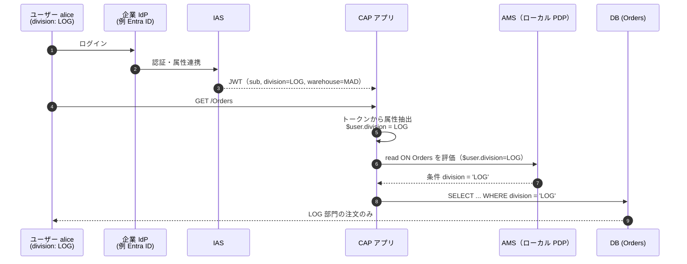

# ユーザー属性による動的な認可 — CAP ＋ AMS（`$user.division`）

> **このページの要点**
> 「部門ごとにデータを絞りたい」を **ロール**で実現すると、`Sales_Manager_EMEA` / `Sales_Manager_APAC` / … と**ロールが爆発**します。CIS/AMS では、**ユーザー本人のプロファイル属性**（`division`, `warehouse` など）を認可条件に使い、`WHERE division = $user.division` という **たった 1 つのポリシー** で全ユーザーに動的対応できます。値は認証時のトークン（IAS 発行）から供給され、部門異動があれば **HR が Identity 側の属性を直すだけ** でアクセスが追随します——ロール再割当も再デプロイも不要です。
>
> これは [03 章](03-authorization.md) の発展トピックです。03 §3 では「**リソース属性**（`Genre` など）を**管理者が定数で絞る**」インスタンスベース認可を見ました。本ページは、絞り込みの値が **ユーザー属性から来る**（ユーザーごとに自動で変わる）パターンを扱います。

---

## 1. ビジネス課題 — ロール爆発

ある事業部を買収し、500 人のユーザーに「自分の部門のデータだけ」を見せたいとします。RBAC でやると、次元（部門・地域・部署・コストセンター…）が増えるたびにロールの組み合わせが掛け算で増えます。

| アプローチ | 表現 | 部門が 3・地域が 3 なら | スケール |
|---|---|---|---|
| **ロールベース（RBAC）** | `Sales_Manager_EMEA`, `Sales_Manager_APAC`, `Sales_Manager_LATAM`, … | 9 ロール、次元追加で掛け算 | ❌ ロール爆発 |
| **属性ベース（ABAC）** | `WHERE division = $user.division` | **ポリシー 1 つ** | ✅ 動的に追随 |

属性ベースでは、`$user.division` が「認証されたユーザーのプロファイル」から値を取ります。管理者は SCI（IAS）管理コンソールでポリシーを一度定義するだけで、あとは **各ユーザーの属性値に応じて自動的に絞り込み** が変わります。EMEA から APAC へ異動したユーザーは、HR が企業 Identity 側の `division` 属性を更新すれば、全アプリのアクセスが自動調整されます。

---

## 2. 03 §3 との違い 🔑 — 「リソース属性」と「ユーザー属性」

03 §3 と本ページは、どちらも「行レベル（インスタンスベース）で絞る」点は同じですが、**絞り込みの値がどこから来るか** が違います。ここを取り違えると設計を誤ります。

| 観点 | 03 §3：リソース属性 | 本ページ：ユーザー属性 |
|---|---|---|
| 代表例 | `Genre`, `Region`, `ProductCategory` | `division`, `warehouse` |
| 値の出どころ | **管理者が定数を設定**（`RESTRICT Genre = 'Fairy Tale'`） | **ユーザーのプロファイル属性**（`$user.division`、トークン由来） |
| ポリシーの数 | 値の組み合わせごとに派生ポリシー | **原則 1 つ**（`= $user.division`） |
| 誰ごとに変わるか | 割り当てられたポリシー単位 | **ユーザー単位で自動** |
| CAP での宣言 | `@ams.attributes: { Genre: (genre.name) }`（cds 要素へマッピング） | `@restrict ... where: 'division = $user.division'` |
| 変更が要るとき | 別の値にしたい → 管理者が別ポリシーを派生 | 異動時に **属性値だけ** 更新（ポリシー不変） |

> ざっくり言うと——**「どのデータか」を管理者が固定するのがリソース属性、「そのユーザーは誰か」で自動的に決まるのがユーザー属性**です。両者は組み合わせても使えます（`WHERE region = 'EU' AND division = $user.division` など）。

---

## 3. 実行時フロー — IAS → JWT → CAP → AMS → SQL フィルタ

ユーザー属性がどう流れて、最終的に SQL の `WHERE` になるかを追います。



同じ `GET /Orders` を `division: RET` の bob が実行すると、注入される条件は自動的に `division = 'RET'` になり、Retail 部門の注文だけが返ります。**ポリシーもコードも 1 つ**のまま、ユーザーごとに結果が変わります。

---

## 4. 実装ウォークスルー

開発者が土台を一度作れば、あとは管理者と HR が運用で回せます。手順は 4 ステップです。

### その前に — 「どちらの経路で絞るか」で必要な作業が変わる 🔑

ユーザー属性で行を絞る方法は 2 つあり、**値を解決するのが誰か** が違います。ここを取り違えると「なぜコードが要るのか」が分からなくなります。

| | (A) CDS の `@restrict where` | (B) AMS ポリシーの条件 |
|---|---|---|
| 書く場所 | CDS サービス定義（`where: 'division = $user.division'`） | DCL ポリシー／SCI コンソールの restriction（`WHERE division = $user.division`） |
| 値を解決するのは | **CAP ランタイム** | **AMS の PDP** |
| 値の入手元 | `UserInfo`（Java）／`req.user.attr`（Node.js）——CAP が IAS トークンの非メタクレームを自動で属性化 | PDP に渡された **input** のみ。既定 input は `$user.user_uuid` / `email` / `groups` などの標準クレームだけ |
| **ステップ 3 のコード** | **不要** | **必要** |
| 変更したいとき | アプリの再デプロイ | 管理者がコンソールで変更（デプロイ不要） |

- 絞り込みが **アプリの仕様として固定**（「常に自部門のみ」）なら → **(A)**。コード不要でシンプルです。
- 管理者が **テナントごとに条件を組み替えたい**（顧客 A は部門制限あり、顧客 B はなし、を再デプロイなしで）なら → **(B)**。このときだけステップ 3 が要ります。

> ⚠️ 行フィルタは `@requires` ではなく **`@restrict`** に書きます。`@requires` はロール要求のみで `where` を持ちません。
>
> なお、どちらの経路でも **ステップ 1（IAS の属性設定）は必須**です。`division` がトークンのトップレベル・クレームとして出ていなければ、(A) も (B) も動きません。

### ステップ 1 — IAS で custom attribute を設定

まず、ユーザープロファイルに `division` / `warehouse` を持たせ、トークンに載るようにします。

1. **IAS 管理コンソール → Applications → 対象アプリケーション** を開く。
2. **Trust → Attributes** タブで属性を追加する。
   - Name: `division`／Source: Cloud Identity Services または企業 IdP
   - 同様に `warehouse` を追加。

例（ユーザーごとの属性値）:

| ユーザー | division | warehouse |
|---|---|---|
| `alice@example.com` | `LOG` | `MAD` |
| `bob@example.com` | `RET` | `BCN` |

認証後、発行された JWT を（例えば [jwt.io](https://jwt.io) で）デコードすると、custom attribute が載っていることを確認できます。

```json
{
  "sub": "alice@example.com",
  "division": "LOG",
  "warehouse": "MAD"
}
```

これで、属性が **IAS からアプリのトークンへ流れている** ことが確認できます。

### ステップ 2 — AMS スキーマにユーザー属性を宣言

ポリシー式で `$user.division` / `$user.warehouse` を使う前に、AMS のスキーマに宣言します。これで DCL コンパイラが属性を認識し、検証・補完が効きます。

```dcl
// ams/dcl/schema.dcl
SCHEMA {
  "$user": {
    groups: String,
    division: String,
    warehouse: String
  }
}
```

> リソース属性（`Genre` など）を `SCHEMA` 直下に宣言するのに対し、**ユーザー属性は `"$user"` の下** に宣言します。CAP では `@ams.attributes` からリソース属性の `schema.dcl` が自動生成されますが（[03 §3](03-authorization.md#3-インスタンスベース行レベル認可-)）、`$user` 属性はこのように手で加えます。

### ステップ 3 — JWT の属性を AMS 入力へマッピング（経路 (B) のときのみ）

> **(A) だけを使うならこのステップは不要です。** CAP は IAS トークンの非メタクレームを自動でユーザー属性にマップするため（[CAP: cap-users](https://cap.cloud.sap/docs/guides/security/cap-users#developing-with-users) の対応表: IAS JWT = *All non-meta attributes* → `$user.<attr>`）、`@restrict where` の `$user.division` は Node.js / Java どちらでも素で動きます。

肝は、**トークンの custom attribute を AMS のポリシー評価入力（`$user.division`）へ橋渡し** することです。既定のプロバイダを拡張し、既定の入力に属性を足します。

**Node.js（`@sap/ams`）** — `IdentityServiceAuthProvider` の `getInput` を上書き:

```js
// srv/server.js
const cds = require('@sap/cds');
const { amsCapPluginRuntime, IdentityServiceAuthProvider } = require("@sap/ams");

class CustomAuthProvider extends IdentityServiceAuthProvider {
  /**
   * @param {import("@sap/xssec").IdentityServiceSecurityContext} securityContext
   */
  getInput(securityContext) {
    const defaultInput = super.getInput(securityContext);

    // JWT ペイロードから custom attribute を取り出して AMS 入力へ
    const division = securityContext.token.payload.division;
    if (division) {
      defaultInput["$user.division"] = division;
    }
    const warehouse = securityContext.token.payload.warehouse;
    if (warehouse) {
      defaultInput["$user.warehouse"] = warehouse;
    }
    return defaultInput;
  }
}

// カスタム AuthProvider を登録（既定の xssecAuthProvider を差し替え）
amsCapPluginRuntime.authProvider.xssecAuthProvider =
  new CustomAuthProvider(amsCapPluginRuntime.ams);
```

- `getInput` が返す入力オブジェクトは、`$user.division` のような **完全修飾の属性名 → 値** の平坦なマップです（`@sap/ams` の [AttributeInput](../docs/Libraries/nodejs/sap_ams/sap_ams.md#authorizations)。例: `{ "$env.$user.origin": "EU" }`）。ここで grounding された属性が、ポリシーの `$user.division` に解決されます。
- 差し替えは `amsCapPluginRuntime.authProvider.xssecAuthProvider = new ...` で行います（[Custom XssecAuthProvider](../docs/Libraries/nodejs/sap_ams/sap_ams.md#custom-xssecauthprovider)）。

**CAP Java（`cap-ams`）** — `SciAuthorizationsProvider` の `getDefaultInput` を上書きし、Spring Bean として登録:

```java
// SecurityConfiguration.java（@Configuration クラス）
import org.springframework.context.annotation.Bean;

import com.sap.cloud.security.ams.core.SciAuthorizationsProvider;
import com.sap.cloud.security.ams.api.*;
import com.sap.cloud.security.ams.cap.api.*;
import com.sap.cloud.security.ams.api.expression.AttributeName;

import java.util.Map;

@Bean
public AuthorizationsProvider<CdsAuthorizations> customAmsAuthProvider(AuthorizationManagementService ams) {
    return new CustomAuthorizationsProvider(ams, CdsAuthorizations::of);
}

public class CustomAuthorizationsProvider extends SciAuthorizationsProvider<Authorizations> {
    private static final AttributeName $USER_DIVISION = AttributeName.of("$user.division");

    @Override
    protected Map<AttributeName, Object> getDefaultInput(Principal principal) {
        Map<AttributeName, Object> defaultInput = super.getDefaultInput(principal);

        // JWT クレームから custom attribute を取り出して AMS 入力へ
        principal.getClaimAsString("division")
                .ifPresent(division -> defaultInput.put($USER_DIVISION, division));

        return defaultInput;
    }
}
```

- 差し替えは **Spring の DI** で行います。`AuthorizationsProvider<CdsAuthorizations>` の Bean を自分で定義すると、スターターの既定 Bean を置き換えます（[cap-ams: Auto-Configured Beans](../docs/Libraries/java/cap-ams.md)。「ライブラリのカスタマイズは通常このインターフェース経由で行う」と明記）。Node.js の `cds.on('bootstrap')` のような差し替えタイミングの気遣いは不要です。
- `cap-ams` の CAP Java 統合は **Spring Boot スターター前提**です（`spring-boot-starter-cap-ams`）。非 Spring Boot の CAP Java アプリはサポートチケットでの相談が案内されています。

**Node.js / Java の対応**:

| 概念 | Node.js (`@sap/ams`) | CAP Java (`ams-core` / `cap-ams`) |
|---|---|---|
| プロバイダ | `IdentityServiceAuthProvider` | `SciAuthorizationsProvider` |
| 上書きするメソッド | `getInput(securityContext)` | `getDefaultInput(Principal)` |
| クレーム取得 | `securityContext.token.payload.division` | `principal.getClaimAsString("division")` |
| 登録方法 | `amsCapPluginRuntime.authProvider.xssecAuthProvider = …` | `@Bean AuthorizationsProvider<CdsAuthorizations>` |
| ステップ 1・2・4 | 共通 | 共通 |

属性が届いているかは、Node.js なら `req.user.attr`、Java なら `UserInfo.getAttributeValues(...)` で確認できます。

```js
// srv/service.js（Node.js）
this.before('READ', 'Orders', (req) => {
  console.log('division:',  req.user.attr.division  || 'not set');
  console.log('warehouse:', req.user.attr.warehouse || 'not set');
});
```

```java
// OrderServiceHandler.java（CAP Java）
@Before(event = CqnService.EVENT_READ, entity = Orders_.CDS_NAME)
public void logUserAttributes(CdsReadEventContext context) {
    UserInfo user = context.getUserInfo();
    logger.debug("division: {}",  user.getAttributeValues("division"));
    logger.debug("warehouse: {}", user.getAttributeValues("warehouse"));
}
```

> CAP では、IAS 認証時に非メタ属性が `$user.<attr>`（Node.js: `req.user.attr.<attr>` ／ Java: `UserInfo.getAttributeValues(...)`）として利用可能です（[CAP: cap-users](https://cap.cloud.sap/docs/guides/security/cap-users)）。**この時点ですでに経路 (A) は動きます。** ステップ 3 の上書きは、その属性を **AMS のポリシー評価（経路 (B)）にも渡す** ためのものです。
>
> `$user.<attr>` は CAP では**値のリスト**として扱われます（複数値属性が前提の設計）。単一値のつもりで比較する場合は、実際のトークン内容で挙動を一度確認してください。

### ステップ 4 — ユーザー属性を参照する認可ポリシー

属性が IAS → JWT → CAP/AMS と流れるようになったら、それを参照する規則を作ります。§4 冒頭の 2 経路がここに対応し、併用もできます。

**経路 (B) — SCI（IAS）管理コンソールで restriction を定義**（運用・本番向き。ステップ 3 のコードが前提）

1. SCI 管理コンソール → Applications → 対象アプリケーション を開く。
2. **Authorisation Policies** タブを開く。
3. 既存の restriction（例では `Reader`）を基に新しい restriction（例 `ReaderByDivision`）を作る。
4. restriction を追加: `division = $user.division`
5. ユーザー／グループにポリシーを割り当てる。

実行時の動き:

- `division: "LOG"` のユーザーが `GET /Orders` を要求。
- AMS が `$user.division = "LOG"` でポリシーを評価。
- `division = $user.division` が `division = 'LOG'` に解決。
- CAP が `WHERE division = 'LOG'` を SQL に注入。
- ユーザーは Logistics 部門の注文だけを見る（`division: "RET"` のユーザーなら自動的に Retail のみ）。

**経路 (A) — CAP サービス定義の `@restrict` で書く**（ステップ 3 のコード不要）

モデルで認可を定義したい場合は、`@restrict` の `where` で `$user.division` を直接参照できます。CAP ランタイムが `UserInfo` から値を取るため、AMS 入力へのマッピングは要りません。

```cds
service OrderService {
  @restrict: [{
    grant: ['READ'],
    to:    ['ReadOrders'],
    where: 'division = $user.division'
  }]
  entity Orders as projection on data.Orders;

  @restrict: [{
    grant: ['READ'],
    to:    ['ReadInventory'],
    where: 'warehouse = $user.warehouse'
  }]
  entity Inventory as projection on data.Inventory;
}
```

> (B) は「アプリ再デプロイなしで管理者が運用調整できる」経路、(A) は「開発者がモデルで固定する」経路です。03 §2 の base policy / custom policy の切り分けと同じ考え方で、**アプリとして届けたい規則は (A)、テナント個別の運用は (B)** に寄せると整理できます。コストの差は「(B) を選ぶとステップ 3 のコードが要る」点だけです。

---

## 5. 関心の分離 — 誰が何を担うか

この方式の効きどころは、責務がきれいに分かれることです。

| 役割 | 担うこと | いつ |
|---|---|---|
| **開発者** | スキーマ宣言（ステップ 2）、経路 (B) なら JWT からの属性抽出（ステップ 3）、アプリのデプロイ | 一度作れば済む（土台） |
| **認可管理者** | SCI コンソールで属性ベースの restriction を定義・変更 | 随時（**コード変更・デプロイ不要**） |
| **HR / Identity チーム** | ユーザープロファイルの属性（`division` 等）を更新 | 異動・組織変更のたび |

HR が Identity 側の属性を直せば、**IPS（Identity Provisioning）** 経由で属性が各アプリへ同期され、アクセスが全アプリで自動調整されます。IAS が「アクセス判断の単一の真実」になり、監査証跡も一元化されます——「アクセス変更依頼」を IT に投げる運用から解放されるのが、この方式の実利です。

---

## このページのまとめ

- **ロール爆発**（次元ごとにロールが掛け算で増える）を、**ユーザー属性ベースの単一ポリシー**（`WHERE division = $user.division`）で回避できる。
- 03 §3 の **リソース属性**（管理者が定数で絞る）と違い、絞り込み値は **ユーザーのプロファイル属性**から来るため、**1 ポリシーで全ユーザーに動的対応**する。
- 実装は 4 ステップ: ① IAS で custom attribute → ② `schema.dcl` に `"$user"` 属性宣言 → ③ JWT 属性を AMS 入力へ（**経路 (B) のときだけ**）→ ④ 規則（SCI コンソール restriction ／ CAP `@restrict where`）。
- **経路 (A)（CDS の `@restrict where`）ならステップ 3 は不要** — CAP が IAS の非メタクレームを自動で属性化するため、Node.js / Java どちらも素で動く。コードが要るのは **経路 (B)（AMS ポリシー内で `$user.<attr>` を参照）** のときだけ。
- ステップ 3 は Node.js / CAP Java で API が 1:1 対応（`getInput` ↔ `getDefaultInput`、`bootstrap` フック ↔ Spring `@Bean`）。
- 責務が **開発者（土台）／認可管理者（ポリシー運用）／HR（属性のメンテ）** に分離し、異動時は **属性値を直すだけ**。

## 関連

- [03. 認可の違い](03-authorization.md) — 本ページの前提（DCL・実行時 PDP・リソース属性のインスタンスベース認可）
- [Instance-Based Authorization（公開 docs）](../docs/CAP/InstanceBasedAuthorization.md) — `@ams.attributes` によるリソース属性マッピング
- [@sap/ams（公開 docs）](../docs/Libraries/nodejs/sap_ams/sap_ams.md) — `IdentityServiceAuthProvider` / AttributeInput / Custom XssecAuthProvider
- [cap-ams（公開 docs）](../docs/Libraries/java/cap-ams.md) — CAP Java 統合の Bean 構成（`AuthorizationsProvider` がカスタマイズの入口）
- [Authorization Checks（公開 docs）](../docs/Authorization/AuthorizationChecks.md) — `SciAuthorizationsProvider` の `getDefaultInput` 上書き例（Node.js / Spring Boot / Java を並記）
- [CAP: CAP Users（cap.cloud.sap）](https://cap.cloud.sap/docs/guides/security/cap-users) — `$user.<attr>` / `@ams.attributes` / base policy（IAS の非メタクレーム → 属性の対応表）
- サンプル: [ams-samples-node](https://github.com/SAP-samples/ams-samples-node)
- 出典ブログ: [Dynamic authorisation with user attributes in SAP CAP and AMS（SAP Community）](https://community.sap.com/t5/technology-blog-posts-by-sap/dynamic-authorisation-with-user-attributes-in-sap-cap-and-ams/ba-p/14388853) — 本ページの元にした記事
