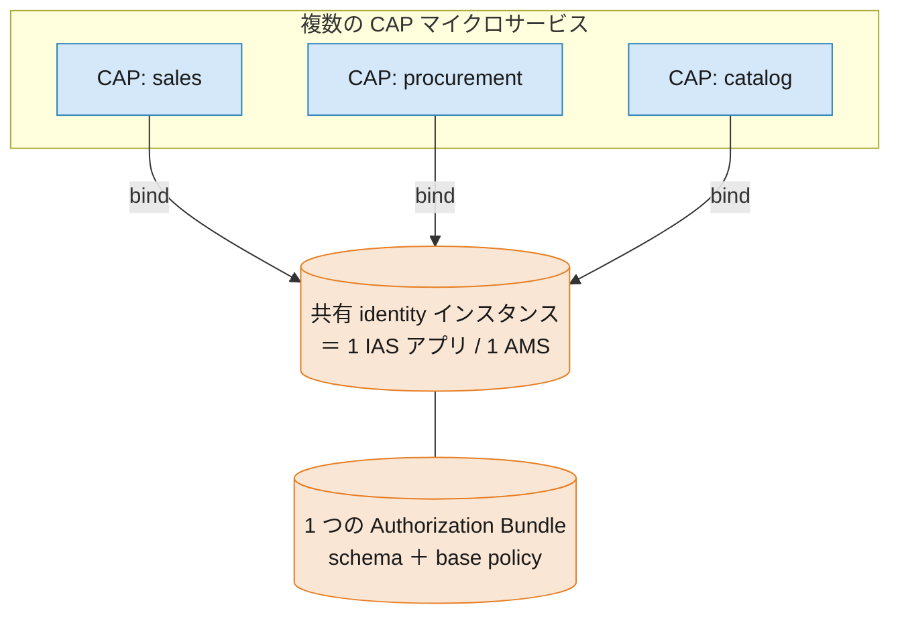
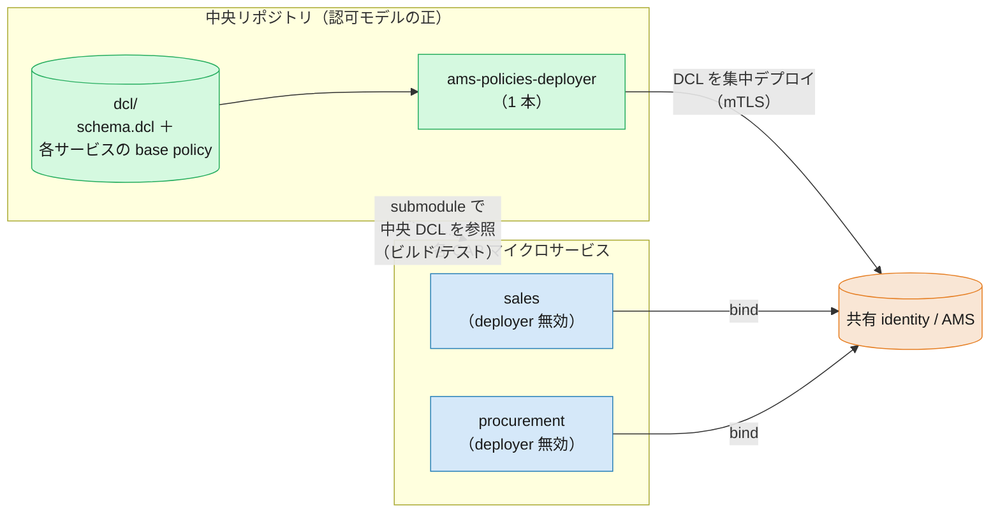

# 共有 IAS アプリと集中 DCL — 複数 CAP マイクロサービス構成

> **このページの要点**
> 複数の CAP マイクロサービスが **1 つの IAS アプリ（＝ 1 つの `identity` インスタンス／AMS インスタンス）を共有** すると、認可の実体である **DCL（schema ＋ base policy）は 1 つの Authorization Bundle に集約** されます。AMS は DCL の **マージに対応していない** ため、各サービスがそれぞれ DCL をデプロイすると **相互に上書き** してしまいます。
> 対策は明快です——**DCL は中央リポジトリで一元管理し、deployer を 1 本だけ動かして集中デプロイ**。各 CAP は自分のデプロイヤ生成を **無効化** し、ビルド／テスト用に中央 DCL を **参照** します。
>
> **⚠️ ただし「ユーザーへの一括割当」の代替ではありません**: 集中 DCL が束ねられるのは**カスタム CAP のポリシーだけ**です。実務の業務ロールは標準 SAP LoB ソリューション（S/4HANA Cloud・SuccessFactors 等）の権限にもまたがり、それらは AMS ポリシーではないので中央 DCL に入りません。**1 ユーザーへの業務ロール一括割当は Identity Directory / IGA（IAS の外側）の仕事**であり、集中 DCL の役割は「**カスタム側を少数の業務ロール型グループに整形して、その外側レイヤーの割当を楽にする**」ことです（[05 §3](05-role-assignment-admin.md#3-グループの役割の違い-)・[07 §3](07-summary-migration-cheatsheet.md#3-中心論点多数のマイクロサービスでcis-方式に乗れるのか-)）。
>
> 本ページは [03. 認可の違い](03-authorization.md)（DCL・base policy・bundle）の **構成／運用面** の補足です。実装の正は公開ドキュメント [Deploying DCL — Microservice Applications](../docs/Authorization/DeployDCL.md#microservice-applications) を参照してください。

---

## 1. なぜ「共有」で問題が起きるのか — 1 AMS = 1 バンドル

「共通の IAS アプリを共有する」とは、技術的には次が **1 つずつ** であることを意味します。

- 1 つの **`identity` サービスインスタンス**（＝ 1 つの IAS アプリケーション）
- 1 つの **AMS インスタンス**（`authorization.enabled: true`）
- 1 つの **Authorization Bundle**（schema ＋ base policy ＋ 実行時ポリシーをコンパイルしたもの）

各 CAP マイクロサービスは、この **同じ `identity` インスタンスにバインド** し、**同じ bundle をダウンロードしてローカル評価** します（bundle と PDP の仕組みは [03 §4](03-authorization.md)）。つまり **schema と base policy は全サービスで共有の 1 セット** になります。



ここで落とし穴があります。**AMS は DCL のマージをしません。** 各サービスが自分の DCL を個別にアップロードすると、**後からデプロイした内容が前をまるごと上書き** します（[DeployDCL の警告](../docs/Authorization/DeployDCL.md#microservice-applications)）。

> ⚠️ 「sales サービスをデプロイ → 次に procurement をデプロイ」とすると、procurement の DCL バンドルで sales の base policy が消える、という事故が起きます。共有構成では **サービスごとの DCL デプロイは禁物** です。

---

## 2. 解決方針 — DCL を中央で一元管理し、集中デプロイ

共通の認可モデル（schema ＋ base policy）を **中央リポジトリ** に集約し、**deployer を 1 本だけ** 動かして共有 AMS インスタンスへアップロードします。



| | 分散デプロイ（❌ NG） | 集中デプロイ（✅ 推奨） |
|---|---|---|
| DCL の所在 | 各サービスに散在・重複 | **中央リポジトリに一元化** |
| デプロイヤ | サービスごとに 1 つ（相互上書き） | **中央に 1 本だけ** |
| business ロール（例 `auditor`） | 各サービスで重複定義 | 1 か所に定義（重複なし） |
| 管理コンソールでの見え方 | マイクロサービス構造が露出・非一貫 | **1 つの一貫した認可モデル** |

> なぜ集中させるのか——マイクロサービスは通常、認可モデルの **一部を共有** します（横断的な `auditor` ロールなど）。これをサービスごとに重複定義すると、顧客管理者には「同じ権限が複数ポリシーに現れる」不可解な UI になり、割当も全サービス分に必要になります。マイクロサービス構造は管理者から **隠蔽** すべき、というのが設計指針です（[DeployDCL: Motivation](../docs/Authorization/DeployDCL.md#motivation-for-central-authorization-model)）。

---

## 3. 共有アプリの DCL（中央リポジトリ）

中央リポジトリのルートに `dcl` フォルダを置き、`schema.dcl`（全サービス共通の属性）と、各サービス向けの DCL パッケージ（base policy）を並べます。deployer は `@sap/ams` の `ams-dcl-content-deployer` を使う **1 本** です。

```text
central-authz/                     ← 認可モデルの「正」を置く中央リポジトリ
├─ dcl/
│  ├─ schema.dcl                   ← 全サービス共通の属性（型は 1 つに統一）
│  ├─ sales/
│  │  └─ policies.dcl              ← sales の base policy
│  ├─ procurement/
│  │  └─ policies.dcl              ← procurement の base policy
│  └─ shared/
│     └─ businessRoles.dcl         ← auditor など横断ロール（重複させない）
└─ ams-policies-deployer/          ← 中央の deployer（1 本だけ動かす）
   └─ package.json
```

集中管理では、**schema の属性型** と **base policy 名** が **サービス間で衝突しない** ように保つ必要があります（1 つの bundle に同居するため）。モデルを変更するときは、複数サービスが同時に動いても壊れないよう **後方互換** を守ります（[Changing DCL](../docs/Authorization/ChangingDCL.md)）。

deployer は CF なら MTA タスク／CF アプリ、Kyma なら Job として実行します（プラットフォーム別スニペットは [DeployDCL: Platforms](../docs/Authorization/DeployDCL.md#platforms)）。バックエンド各サービスの起動を **DCL アップロード完了後** に遅らせるため、`deployed-after` フックを使うのが定石です。

---

## 4. 各 CAP 側の設定

各 CAP マイクロサービスでやることは 2 つです——**(a) 共有 `identity` にバインドする**、**(b) 自前のデプロイヤ生成を止め、中央 DCL を参照する**。

### (a) 共有 identity インスタンスにバインド

すべてのサービスが **同じ `identity` インスタンス**（＝同じ IAS アプリ／AMS）にバインドします。インスタンスは中央で 1 つ作成し、各サービスはそれを共有します（別 MTA からは *既存インスタンス* として参照）。

```yaml
# 各サービスの mta.yaml（共有インスタンスを参照）
resources:
  - name: shared-authz-identity
    type: org.cloudfoundry.managed-service
    parameters:
      service: identity
      service-name: shared-authz-identity     # 全サービスで同一の名前
      service-plan: application
      config:
        authorization:
          enabled: true                        # AMS を有効化（共有インスタンス側で 1 回）
```

### (b) デプロイヤ生成を無効化し、中央 DCL を参照

CAP の AMS プラグイン設定は `requires.auth.ams`（[cds env](../docs/CAP/cds-Plugin.md#configuration)）で行います。共有構成では次の 2 点が要です。

```jsonc
// 各サービスの package.json の "cds"（または .cdsrc.json）
{
  "requires": {
    "auth": {
      "ams": {
        "generatePoliciesDeployer": false,   // このサービスからは deployer を作らない（集中デプロイに一本化）
        "dclRoot": "central-authz/dcl"        // 中央 DCL（submodule）を参照
      }
    }
  }
}
```

- **`generatePoliciesDeployer: false`** — 既定では `cds build` がサービスごとに deployer アプリを生成しますが、共有構成ではこれを止め、**デプロイは中央の 1 本に集約** します（既定 `"auto"`。[Base Policy Upload](../docs/CAP/cds-Plugin.md#base-policy-upload)）。
- **`dclRoot`** — DCL の生成・ローカルコンパイル・バリデーションが参照するルートフォルダ（既定は Node.js `ams/dcl`／Java `srv/src/gen/ams`）。**中央 DCL を submodule として取り込んだパス** を指すことで、ローカルビルド／テストが共有モデルで動きます。
- 中央がモデルを所有し、サービス側で base policy を自動生成させたくない場合は **`generateDcl: false`** も併用します（各サービスの `@requires`/`@restrict` から生成された DCL を使う場合は、**中央リポジトリへ集約してから 1 本の deployer でデプロイ** します。AMS はマージしないため）。

### 中央 DCL の取り込み方

中央リポジトリの `dcl` フォルダを、各サービスのリポジトリで参照します（[DeployDCL: Accessing central DCL files](../docs/Authorization/DeployDCL.md#accessing-central-dcl-files)）。代表的な手段は次の 3 つです。

- **git submodule ＋ `git sparse-checkout`（cone mode）** — `dcl` フォルダだけをチェックアウト
- **symbolic link** — submodule の `dcl` をサービス内の特定パスへリンク
- **`dclRoot` 設定** — 取り込んだフォルダを直接指す

git submodule を使わない場合の代替: **Git monorepo** / **NPM workspaces** / **Maven modules**。

#### submodule ＋ sparse-checkout の具体手順

中央リポジトリを submodule として追加し、cone モードの sparse-checkout で **`dcl` フォルダだけ** を取り込みます（`ams-policies-deployer/` などは展開しない）。

```bash
# ① 中央リポジトリを submodule として追加
git submodule add https://github.com/acme/central-authz.git central-authz

# ② submodule 内で dcl フォルダだけに絞る（set が cone モードで自動初期化）
git -C central-authz sparse-checkout set dcl

git add .gitmodules central-authz
git commit -m "Add central-authz submodule (dcl only)"
```

sparse-checkout の設定は **submodule のローカルにのみ保存され `.gitmodules` には載りません**。そのため、このリポジトリを clone した各メンバーは初期化後に **もう一度** 絞り込みます（bootstrap スクリプトにまとめると確実）。

```bash
git submodule update --init
git -C central-authz sparse-checkout set dcl
```

あとは `dclRoot` を submodule 内の `dcl` に向けます（例: `"dclRoot": "central-authz/dcl"`）。中央 DCL を更新したら `git submodule update --remote central-authz` → コミットで追従します。

> **`dclRoot` はプロジェクト外を指せる？** 技術的にはローカルの `cds build`/`cds watch` は `../shared/dcl` のような外部パスでもファイルを見つけられますが、**推奨しません**。`cds build` の生成物（`gen/`）や deployer アプリは**プロジェクト配下からパッケージ**され、**MTA モジュール／`cf push`／Docker ビルドコンテキストはプロジェクト外のファイルを含めません**。外部ディレクトリを指すと **CI/CD・クラウドビルドで DCL が欠落** します。だからこそ、submodule や symbolic link で中央 DCL を **プロジェクト内に取り込んでから** `dclRoot` で指す、というのが定石です。

> 実行時のコードは変わりません。各サービスは共有 `identity` にバインドしているだけで、`@sap/ams` プラグインが **同じ bundle を自動でダウンロード** して認可チェックを行います。共有構成で特別なのは **ビルド／デプロイの構成** であって、ランタイムの実装ではありません。

---

## このページのまとめ

- 共有 IAS アプリ = **1 identity / 1 AMS / 1 bundle**。schema と base policy は全サービス共通の 1 セット。
- **AMS は DCL をマージしない** → サービスごとの個別デプロイは相互上書き。共有構成では厳禁。
- **DCL は中央リポジトリで一元管理**し、**deployer 1 本で集中デプロイ**。横断ロールの重複を避け、管理コンソールで一貫した認可モデルに。
- 各 CAP は **共有 `identity` にバインド**し、**`generatePoliciesDeployer: false`**（＋必要に応じて `generateDcl: false`）でデプロイヤ生成を無効化、**`dclRoot`** で中央 DCL（submodule）を参照。
- ランタイムの実装は不要。特別なのはビルド／デプロイの構成だけ。

## 関連

- [03. 認可の違い](03-authorization.md) — DCL・base policy／custom policy・bundle・実行時 PDP
- 公開ドキュメント: [Deploying DCL](../docs/Authorization/DeployDCL.md) / [Changing DCL](../docs/Authorization/ChangingDCL.md) / [cds Plugin `@sap/ams`](../docs/CAP/cds-Plugin.md)
